1.1 Introduction
================

What is a DBMS ?
----------------

-   A database management system (DBMS) provides **efficient**,
    > **reliable**, **convenient** and **safe** **multi-user** **storage
    > of** and **access to** **massive** amounts of **persistent** data.

    -   **massive** scale: So if you think about the amount of data that
        > is being produced today, *[database systems are handling
        > terabytes of data]{.underline}*, sometimes even terabytes of
        > data every day. And one of the critical aspects is that the
        > data that\'s handled by database management systems systems is
        > *[much larger than can fit in the memory of a typical
        > computing system]{.underline}*. So memories are indeed growing
        > very, very fast, but the amount of data in the world and data
        > to be handled by database systems is growing much faster. So
        > *[database systems are designed to handle data that to
        > residing outside of memory.]{.underline}*

    -   **persistent**: And what I mean by that is that the *[data in
        > the database outlives the programs that execute on that
        > data]{.underline}*. So if you run a typical computer program
        > the program will start the variables will be created. There
        > will be data that\'s operated on the program, the program will
        > finish and the data will go away. It\'s sort of the other way
        > with databases. The data is what sits there and then program
        > will start up, it will operate on the data, the program will
        > stop and the *[data will still be there]{.underline}*. Very
        > often actually multiple programs will be operating on the same
        > data.

    -   **safety**: So database systems, since they run critical
        > applications such as telecommunications and banking systems,
        > have to have guarantees that the data managed by the system
        > will stay in a consistent state, it won\'t be lost or
        > overwritten when there are failures, and there can be
        > *[hardware failures]{.underline}*. There can be *[software
        > failures]{.underline}*. Even simple *[power
        > outages]{.underline}*. You don\'t want your bank balance to
        > change because the power went out at your bank branch. And of
        > course there are the problem of *[malicious
        > users]{.underline}* that may try to corrupt data. So database
        > systems have a number of built in *[mechanisms that ensure
        > that the data remains consistent]{.underline}*, regardless of
        > what happens.

    -   **multi-user**: So I mentioned that multiple programs may
        > operate on the same database. And even with one program
        > operating on a database, that program may allow many different
        > users or applications to *[access the data
        > concurrently]{.underline}*. So when you have multiple
        > applications working on the same data, the system has to have
        > some mechanisms, again, to ensure that the data stays
        > consistent. That you don\'t have, for example, half of a data
        > item overwritten by one person and the other half overwritten
        > by another. So there\'s mechanisms in database systems called
        > *[concurrency control]{.underline}*.

        -   And the idea there is that we control the way multiple users
            > access the database. Now we don\'t control it by only
            > having one user have exclusive access to the database or
            > the performance would slow down considerably. So the
            > *[control actually occurs at the level of the data
            > items]{.underline}* in the database. So many users might
            > be operating on the same database but be operating on
            > different individual data items. It\'s a little bit
            > similar to, say, file system concurrency or even variable
            > concurrency in programs, except it\'s more centered around
            > the data itself.

    -   **convenience:** convenience is actually one of the critical
        > features of database systems. They really are *[designed to
        > make it easy to work with large amounts of data]{.underline}*
        > and to do very powerful and interesting processing on that
        > data. So there\'s a couple levels at which that happens:

        -   1\. "convenient weil: man muss sich nicht mit der Speicherung der Daten
            > beschäftigen, DBMS macht das schon": There\'s a notion in databases
            > called *[Physical Data Independence]{.underline}*.

            -   It\'s kind of a mouthful, but what that\'s saying is
                > that the way that data is actually stored and laid out
                > on disk is independent of the way that programs think
                > about the structure of the data. So you could have a
                > program that operates on a database and underneath
                > there could be a complete change in the way the data
                > is stored, yet the program itself would not have to be
                > changed. So the operations on the data are independent
                > from the way the data is laid out.

        -   2\. "convenient weil: man muss nicht überlegen wie man "effizient"
            > queryt, die query language macht das schon" And somewhat related to that
            > is the notion of *[high level query languages]{.underline}*.

            -   So, the databases are usually queried by languages that
                > are relatively compact to describe, really at a very
                > high level what information you want from the
                > database. Specifically, they obey a notion that\'s
                > called *[declarative]{.underline}*,

                -   in the query, you describe what you want out of the
                    > database but you don\'t need to describe the
                    > algorithm to get the data out, and that\'s a
                    > really nice feature. It allows you to write
                    > queries in a very simple way, and then the system
                    > itself will find the algorithm to get that data
                    > out efficiently.

    -   **efficiency**: a similar parallel joke, which is that the three
        > most important things in a database system is first
        > *[performance]{.underline}*, second performance and again
        > performance. So database systems have to do really *[thousands
        > of queries or updates per second]{.underline}*. These are not
        > simple queries necessarily. These may be very complex
        > operations. So, constructing a database system, that can
        > execute queries, complex queries, at that rate, over gigantic
        > amounts of data, terabytes of data is no simple task, and that
        > is one of the major features also, provided by a database
        > management system.

    -   **reliability**: Again, looking back at say your banking system
        > or your telecommunications system, it\'s critically important
        > that those are up all the time. So *[99.99999 % up
        > time]{.underline}* is the type of guarantee that database
        > management systems are making for their applications.

Not covered in this course
--------------------------

-   When people build database applications, sometimes they program them
    > with what\'s known as a *[framework]{.underline}*. Currently at
    > the time of this video, some of the popular frameworks are
    > *[Django]{.underline}* or *[Ruby on Rails]{.underline}*, and these
    > are environments that help you develop your programs, and help you
    > generate, say the calls to the database system. We\'re not, in
    > this set of videos, going to be talking about the frameworks, but
    > rather we\'re going to be talking about the data base system
    > itself and how it is used and what it provides.

-   database systems are often used in conjunction with what\'s known as
    > *[middle-ware]{.underline}*. Again, at the time of this video,
    > typical middle-ware might be *[application servers]{.underline}*,
    > *[web servers]{.underline}*, so this middle-ware helps
    > applications interact with database systems in certain types of
    > ways. Again, that\'s sort of outside the scope of the course. We
    > won\'t be talking about middleware in the course.

-   Finally, it\'s not the case that every application that involves
    > data necessarily uses the database system, so historically, a lot
    > of data has been stored in *[files]{.underline}*, I think that\'s
    > a little bit less so these days. Still, there\'s a lot of data out
    > there that\'s simply sitting in files. *[Excel
    > spreadsheets]{.underline}* is another domain where there\'s a lot
    > of data sitting out there, and it\'s useful in certain ways, and
    > the *[processing of data is not always done through query
    > languages associated with database systems]{.underline}*. For
    > example, *[Hadoop]{.underline}* is a processing framework for
    > running operations on data that\'s stored in files.

-   **Again, in this set of videos we\'re going to focus on the database
    > management system itself and on storing and operating on data
    > through a database management system.**

Key concepts
------------

-   So there are four key concepts that we\'re going to cover for now.

    -   **data model**: The data model is a description of, in general,
        > how the data is structured.

        -   **relational data model**, we\'ll spend quite a bit of time
            > on that. In the relational data model the data and the
            > database is thought of as a set of records.

        -   **XML documents**, so, an XML document captures data,
            > instead of a set of records, as a hierarchical structure,
            > of labeled values.

        -   **graph data model** where all data in the database is in
            > the form of nodes and edges.

    -   So again, a data model is telling you the general form of data
        > that\'s going to be stored in the database.

    -   **schema versus data**. One can think of this kind of *[like
        > types and variables in a programming language]{.underline}*.
        > The schema sets up the structure of the database. Maybe I\'m
        > going to have information about students with IDs and GPAs, or
        > about colleges, and it\'s just going to tell me the structure
        > of the database where the data is the actual data stored
        > within the schema. Again, in a program, you set up types and
        > then you have variables of those types, we\'ll set up a
        > schema, and then we will have a whole bunch of data that
        > adheres to that schema. Typically the schema is set up at the
        > beginning, and doesn\'t change very much where the data
        > changes rapidly. Now to set up the schema, one normally uses
        > what\'s known as a *[data definition language]{.underline}*.
        > Sometimes people use higher level design tools that help them
        > think about the design and then from there go to the data
        > definition language. But it\'s *[used in general to set up a
        > scheme or structure for a particular database.]{.underline}*
        > Once the schema has been set up and data has been loaded, then
        > it\'s possible to start querying and modifying the data and
        > that\'s typically done with what\'s known as the *[data
        > manipulation language]{.underline}*, so *[for querying and
        > modifying the database]{.underline}*.

People that are involved in a database system
---------------------------------------------

-   the person who implements the database system itself, the **database
    > implementer**. That\'s the person who builds the system, that\'s
    > not going to be the focus of this course. We\'re going to be
    > focusing more on the types of things that are done by the other
    > three people that I\'m going to describe.

-   **database designer**. So the database designer is the person who
    > establishes the schema for a database. So, let\'s suppose we have
    > an application. We know there\'s going to be a lot of data
    > involved in the application and we want to figure out how we are
    > gonna structure that data before we build the application. That\'s
    > the job of the database designer. It\'s a surprisingly difficult
    > job when you have a very complex data involved in an application.

-   Once you\'ve established the structure of the database then it\'s
    > time to build the applications or programs that are going to run
    > on the database, often interfacing between the eventual user and
    > the data itself, and that\'s the job of the **application
    > developer**, so those are the programs that operate on the
    > database. And again I\'ve mentioned already that you can have a
    > database with many different programs that operate on it, be very
    > common. You might, for example, have a sales database where some
    > applications are actually inserting the sales as they happen,
    > while others are analyzing the sales. So it\'s not necessary to
    > have a one-to-one coupling between programs and databases.

-   the **database administrator**. So the database administrator is the
    > person who loads the data, sort of gets the whole thing running
    > and keeps it running smoothly. So, this actually turns out to be a
    > very important job for large database applications. For better or
    > worse, database systems do tend to have a number of tuning
    > parameters associated with them, and getting those tuning
    > parameters right can make a significant difference in the all
    > important performance of the database system. So database
    > administrators are actually, highly valued, very important, highly
    > paid as a matter of fact, and are, for large deployments, an
    > important person in the entire process.

-   **in this class we\'ll be focusing mostly on designing and
    > developing applications**, a little bit on administration, but in
    > general thinking about databases and the use of database
    > management systems from the perspective of the application builder
    > and user.

2.1 Relational model
====================

Why is it important ?
---------------------

-   The relational model *[underlies all commercial database
    > systems]{.underline}* at this point in time.

-   it *[can be queried]{.underline}*.

    -   By that I mean we can ask questions of databases in the model
        > using High Level Languages. High Level Languages are simple,
        > yet extremely expressive for asking questions over the
        > database.

-   *[there are extremely efficient implementations]{.underline}* of the
    > relational model and of the query languages on that model.

Basic constructs in the relational model
----------------------------------------

-   the primary construct is in fact, **the relation**.

    -   A database consists of a set of relations or **sometimes
        > referred to as \"tables\"**, *[each of which has a
        > name]{.underline}*.

        -   So, we\'re gonna use two relations in our example. Our
            > example is gonna be a fictitious database about students
            > applying to colleges. For now we\'re just gonna look at
            > the students and colleges themselves. So we\'re gonna have
            > two tables, and let\'s call those tables the Student table
            > and the College table.

-   Next, we have the concept of **attributes**. So every relation and
    > relational database has a *[predefined]{.underline}* set of
    > **columns** or attributes *[each of which has a
    > name]{.underline}*.

    -   So, for our student table, let\'s say that each student is gonna
        > have an ID, a name, a GPA and a photo. And for our college
        > table, let\'s say that every college is going to have a name,
        > a state, and an enrollment. We\'ll just abbreviate that ENR.
        > So those are the labeled columns

-   Now the actual data itself is stored in what are called **the
    > tuples** (or **the rows**) in the tables.

-   in a relational database, typically *[each attribute or
    > column]{.underline}* has a **type** sometimes referred to as a
    > **domain**.

-   We do also in most relational databases have a concept of
    > *[enumerated domain]{.underline}*.

    -   So for example, the state might be an enumerated domain for the
        > 50 abbreviations for states. (domain ist also: string data
        > type mit 50 möglichen Werten)

-   Now, it\'s typical for relational databases to have just *[atomic
    > types]{.underline}* in their attributes as we have here, but many
    > database systems do also support *[structured types]{.underline}*
    > inside attributes.

[[https://vinay200005.blogspot.com/2019/11/1-what-is-difference-between-atomic-and.html]{.underline}](https://vinay200005.blogspot.com/2019/11/1-what-is-difference-between-atomic-and.html)

**What is the difference between Atomic and Composite data with
examples?**

Answer:

**Atomic Data**:

The Atomic data is the data which is viewed as single and non
decomposable entity by the user. Due to its numerical properties, the
atomic data can also be called as Scalar data.

Example:

Consider an integer 5678.It can be decomposed into single digit
i.e.,(5,6,7,8).However, after decomposition these digits doesn\'t hold
the same characteristics as the actual integer i.e.,(5678)does. Thus,the
Atomic data is considered as single and non decomposable data.

**Composite data**:

The composite data is defined as the data which can be decomposed into
several meaningful subfield.It *[can be also be called as structured
data]{.underline}* and it is implemented in C++ by using structure,class
etc..

Example:

Consider an employee\'s record which contains fields such as employee
ID, name, salary etc.. Each employee record is decomposed into several
sub-fields(i.e., employee ID,name, salary). Thus, the composite data can
be decomposed without any change in its meaning.

-   The **schema** of a database is the structure of the relation. So
    > the schema includes the *[name of the relation]{.underline}* and
    > *[the attributes of the relation]{.underline}* and *[the types of
    > those attributes]{.underline}*.

-   the **instance** is the *[actual contents]{.underline}* of the table
    > at a given point in time.

-   So, typically you set up a schema in advance, then the instances of
    > the data will change over time.

-   **null:** a special value that\'s *[in any type of any
    > column]{.underline}*

    -   Null values are used to denote that a particular value is maybe
        > unknown or undefined.

-   one has to be very careful in a database system when you run
    > *[queries over relations that have null values]{.underline}*.

    -   query GPA \> 3.5 =\> students with GPA = null must be excluded

    -   query GPA \<= 3.5 =\> students with GPA = null must be excluded

    -   query (GPA \> 3.5 **or** GPA \<= 3.5) =\> students with GPA =
        > null must be excluded !!!

        -   even though it looks like every tuple should satisfy this
            > condition, that it\'s always true, that\'s not the case
            > when we have null values. So, that\'s why one has to be
            > careful when one uses null values in relational databases.

-   And, a **key** is an attribute in of a relation where every value
    > for that attribute is unique.

    -   So if we look at the student relation, we can feel pretty
        > confident that the ID is going to be a key. In other words,
        > every tuple is going to have a unique ID.

    -   Thinking about the college relation, it\'s a little less clear.
        > We might be tempted to say that the name of the college is an
        > ID, but actually college names probably are not unique across
        > the country. There\'s probably a lot of or several colleges
        > named Washington college for example. You know what, *[we\'re
        > allowed to have sets of attributes that are
        > unique]{.underline}* and that makes sense in the college
        > relation. Most likely the combination of the name and state of
        > a college is unique, and that\'s what we would identify as the
        > key for the college relation.

    <!-- -->

    -   Now, you might wonder **why it\'s even important to have
        > attributes that are identified as keys**. There\'s actually
        > several uses for them:

        -   *[to identify specific tuples]{.underline}*. So if you want
            > to run a query to get a specific tuple out of the database
            > you would do that by asking for that tuple by its key.

        -   database systems for efficiency tend to build special index
            > structures or store the database in a particular way. So
            > *[it\'s very fast to find a tuple based on its
            > key]{.underline}*.

        -   And lastly, if one relation in a relational database wants
            > to refer to tuples of another, there \'s no concept of
            > pointer in relational databases. Therefore, the first
            > relation will typically *[refer to a tuple in the second
            > relation by its unique key]{.underline}*.

How one creates relations or tables in the SQL language
-------------------------------------------------------

-   It\'s very simple, you just say \"**create table**\" give the name
    > of the relation and a list of the attributes. And if you want to
    > give types for the attributes. It\'s similar except you follow
    > each attribute name with its type:

    -   Create Table College(name string, state char(2), enrollment
        > integer)

2.2 Querying relational databases
=================================

-   bis 1:47 schauen "database system as gigantic Disc", basic paradigm
    > of querying and modifying data in database system

-   Relational databases support **ad hoc queries** and **high-level
    > languages**.

    -   By **ad hoc**, I mean that you can pose queries that you didn\'t
        > think of in advance. So it\'s not necessary to write long
        > programs for specific queries. Rather the language can be used
        > to pose a query *[as you think]{.underline}* about what you
        > want to ask.

    -   And as mentioned in previous videos the languages supported by
        > relational systems are **high level**, meaning you can write
        > in a fairly compact fashion rather complicated queries and you
        > don\'t have to write the algorithms that get the data out of
        > the database.

-   example queries, see slide

    -   Now these might seem like a fairly complicated queries but all
        > of these *[can be written in a few lines]{.underline}* in say
        > the SQL language or a pretty simple expression in relational
        > algebra.

-   **posing queries and executing them are not correlated:** There are
    > some queries that are easy to pose but hard to execute efficiently
    > and some that are vice-versa.

-   Frequently, people talk about **the query language of the database
    > system**. That\'s usually used sort of synonymously with the
    > **DML** or **Data Manipulation Language** which usually includes
    > not only querying but also data modifications.

-   In all relational query languages, when you ask a query over a set
    > of relations, you get a relation as a result.

    -   So let\'s run a query cue say over these three relations shown
        > here and what we\'ll get back is another relation.

    -   *[When you get back the same type of object that you
        > query]{.underline}*, that\'s known as **closure** of the
        > language. And it really is a nice feature.

    -   For example, when I want to run another query, say Q2, that
        > query could be posed over the answer of my first query and
        > could even combine that answer with some of the existing
        > relations in the database. That\'s known as
        > **compositionality**, *[the ability to run a query over the
        > result of our previous query]{.underline}*.

Query Languages: Relational algebra and SQL
-------------------------------------------

-   **Relational algebra** is a formal language. Well, it\'s an algebra
    > as you can tell by its name. So it\'s very theoretically
    > well-grounded.

-   **SQL** by contrast is what I\'ll call an actual language or an
    > implemented language. That \'s the one you\'re going to run on an
    > actual deployed database application. But the SQL language *[does
    > have as its foundation relational algebra]{.underline}*. That\'s
    > how the semantics of the SQL language are defined.

-   Now let me just give you a flavor of these two languages and I\'m
    > going to **write one query in each of the two languages**:

    -   Let\'s start in **relational algebra**:

        -   So we\'re looking for "the ID\'s of students whose GPA is
            > greater than 3.7 and they\'ve applied to Stanford". In
            > relational algebra, the basic **operators** language are
            > **Greek symbols**. Again, we\'ll learn the details later,
            > but this particular expression will be written by a Phi
            > followed by a Sigma. The Phi says we\'re going to get the
            > ID, the Sigma says we want students whose GPA is greater
            > than 3.7 and the college that the students have applied to
            > is Stanford. And then that will operate on what\'s called
            > the natural join of the student relation with the apply
            > relation. Again, we\'ll learn the details of that in a
            > later video.
            > 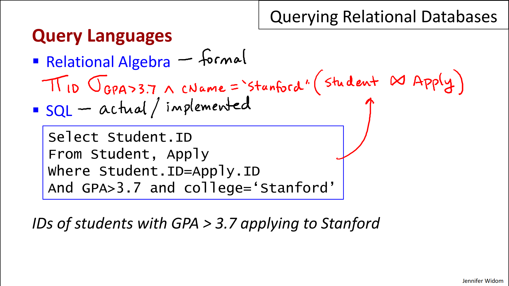{width="2.9843755468066493in"
            > height="1.6749912510936134in"}

    -   Now, here\'s the **same query in SQL**:

        -   And this is something that you would actually run on a
            > deployed database system, and the SQL query is, in fact,
            > **directly equivalent to the relational algebra query**.

-   Now, pedagogically, I would highly recommend that you learn the
    > relational algebra by watching the relational algebra videos
    > before you move on to the SQL videos, but I\'m not going to
    > absolutely require that. So, if you\'re in a big hurry to learn
    > SQL right away you may move ahead to the SQL videos. If you\'re
    > interested in the formal foundations and a deeper understanding, I
    > recommend moving next to the relational algebra video.

3.1 Well-formed XML
===================

Terminology
-----------

-   XML can be thought of as a *[data model]{.underline}*, an
    > *[alternative to the relational model]{.underline}*, for
    > structuring data.

-   The full name of XML is the **extensible markup language**.

-   XML is a *[standard for data representation and
    > exchange,]{.underline}* and it was *[designed initially for
    > exchanging information on the Internet.]{.underline}*

-   XML can be thought of as a *[document format similar to
    > HTML]{.underline}*, if you\'re familiar with HTML. Most people
    > are. The big *[difference]{.underline}* is that the *[tags in an
    > XML document describe the **content** of the data rather than how
    > to format the data]{.underline}*, which is what the tags in HTML
    > tend to represent.

-   XML also has a *[streaming format]{.underline}* or a *[streaming
    > standard]{.underline}*, and that\'s typically **for the use of XML
    > in programs**, for admitting XML and consuming XML.

-   3.1 xml part 1 ab 1:00 schauen

-   So that\'s what **elements** consist of, an **opening tag**,
    > **text** or other **sub-elements** and a **closing tag**.

-   In addition we have have **attributes**: so each element may have
    > within its opening tag a set of attributes and an attribute
    > consists of an **attribute name**, the equal sign and then an
    > **attribute value**

    -   *[any element can have any number of attributes]{.underline}* as
        > long as the attribute *[names are unique]{.underline}*

-   And finally, the third component of XML is the **text**: So, within
    > elements, we can have **strings** (eg. titles, remarks, ...). If
    > you think of XML as a tree, the *[strings form the leaf elements
    > of the tree]{.underline}*

Comparing the relational model against XML
------------------------------------------

-   **Why knowing the differences is important**: in many cases when
    > designing an application that\'s dealing with data you might have
    > to make a decision whether you want to use a relational database
    > or whether you want to store the data in XML.

-   *[structure of the data]{.underline}* itself:

    -   the structure in a *[relational model]{.underline}* is basically
        > a **set of tables**. So we define the set of columns and we
        > have a set of rows.

    -   *[XML]{.underline}* is generally, again it\'s usually in a
        > document or a string format, but if you think about the
        > structure itself, the structure is hierarchical. The nested
        > elements induce a **hierarchy** or a **tree**.

        -   **Note**: There are constructs that actually allow us to
            > have links within documents and so, you can also have XML
            > representing a **graph** though, in general, it\'s mostly
            > thought of as a tree structure.

-   *[schemas]{.underline}*:

    -   In the *[relational model]{.underline}* the schema is very
        > important. You **fix your schema in advance**, when you design
        > your database, and them you add the data to conform to the
        > schema.

    -   in *[XML]{.underline}*, you have a lot more flexibility. So the
        > schema is flexible. In fact, a lot of people refer to XML as
        > **self-describing**. In other words, the schema and the data
        > kind of mixed together. The **tags** on elements are **telling
        > you the kind of data** you\'ll have, and you can have a lot of
        > irregularity.

        -   **Note**: there are many mechanisms for introducing schemas
            > into XML but they\'re not required.

    -   In the *[relational model]{.underline}* schemas are *[absolutely
        > required]{.underline}*. In *[XML]{.underline}* they\'re more
        > *[optional]{.underline}*.

-   *[attributes (XML) vs columns (relational model)]{.underline}*:

    -   In *[XML]{.underline}*, it\'s perfectly acceptable to have some
        > attributes for some elements and those **attributes don\'t
        > appear** in other elements

    -   in the *[relational model]{.underline}*, we would have to have a
        > column for addition, and we have one for every book. Although
        > of course we could have **null** editions for some books.

    -   related to this: **Having different numbers of things** is
        > perfectly standard in XML (eg number of authors. So this first
        > book has two authors. The second book - you can\'t see them
        > all, but it has three authors)

-   *[how this data is queried]{.underline}*:

    -   So for the *[relational model]{.underline}*, we have
        > **relational algebra**. We have **SQL**. These are pretty
        > simple, nice languages, I would say.

    -   *[XML]{.underline}* querying is a little trickier. Now, one of
        > the factors here is that XML is a lot newer than the
        > relational model and querying XML is still settling down to
        > some extent. But I\'m just gonna say, it\'s a little less
        > \[simple\]

-   *[ordering]{.underline}*:

    -   So the *[relational model]{.underline}* is fundamentally an
        > **unordered model** and that can actually be considered a bad
        > thing to some extent. Sometimes in data applications it\'s
        > nice to have ordering.

        -   **Note**: We learned the "**ORDER BY" clause** in SQL and
            > that\'s a way **to get order** in query results. But
            > fundamentally, the data in our table, in our relationship
            > database, is a **set of data, without an ordering within
            > that set**.

    -   in *[XML]{.underline}* we do have, I would say, an **implied
        > ordering**. So XML, as I said, can be thought of as either a
        > document model or a stream model. In either case, just the
        > nature of the XML **being laid out in a document** as we have
        > here or **being in a stream** **[induces an
        > order]{.underline}**.

    -   Example:

        -   Very specifically, let\'s take a look at the authors here.
            > So here we have two authors, and these authors are in an
            > order in the document. If we put those authors **in a
            > relational database**, there would be **no order**. They
            > could come out in either order unless we did a ORDER BY
            > clause in our query, whereas **in XML**, implied by the
            > document structure **is an order**. And there\'s an order
            > between these two books as well. Sometimes that order is
            > meaningful; sometimes it\'s not. But it is available to be
            > used in an application.

-   *[implementation]{.underline}*:

    -   **Native**: As I mentioned in earlier videos, the *[relational
        > model]{.underline}* has been around for as least 35 years, and
        > **the systems that implement it** have been around almost as
        > long. They\'re **very mature** systems. They implement the
        > relational model as the native model of the systems and
        > they\'re **widely used**.

    -   **Add-on**: Things with *[XML]{.underline}* are a little bit
        > different, partly again because XML hasn\'t been around as
        > long. But what\'s happening right now in terms of XML and
        > conventional database systems is **XML is typically an
        > add-on**. So in most systems, **XML will be a layer over the
        > relational database system**.

        -   You can enter **data** in XML; you can **query** data in
            > XML. It will be **translated to a relational
            > implementation**. That\'s not necessarily a bad thing. And
            > it does allow you to combine relational data and XML in a
            > single system, sometimes even in a single query, but it\'s
            > not the native model of the system itself.

Well-formed definition
----------------------

-   An XML document or an XML stream is considered **well-formed** if it
    > adheres to the basic structural requirements of XML:

    -   *[single root element]{.underline}* (eg. "bookstore")

    -   all of our *[tags are matching]{.underline}*, we don\'t have
        > open tags without closed tags;

    -   our *[tags are properly nested]{.underline}*, so we don\'t have
        > interleaving (Verschachtelung) of elements.

    -   within each element if we have *[attribute names]{.underline}*,
        > they\'re *[unique]{.underline}*.

-   In order to *[test whether a document is well-formed]{.underline}*,
    > and specifically *[to access the components of the document **in a
    > program**]{.underline}*, we have what\'s called an **XML parser**
    > (s. [[Link]{.underline}](#6hu1o1xf15e0))

    -   So, we\'ll take an XML document here, and we\'ll feed it to an
        > XML parser (s. [[Link]{.underline}](#6hu1o1xf15e0)), and the
        > parser will check the basic structure of the document, just to
        > make sure that everything is okay. If the document doesn\'t
        > adhere to these three requirements up here, the *[parser will
        > just send an error saying it\'s not well-formed]{.underline}*.
        > *[If the document does adhere to the structure]{.underline}*,
        > then what comes out is **parsed XML**. And, there\'s various
        > **standards for how we show (genauer:** accessing and
        > manipulating**) parsed XML**:

        -   **document object model**, or **DOM**; it\'s a
            > *[programmatic interface]{.underline}* for sort of
            > *[traversing the tree]{.underline}* that\'s implied by
            > XML.

            -   Wiki: The **Document Object Model** (**DOM**) is a
                > [[cross-platform]{.underline}](https://en.wikipedia.org/wiki/Cross-platform)
                > and
                > [[language-independent]{.underline}](https://en.wikipedia.org/wiki/Language-independent_specification)
                > interface that treats an
                > [[XML]{.underline}](https://en.wikipedia.org/wiki/XML)
                > or
                > [[HTML]{.underline}](https://en.wikipedia.org/wiki/HTML)
                > document as a [[tree
                > structure]{.underline}](https://en.wikipedia.org/wiki/Tree_structure)
                > wherein each
                > [[node]{.underline}](https://en.wikipedia.org/wiki/Node_(computer_science))
                > is an
                > [[object]{.underline}](https://en.wikipedia.org/wiki/Object_(computer_science))
                > representing a part of the document.

                -   The DOM represents a document with a logical tree.
                    > Each branch of the tree ends in a node, and each
                    > node contains objects.

                -   DOM methods allow programmatic access to the tree;
                    > with them one can change the structure, style or
                    > content of a document.

                -   Nodes can have [[event
                    > handlers]{.underline}](https://en.wikipedia.org/wiki/Event_handler)
                    > attached to them. Once an event is triggered, the
                    > event handlers get executed.

            -   What is *[the DOM]{.underline}* ?
                > [[https://www.w3schools.com/xml/xml\_dom.asp]{.underline}](https://www.w3schools.com/xml/xml_dom.asp)

                -   The DOM defines a standard for accessing and
                    > manipulating documents:

                    -   *\"The W3C Document Object Model (DOM) is a
                        > platform and language-neutral interface that
                        > allows programs and scripts to dynamically
                        > access and update the content, structure, and
                        > style of a document.\"*

                -   The HTML DOM defines a standard way for accessing
                    > and manipulating HTML documents. It presents an
                    > HTML document as a tree-structure.

                -   The XML DOM defines a standard way for accessing and
                    > manipulating XML documents. It presents an XML
                    > document as a tree-structure.

            -   What is *[the XML Parser]{.underline}* ?
                > [[https://www.w3schools.com/xml/xml\_parser.asp]{.underline}](https://www.w3schools.com/xml/xml_parser.asp)

                -   The [[XML DOM (Document Object
                    > Model)]{.underline}](https://www.w3schools.com/xml/dom_intro.asp)
                    > defines the properties and methods for accessing
                    > and editing XML. However, before an **XML
                    > document** can be accessed, it must be **loaded
                    > into** an XML **DOM object**.

                -   All modern browsers have a built-in XML parser that
                    > can convert text into an XML DOM object.

            -   s\. auch Bsp auf den beiden Webseiten

        -   **SAX**. That\'s a more of a *[stream model]{.underline}*
            > for XML.

            -   Wiki: **SAX** (**Simple API for XML**) is an
                > [[event-driven]{.underline}](https://en.wikipedia.org/wiki/Event-driven_programming)
                > [[online
                > algorithm]{.underline}](https://en.wikipedia.org/wiki/Online_algorithm)
                > for
                > [[parsing]{.underline}](https://en.wikipedia.org/wiki/Parsing)
                > [[XML]{.underline}](https://en.wikipedia.org/wiki/XML)
                > documents, with an
                > [[API]{.underline}](https://en.wikipedia.org/wiki/Application_programming_interface)
                > developed by the XML-DEV mailing list.

                -   SAX provides a mechanism for reading data from an
                    > XML document that is an alternative to that
                    > provided by the [[Document Object
                    > Model]{.underline}](https://en.wikipedia.org/wiki/Document_Object_Model)
                    > (DOM).

                -   Where the DOM operates on the document as a
                    > whole---building the full [[abstract syntax
                    > tree]{.underline}](https://en.wikipedia.org/wiki/Abstract_syntax_tree)
                    > of an XML document for convenience of the
                    > user---SAX parsers operate on each piece of the
                    > XML document sequentially, issuing parsing events
                    > while making a single pass through the input
                    > stream.

    -   So these are the ways in which a program would access the parsed
        > XML when it comes out of the parser

How we display XML
------------------

-   one way to display XML is *[just as we see it here]{.underline}*,
    > but very often we want to format the data that\'s in an XML
    > document or an XML string in a more intuitive way.

-   What we can do is use a rule-based language to take the XML and
    > *[translate it automatically to HTML]{.underline}*, which we can
    > then render in a browser. A couple of popular languages are
    > **cascading style sheets** known as **CSS** or the **extensible
    > style sheet** language known as **XSL**.

    -   We\'re going to look a little bit with XSL on a later video in
        > the context of query in XML. We won\'t be covering CSS in this
        > course.

### CSS and XSL (basic idea)

-   But let\'s just understand how these languages are used, what the
    > basic structure is.

-   **[the rules]{.underline}**: So the idea is that we have an XML
    > document and then we send it to an interpreter of CSS or XSL, but
    > we also have to have *[the rules that we\'re going to use on that
    > particular document]{.underline}*. And the rules are going to do
    > things like *[match patterns]{.underline}* or *[add extra
    > commands]{.underline}* and once we send an XML document through
    > the interpreter we\'ll get an HTML document out and then we can
    > render that document in the browser.

    -   **Note**: we\'ll also check with the parser to make sure that
        > the document is well formed as well before we translate it to
        > HTML.

Conclusion
----------

-   XML is a *[standard for data representation and
    > exchange]{.underline}*.

-   It can also be thought of as a *[data model]{.underline}*. Sort of a
    > *[competitor to the relational model]{.underline}* for structuring
    > the data in one\'s application.

    -   It generally has *[a lot more flexibility than the relational
        > model]{.underline}*, which can be a plus and a minus,
        > actually.

3.2 DTDs, IDs & IDREFs
======================

Terminology
-----------

-   **Valid XML** has to adhere to the same basic structural
    > requirements as well-formed XML, but it also adheres to **content
    > specific specifications**. And we\'re going to learn two
    > **languages for those specifications**.

    -   **Document Type Descriptors** or **DTDs**

    -   **XML schema**

        -   Specifications in XML schema are known as **XSDs** or **XML
            > Schema Descriptions**

-   So as a reminder, here\'s how things worked with *[well-formed XML
    > documents]{.underline}*. We sent the document to a parser and the
    > parser would either return that the document was **not
    > well-formed** or it would return **parsed XML**.
    > 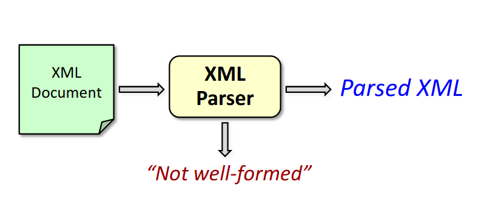{width="4.136640419947507in"
    > height="1.8274311023622047in"}

-   Now let\'s consider what happens with *[valid XML]{.underline}*. Now
    > we use a validating XML parser, and we have an **additional
    > input** to the process, which is **a specification**, either a
    > **DTD** or an **XSD**. So that\'s also fed to the parser, along
    > with the document.

    -   The parser can again say the document is **not well formed** if
        > it doesn\'t meet the basic structural requirements.

    -   It could also say that the document is **not valid**, meaning
        > the structure of the document doesn\'t match the content
        > specific specification.

    -   If everything is good, then once again \"**parsed XML**\" is
        > returned.

> 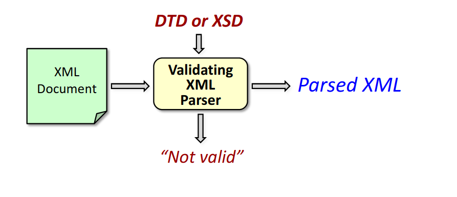{width="4.270082020997376in"
> height="1.85036854768154in"}

-   A *[DTD]{.underline}* is *[a language]{.underline}* that\'s kind of
    > *[like a grammar]{.underline}*, and **what you can specify** in
    > that language is for a particular document

    -   what **elements** you want that document to contain,

    -   the **tags** of the elements,

    -   what **attributes** can be in the elements,

    -   how the different types of elements can be **nested**.

    -   Sometimes the **ordering of the elements** might want to be
        > specified,

    -   and sometimes the **number of occurrences of different
        > elements**.

    -   DTDs also allow the introduction of **special types of
        > attributes**, called **ids** and **idrefs**.

        -   And, effectively, what these allow you to do is **specify
            > pointers within a document**, although these pointers are
            > **untyped**.

Positives and negatives about choosing to use a DTD or an XSD for one\'s XML data
---------------------------------------------------------------------------------

**Why important:** If you\'re building an application that encodes its
data in XML, you\'ll have to decide whether you want the XML to just be
well formed or whether you want to have specifications and require the
XML to be valid to satisfy those specifications.

-   *[positives]{.underline}*:

    -   when you write your program, you can assume that the data
        > adheres to a specific structure. So programs can assume a
        > structure and so the **programs themselves are simpler**
        > because they don\'t have to be doing a lot of error checking
        > on the data. They\'ll know that before the data reaches the
        > program, it\'s been run through a validator and it does
        > satisfy a particular structure.

    -   we talked some time ago about the **cascading style sheet**
        > language and the **extensible style sheet** languages. These
        > are languages that take XML and they run rules on it to
        > process it into a different form, often HTML. When you write
        > those rules, if you note that the data has a certain
        > structure, then those **rules can be simpler**, so like the
        > programs they also can assume particular structure and it
        > makes them simpler.

    -   Now, another use for DTDs or XSDs is **as a specification
        > language** for conveying what XML might need to look like.

        -   example:

            -   if you\'re performing data exchange using XML, maybe a
                > company is going to receive purchase orders in XML,
                > the company can actually use the DTD as a
                > specification for what the XML needs to look like when
                > it arrives at the program it\'s going to operate on
                > it.

    -   Also **documentation**, it can be useful to use one of the
        > specifications to just document what the data itself looks
        > like.

    -   In general, really what we have here is the "**benefits of
        > typing**" [^1]

        -   ie DTDs und XSDs sind quasi **types** (wie int, float, ...)
            > und stellen - wie alle types - eine gewisse Form der Daten
            > sicher[]{#9gu8288dnxzl .anchor}

    -   We\'re talking about **strongly typed data** versus
        > **loosely-typed data**, if you want to think of it that way.
        > [^2]

-   *[negatives]{.underline}* - benefits of not using a DTD:

    -   **flexibility**: So a DTD makes your XML data have to conform to
        > a specification. If you want more flexibility or you want ease
        > of change in the way that the data is formatted without
        > running into a lot of errors, then, if that\'s what you want,
        > then **the DTD can be constraining**.

    -   **messiness:** Another fact is that **DTDs can be "fairly"
        > messy** and this is not going to be obvious to you yet until
        > we get into the demo, but **if the data is irregular, very
        > irregular, then specifying its structure can be hard**,
        > especially for irregular documents. Actually, when we see the
        > schema language, we\'ll discover that **XSDs can be, I would
        > say, "really" messy**, so they can actually get very large.
        > It\'s possible to have a document where the specification of
        > the structure of the document is much, much larger than the
        > document itself, which seems not entirely intuitive, but when
        > we get to learn about XSDs, I think you\'ll see how that can
        > happen.

    -   So, overall, this is the "**benefits of no typing**". It\' s
        > really quite similar to the analogy in programming languages.
        > []{#my7qdc2v408e .anchor}

Example: DTDs
-------------

-   watch 3.2 ab 5:30-Ende

-   merken, was \#PCDATA, EMPTY, \#IMPLIED, CDATA, ID, usw. bedeutet

### Declaring Elements

-   In a DTD, XML elements are declared with the following syntax:

> \<!ELEMENT element-name category\>
>
> or
>
> \<!ELEMENT element-name (element-content)\>

### Empty Elements

-   zu EMPTY:

    -   W3schools: Empty elements are declared with the category keyword
        > EMPTY:

> \<!ELEMENT element-name EMPTY\>
>
> Example:
>
> \<!ELEMENT br EMPTY\>
>
> XML example:
>
> \ 

### Elements with Parsed Character Data

-   zu \#PCDATA:

    -   aus github: \#PCDATA is \[the type\] when you have a leaf that
        > consists of **text data in the XML tree**

    -   vom Quiz: \#PCDATA is not appropriate for the type of an
        > attribute. It is used for the type of **\"leaf\" text**.

    -   W3schools: Elements with only **parsed character data** are
        > declared with \#PCDATA inside parentheses:

> \<!ELEMENT element-name (\#PCDATA)\>
>
> Example:
>
> \<!ELEMENT from (\#PCDATA)\>

ID, IDREF and IDREFS
--------------------

-   zB die "ISBN" eines Buches kann im DTD als **ID-attribute**
    > festgelegt werden mit

> \<!ELEMENT Book (Title, Remark?)\>
>
> \<!ATTLIST Book ISBN ID \#REQUIRED
>
> Price CDATA \#REQUIRED
>
> Authors IDREFS \#REQUIRED\>
>
> und "book" als **IDREF-attribute** mit
>
> \<!ELEMENT BookRef EMPTY\>
>
> \<!ATTLIST BookRef book IDREF \#REQUIRED\>
>
> Dann kann man mit \<BookRef book=\"ISBN-0-13-713526-2\"/\> auf ein
> Buch mit dieser "ISBN" verweisen

-   the *[pointers]{.underline}* when you have a DTD are
    > *[untyped]{.underline}*.

    -   So it does check to make sure that this is **an ID** of another
        > element, but we weren\'t able to specify that it should be **a
        > book element** in our DTD, and since we\'re not able to
        > specify it, of course it\'s not possible to check it.

    -   **in XML schema, we can have typed pointers** but it\'s not
        > possible to have them in DTDs

3.3 XML Schema
==============

-   XML schema is an **extensive** language, very powerful.

-   Like document type descriptors **we can specify**:

    -   the **elements** we want in our XML data,

    -   the **attributes**,

    -   the **nesting** of the elements,

    -   how elements need to be **ordered**,

    -   **number of occurrences of elements**.

    -   In addition \[compared to DTDs\] we can specify

        -   **data types **

        -   we can specify **keys**,

        -   the **pointers** that we can specify **are now typed**

        -   and much, much more.

-   Now, **one difference between XML schema and DTDs** is that *[the
    > specifications in XML schemas]{.underline}* called **XSD**\'s are
    > actually **written in the xml language** itself.

    -   That can be useful for example if we have a browser that nicely
        > renders the XML.

-   watch ab 1:26

-   So, the other thing I want to mention is that right now we have the
    > XML schema descriptor in one file and the XML in another. You
    > might remember for the DTD, we simply placed the DTDs
    > specification at the top of the file with the XML. **For DTDs you
    > can do it either way** in the same file or in a separate file.
    > **For XSDs, we always put those in a separate file.**

-   Also notice that the **XSD itself is in XML**. It is using **special
    > tags**. These are **tags that are part of the XSD language**, but
    > we are **still expressing it in XML**.

-   So we have two XML files, the data file and the schema file. **To
    > validate the data file against the schema file**, we can use again
    > the **xmllint** feature.

-   four *[features]{.underline}* of XML schema *[that aren\'t present
    > in DTD\'s]{.underline}*.

    -   One of them is **typed values.** (zB attribute "Price=" muss
        > einen **int** value haben)

    -   One of them is **key declarations**. Similar to IDs but a little
        > bit more powerful.

-   **Was meint sie mit** "When we did something similar with DTDs we
    > got an error because in DTDs, IDs have be globally unique. Here we
    > should not get an error. HG should be a perfectly reasonable key
    > for books because we don\'t have another value that\'s the same.
    > And in fact it does validate."

    -   **benutzt man DTDs** kann man im .xml nicht ISBN="HG" und
        > gleichzeitig Ident="HG" festlegen, weil jeder key **value**
        > (hier: "HG") nur einmal vorkommen darf, auch wenn die keys
        > unterschiedliche **Namen** haben (die Namen hier: ISBN, Ident)
        > =\> dh. die keys dürfen **GLOBAL** nur einmal vorkommen

    -   **benutzt man XSDs** geht das !

    -   One is **references** which are again similar to pointers But a
        > little more powerful (sind sozusagen "typed" pointers)

<!-- -->

-   one of the reference types that we\'ve defined in our DTD is a
    > pointer to authors that we\'re using in our books. Specifically,
    > we want to specify that this attribute here, the "authIdent", has
    > a value that is a key **for the author elements**. And we want to
    > make sure it\'s author elements that its pointing to **and not
    > other types** of elements. Dies kann man über **XPath** mit
    > "keyref" machen (in späteren videos):

> \<xsd:keyref name=\"AuthorKeyRef\" refer=\"AuthorKey\"\>
>
> \<xsd:selector xpath=\"Book/Authors/Auth\" /\>
>
> \<xsd:field xpath=\"\@authIdent\" /\>
>
> \</xsd:keyref\>
>
> what it says is that when we navigate in the document down to one of
> these "Auth" elements, within that "Auth" element, the "authIdent"
> attribute is a reference to what we have already defined as author
> keys (hier: "HG", "JU", "JW").
>
> Analoges Bsp. für "Books":
>
> \<xsd:keyref name=\"BookKeyRef\" refer=\"BookKey\"\>
>
> \<xsd:selector xpath=\"Book/Remark/BookRef\" /\>
>
> \<xsd:field xpath=\"\@book\" /\>
>
> \</xsd:keyref\>

-   and finally **occurrence constraints**.

> 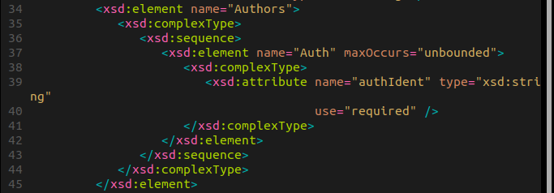{width="4.848958880139983in"
> height="1.6865944881889763in"}
>
> wenn "minOccurs=" oder "maxOccurs=" nicht angegeben wird, ist es **per
> default gleich 1 !**

-   wdh. XML Quiz !

-   lerne regexp basics !

4.1 JSON
========

-   Like XML, JSON can be thought of as **a data model**. An alternative
    > to the relational data model that is more appropriate **for
    > semi-structured data**.

-   JSON is by a large margin the newest \[of the three data models:
    > relational model, XML and JSON\]

-   **there aren\'t as many tools for JSON** as we have for XML and
    > certainly not as we have for relational.

-   JSON stands for **Javascript object notation**. Although it\'s
    > evolved to become **pretty much independent of Javascript at this
    > point**.

-   The little snippet of JSON in the corner right, now mostly for
    > decoration. We\'ll talk about the details in just a minute.

-   JSON was **designed originally for what\'s called serializing data
    > objects**. That is taking the objects that are in a program and
    > sort of writing them down in a serial fashion, typically in files.

-   one thing about JSON is that

    -   it is **human readable**, similar to the way xml is human
        > readable and

    -   is **often used for data interchange**. So, for writing out, say
        > the objects program so that they can be exchanged with another
        > program and read into that one.

-   Also, just more generally, because JSON is **not as rigid as the
    > relational model**, it\'s generally **useful for representing and
    > for storing data that doesn\'t have rigid structure** that we\'ve
    > been calling **semi-structured data**.

-   As I mentioned, JSON is **no longer closely tied to JavaScript**

    -   Many different programming languages do have parsers for reading
        > JSON data into the program and for writing out JSON data as
        > well.

-   Now, let\'s talk about the **basic constructs in JSON**, and as we
    > will see this constructs are **recursively defined**.

-   I. The **basic atomic values** (=**Base values**) in JSON are fairly
    > typical:

    -   We have **numbers**,

    -   we have **strings**.

    -   We also have **Boolean Values** although there are none of those
        > in this example, that\'s true and false, and no values.

-   II\. There are two types of **composite values** in JSON:

    -   1\. **Objects** are **enclosed in curly braces and they consist of sets
        > of label-value pairs**.

        -   For example, we have an object here that has a first name
            > and a last name. We have a more - bigger, let\'s say,
            > object here that has ISBN, price, edition, and so on.

    -   2\. the second type of composite value in JSON is **arrays**, and arrays
        > are **enclosed in square brackets with commas between the array
        > elements**. Actually, we have commas in the objects, as well, and
        > **arrays are lists of values**.

        -   For example, we can see here that authors is a list of
            > author objects.

-   Now I mentioned that the **constructs are recursive**, specifically

    -   the **values inside arrays can be anything**, they can be other
        > arrays or objects, base values and the values are making up
        > the label-value pairs

    -   and **objects can also be any composite value or a base value**.

-   And I did want to mention, by the way, that sometimes this word
    > "**label**" in "**label**-value pairs" is called a
    > \"**property**\".

-   So, just like XML, JSON has some basic structural requirements in
    > its format but it **doesn\'t have a lot of requirements in terms
    > of uniformity**. We have a couple of examples of **heterogeneity**
    > in here, for example,

    -   this book has an edition and the other one doesn\'t.

    -   This book has a remark and the other one doesn\'t.

    -   But we\'ll see many more examples of heterogeneity when we do
        > the demo and look into JSON data in more detail.

-   Now let\'s **compare JSON and the relational model**.

    -   We will see that many of the comparisons are fairly similar to
        > when we compared **XML** to the **relational model**.

    -   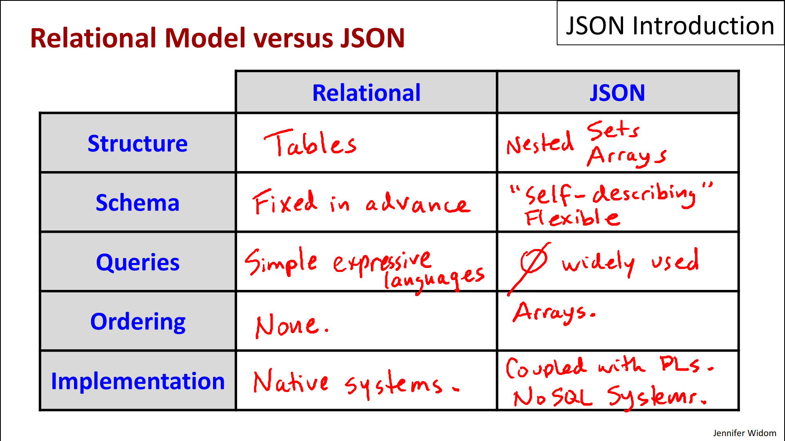{width="3.713542213473316in"
        > height="2.0911800087489065in"}

-   Let\'s start with the **basic structures** underlying the data
    > model.

    -   So, the **relational model** is based on **tables**. We set up
        > structure of table, a set of columns, and then the data
        > becomes rows in those tables.

    -   **JSON** is based instead on sets, the **sets of label pairs and
        > arrays** and as we saw, they can be nested.

-   One of the big differences between the two models, of course, is the
    > **schema**.

    -   So the Relational model has a **Schema fixed in advance**, you
        > set it up before you have any data loaded and then all data
        > needs to conform to that Schema.

    -   JSON on the other hand typically **does not require a schema**
        > in advance. In fact, the **schema and the data are kinda mixed
        > together** just like in XML, and this is often referred to as
        > **self-describing data**, where the **schema elements are
        > within the data itself**. And this is of course typically more
        > flexible than the relational model. But there are advantages
        > to having a schema as well, definitely.

-   As far as **queries** go,

    -   one of the nice features of the relational model is that there
        > are **simple, expressive languages for querying** the
        > database.

    -   In terms of JSON, although a few things have been proposed; at
        > this point **there\'s nothing widely used for querying JSON
        > data**. Typically JSON data is read into a program and it\'s
        > manipulated programmatically.

        -   Now let me interject that this video is being made in
            > February 2012. So it is possible that some JSON query
            > languages will emerge and become widely used. There is
            > just nothing used at this point. There are some proposals:
            > There\'s

            -   a **JSON path** language,

            -   **JSON Query**,

            -   a language called **JAQL**.

        -   It may be that just like XML, the query language are gonna
            > follow the prevalent use of the data format or the data
            > model. But that does not happened yet, as of
            > February 2012.

-   How about **ordering**?

    -   One aspect of the relational model is that it\'s an **unordered
        > model**. It\'s **based on sets** and if we want to see
        > relational data in sorted order then we put that inside a
        > query.

    -   In JSON, we have arrays as one of the basic data structures, and
        > **arrays are ordered**. Like XML, JSON data is usually written
        > to files and **files themselves are naturally ordered**, **but
        > the ordering** of data in files usually **isn\'t relevant**,
        > sometimes it is, but typically not.

-   Finally, in terms of **implementation**,

    -   for the relational model, **there are systems that implement the
        > relational model natively**. They\'re very mature, generally
        > quite efficient and powerful systems.

    -   For JSON, **we [haven\'t]{.underline} yet seen stand alone
        > database systems that use JSON as their data model** instead
        > JSON is more typically coupled with programming languages.

        -   One thing I should add however JSON is **used in NoSQL
            > systems**. We do have videos about NoSQL systems you may
            > or may not have watched those yet. There\'s a couple of
            > different ways that JSON is used in those systems:

            -   One of them is just **as a format** for reading data
                > into the systems and writing data out from the
                > systems.

            -   The other way that it is used is that some of the NoSQL
                > systems are what are called \"**Document Management
                > Systems**\" where the **documents themselves may
                > contain JSON data** and then the systems will have
                > special features for manipulating the JSON in the
                > documents that are stored by the system.

JSON vs XML
-----------

-   Now let\'s compare JSON and XML. This is actually a **hotly
    > debated** comparison right now. There is **significant overlap in
    > the uses of JSON and XML**. **Both of them are very good for
    > putting semi-structured data into a file format and using it for
    > data interchange**. And so because there\'s so much overlap in
    > what they\'re used for, it\'s not surprising that there\'s
    > significant debate.

-   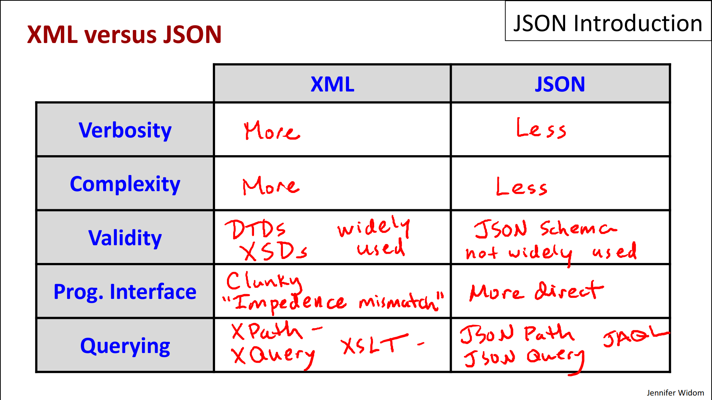{width="4.328125546806649in"
    > height="2.437265966754156in"}

-   Let\'s start by looking at the **verbosity** of expressing data in
    > the two languages.

    -   So it is the case that **XML is in general, a little more
        > verbose than JSON**. So the same data expressed in the 2
        > formats will tend to have more characters in XML than JSON and
        > you can see that in our examples because our big JSON example
        > was actually pretty much the same data that we used when we
        > showed XML. And the **reason** for XML being a bit more
        > verbose largely has to do actually with **closing tags**, and
        > some other features. But I\'ll let you judge for yourself
        > whether the somewhat longer expression of XML is a problem.

-   Second is **complexity**,

    -   most people would say that **XML is a bit more complex than
        > JSON**. I\'m not sure I entirely agree with that comparison.

        -   If you look at the subset of XML that people really use,
            > you\'ve got attributes, sub elements and text, and that\'s
            > more or less it.

        -   If you look at Json, you got your basic values and you\'ve
            > got your objects and your arrays.

    -   I think the issue is that XML has a lot of extra stuff that goes
        > along with it. So, **if you read the entire XML specification,
        > it will take you a long time. **

    -   **JSON, you can grasp the entire specification a little bit more
        > quickly**.

-   Now let\'s turn to **validity**. And by validity I mean the ability
    > to specify constraints or restriction or schema on the structure
    > of data in one of these models, and have it enforced by tools or
    > by a system.

    -   Specifically in XML we have the notion of **document type
        > descriptors**, or **DTDs**, we also have **XML Schema** which
        > gives us **XSD\'s**, **XML Schema Descriptors**. And these are
        > schema like things that we can specify, and we can have our
        > data checked to make sure it conforms to the schema,

        -   and these are, I would say, **fairly widely used** at this
            > point for XML.

    -   For JSON, there\'s something called **JSON Schema**. And, you
        > know, similar to XML Schema, it\'s a way to specify the
        > structure and then we can check that JSON conforms to that and
        > we will see some of that in our demo.

        -   The current status, February 2012 is that **this is not
            > widely used at this point**. But again, it could really
            > just be evolution. If we look back at XML, as it was
            > originally proposed, probably we didn\'t see a whole of
            > lot of use of DTDs, and in fact not as XSDs for sure until
            > later on. So we\'ll just have to see whether JSON evolves
            > in a similar way.

-   Now the **programming interface** is where JSON really shines.

    -   The programming interface for XML can be **fairly clunky**. The
        > XML model, the attributes and sub-elements and so on, **don\'t
        > typically match the model of data inside a programming
        > language**. In fact, that\'s something called the **impedance
        > mismatch**:

        -   \[impedance mismatch in **relational database** systems:\]
            > The impedance mismatch has been discussed in database
            > systems actually for decades because one of the original
            > criticisms of relational database systems is that the data
            > structures used in the database, specifically **tables,
            > didn\'t match directly with the data structures in
            > programming languages**. So there had to be some
            > manipulation at the interface between programming
            > languages and the database system.

        -   \[impedance mismatch in **XML** systems:\] So that same
            > impedance mismatch is pretty much present in XML where in
            > **JSON is really a more direct mapping between many
            > programming languages and the structures of JSON**.

-   Finally, let\'s talk about **querying**.

    -   for XML we do have **XPath**, we have **XQuery**, we have
        > **XSLT**. Maybe **not all of them are widely used** but
        > there\'s no question that XPath at least and XSL are used
        > quite a bit.

    -   I\'ve already touched on this a bit, but JSON **does not have
        > any mature, widely used query languages at this point**.

        -   There is a proposal called **JSON path**. It looks actually
            > quite a lot like XPath. Maybe it\'ll catch on.

        -   There\'s something called **JSON Query**. Doesn\'t look so
            > much like XML Query, I mean, XQuery.

        -   and finally, there has been a proposal called **JAQL** for
            > the **JSON query language**,

        -   but again as of February 2012 all of these are still very
            > early, so we just don\'t know what\'s going to catch on.

Valid JSON
----------

### Syntactically

-   So now let\'s talk about the **validity** of JSON data. JSON data
    > that\'s **syntactically valid**, simply needs to adhere to the
    > **basic structural requirements**.

-   As a reminder, that would be that we have sets of label value pairs,
    > we have arrays of values and our base values are from predefined
    > types. And again, these values here are defined recursively. So we
    > start with a JSON file and we send it to a **parser**, the parser
    > may determine that the file has syntactic errors or if the file is
    > syntactically correct then it can be parsed into objects in a
    > programming language.

### Semantically

-   Now if we\'re interested in **semantically valid** JSON; that is
    > **JSON that conforms to some constraints or a schema**, then

    -   in addition to checking the basics structural requirements,

    -   we check whether JSON conforms to the specified schema.

-   If we use a language like **JSON schema** for example, we put a
    > specification in as a separate file, and in fact **JSON schema is
    > expressed in JSON itself**, as we\'ll see in our demo, we send it
    > to a **validator** and that validator might find that there are
    > some **syntactic errors** or it may find that there are some
    > **semantic errors** so the data could be correct syntactically but
    > not conform to the schema. If it\'s both syntactically and
    > semantically correct then it can move on to the parser where it
    > will be parsed again into objects in a programming language.

Summary
-------

-   So **to summarize**, JSON stands for Javascript Object Notation.
    > It\'s a standard for taking data objects and serializing them into
    > a format that\'s human readable. It\'s also very useful for
    > exchanging data between programs, and for representing and storing
    > semi-structured data in a flexible fashion.

-   In the **next video** we\'ll go live with a demonstration of JSON.
    > We\'ll use a couple of JSON editors, we\'ll take a look at the
    > structure of JSON data, when it\'s syntactically correct. We\'ll
    > demonstrate how it\'s very flexible when our data might be
    > irregular, and we\'ll also demonstrate schema checking using an
    > example of JSON\'s schema.

4.2 Demo
========

5.1 Relational Algebra 1
========================

-   So let\'s talk about, say, doing the **cross products** of students
    > and apply. So if we do this cross products, just to save drawing,
    > I\'m just gonna **glue these two relations together** here. So if
    > we do the cross product we\'ll get at the result a big relation,
    > here, which is going to have eight attributes (4 + 4, dh
    > **dieselben** 4 Spalten einfach "**aneinandergeschoben**")

    -   aber Ergebnis hat mehr Zeilen, s. [[nächster
        > Punkt]{.underline}](#isk5wwmds2ae)

-   Now let\'s talk about the contents of these. So let\'s suppose that
    > the student relation had **S** tuples (=Reihen) in it, while the
    > apply had **A** tuples (=Reihen) in it, the **result** of the
    > **Cartesian products (= cross products)** is gonna have **S times
    > A tuples** (=Reihen), is going to have one tuple (=Reihe) for
    > every combination of tuples (=Reihen) from the student relation
    > and the apply relation.

-   Now, the cross-product seems like it might not be that helpful, but
    > what is interesting is when we use the cross-product together with
    > other operators:

    -   **Example**: "Let\'s suppose that we want to get the names and
        > GPAs of students with a high school size greater than a
        > thousand who applied to CS and were rejected."

    -   {width="4.901042213473316in"
        > height="2.2223687664041996in"}

-   relational algebra includes an operator called the **natural join**
    > that is used to combine tuples s.t. we get meaningful combinations
    > of tuples. What the natural join does is, it performs a
    > **cross-product**, but then it **enforces equality on all of the
    > attributes with the same name**. In addition it gets rid of these
    > pesky attributes that have the same names (ie. it **removes the
    > duplicate columns**).

    -   The natural join operator is written using a **bow tie**,
        > that\'s just the convention. You will find that in your text
        > editing programs if you look carefully.

    -   **Example**:

        -   1\. the example from above

        -   2\. Now let\'s add one more complication to our query. Let\'s suppose
            > that we\'re only interested in applications to colleges where the
            > enrollment is greater than 20,000.

            -   Now, technically, the natural join is a **binary
                > operator**, people often use it without parentheses
                > because it\'s **associative**, but if we get pedantic
                > about it we could add that and then we\'re in good
                > shape.

    -   The natural join actually **does not add any expressive power**
        > to relational algebra, \[\...\] but it is very convenient
        > notationally.

        -   We can **rewrite the natural join** without \[the natural
            > join\] using the cross-product:

            -   first expression E1 union the schema of the second
                > expression E2 (That\'s a **real union**, so that means
                > if we have two copies we just keep one of them.) Over
                > the selection of - now we\'re going to set all the
                > shared attributes of the first expression to be equal
                > to the shared attributes of the second - I\'ll just
                > write E1.A1 equals E2.A1 and E1.A2 equals E2.A2. Now
                > these are the cases where, again, the attributes have
                > the same names, and so on. So we\'re setting all those
                > equal, and that is applied over E1 cross-product E2.

> 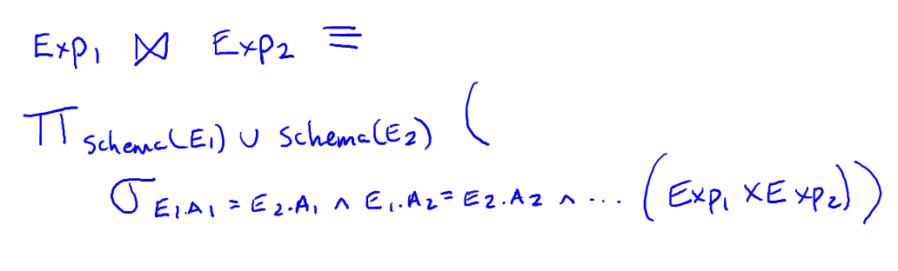{width="4.238523622047244in"
> height="1.2743733595800526in"}

-   **theta join operator**:

    -   Like natural join, theta join is actually an abbreviation that
        > **doesn\'t add expressive power** to the language.

    -   The theta join operator takes two expressions and combines them
        > with the bow tie looking operator, but **with a subscript
        > theta**.

> 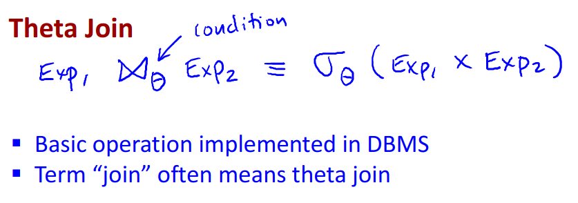{width="4.453125546806649in"
> height="1.568209755030621in"}

-   That **theta is a condition**. It\'s a condition in the style of the
    > condition in the selection operator.

-   It\'s **equivalent to** applying the theta condition to the
    > cross-product of the two expressions.

-   So you might wonder why I even mention the theta join operator, and
    > the reason I mention it is that **most DBMS** implement the theta
    > join as their **basic operation for combining relations**.

-   So the basic operation is take two relations, combine all tuples,
    > but then only keep the combinations that pass the theta condition.

-   Often when you talk to people who build database systems or use
    > databases, when they use **the word join**, they really mean the
    > theta join.

<!-- -->

-   So, in conclusion, **relational algebra** is a **formal language**.
    > It operates on sets of relations and produces relations as a
    > result.

    -   The simplest query is just the name of a relation and then
        > operators are used to filter relations, slice them, and
        > combine them.

    -   So far, we\'ve learned:

        -   the select operator for selecting rows;

        -   the project operator for selecting columns;

        -   the cross-product operator for combining every possible pair
            > of tuples from two relations;

        -   and then two **abbreviations**, the **natural join**, which
            > a very useful way to combine relations by enforcing a
            > equality on certain columns; and the **theta join**
            > operator.

5.2 Relational Algebra 2
========================

-   bei natural join kommen in der result relation nur die Reihen vor,
    > für die es in den beiden gejointen relations matches gab, **der
    > Rest fällt weg** (vgl.
    > [[https://www.geeksforgeeks.org/extended-operators-in-relational-algebra/]{.underline}](https://www.geeksforgeeks.org/extended-operators-in-relational-algebra/)
    > unter natural join)

    -   im Video beim Bsp. zum "Difference operator": beim natural join
        > fallen alle Reihen der "Student" relation weg, deren sID nicht
        > auch in der Differenz vorkommt

-   This video will cover

    -   set operators,

        -   union

        -   difference

        -   intersection,

    -   the renaming operator, and

    -   different notations for expressions of relational algebra.

-   Just as a reminder, we **apply** a relational algebra **query or
    > expression** **to a set of relations** and we get as a result of
    > that expression **a relation as our answer**.

-   The first of three set operators is the **union operator**, and
    > **it\'s a standard set union** that you learned about in
    > elementary school.

    -   Let\'s suppose, for example, that we want "a list of the college
        > and student names in our database". So we just want those as a
        > list. For example, we might want Stanford and Susan and
        > Cornell and Mary and John and so on.

        -   Now you might think we can generate this list by using one
            > of the operators we\'ve already learned for combining
            > information from multiple relations, such as the
            > cross-product operator or the natural join operator. The
            > problem with those operators is that they kind of combine
            > information from multiple relations horizontally. They
            > might take a tuple T1 from one relation and tuple T2 from
            > the other and kind of match them. But that\'s not what we
            > want to do here. We want to **combine the information
            > vertically** to create our list. And to do that we\'re
            > going to use the union operator.

        -   So in order to get a list of the college names and the
            > student names, we\'ll project the college name from the
            > college relation. That gives us a list of college names.
            > We\'ll similarly project the student name from the student
            > relation, and we\'ve got those two lists and we\'ll just
            > apply the union operator between them and that will give
            > us our result. Now, technically, in relational algebra
            > **in order to union two lists they have to have the same
            > schema**, that means that same attribute name and these
            > don\'t, but we\'ll correct that later (→rename operator).
            > For now, you get the basic idea of the union operator.
            > 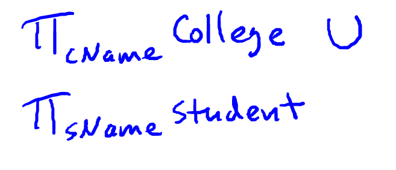{width="2.3802088801399823in"
            > height="1.0264643482064741in"}

-   Our next set operator is the **difference operator**, and this one
    > can be extremely useful.

    -   As an **example**, let\'s suppose we want to find "the IDs of
        > students who didn\'t apply to any colleges".

        -   We\'ll start by projecting the student ID from the student
            > relation itself and that will give us all of these student
            > IDs. Then lets project the student ID from the apply
            > relation and that gives us the IDs of all students who
            > have applied somewhere. All we need to do is take the
            > difference operator, written with the minus sign, and that
            > gives us the result of our query. It will take all IDs of
            > the students and then subtract the ones who have applied
            > somewhere.
            > {width="2.7343755468066493in"
            > height="0.5074879702537183in"}

    -   Suppose instead that we wanted "the names of the students who
        > didn\'t apply anywhere, not just their IDs".

        -   So that\'s a little bit more complicated. You might think,
            > \"Oh, just add student name to the projection list here,\"
            > but if we do that, then we\'re trying to subtract a set
            > that has just IDs from a set that has the pair of ID
            > names. And we can\'t have the student name here because
            > the student name isn\'t part of the apply relation.

        -   So there is a nice trick, however, that\'s going to do what
            > we want. What we\'re going to do is we\'re going to take
            > this whole expression here which gives us the student IDs
            > who didn\'t apply anywhere and we\'re gonna do a natural
            > join with the student relation. And now, that\'s called a
            > **join back**. So we\'ve taken the IDs, a certain select
            > set of IDs and we\'ve joined them back to the student
            > relation. That\'s going to give us a schema that\'s the
            > student relation itself, and then we\'re just going to add
            > to that a projection of the student name. And that will
            > give us our desired answer.
            > 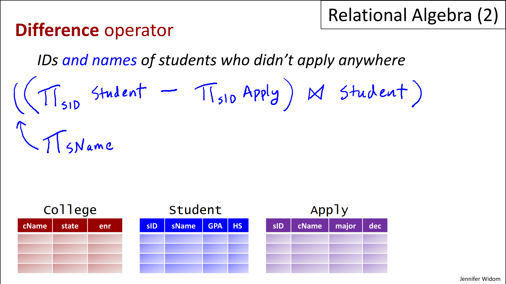{width="2.6690715223097112in"
            > height="1.5013527996500438in"}

-   The last of the three set operators is the **intersection
    > operator**.

    -   So let\'s suppose we want to "find names that are both a college
        > name and a student name". So perhaps, Washington is the name
        > of a student and a college.
        > 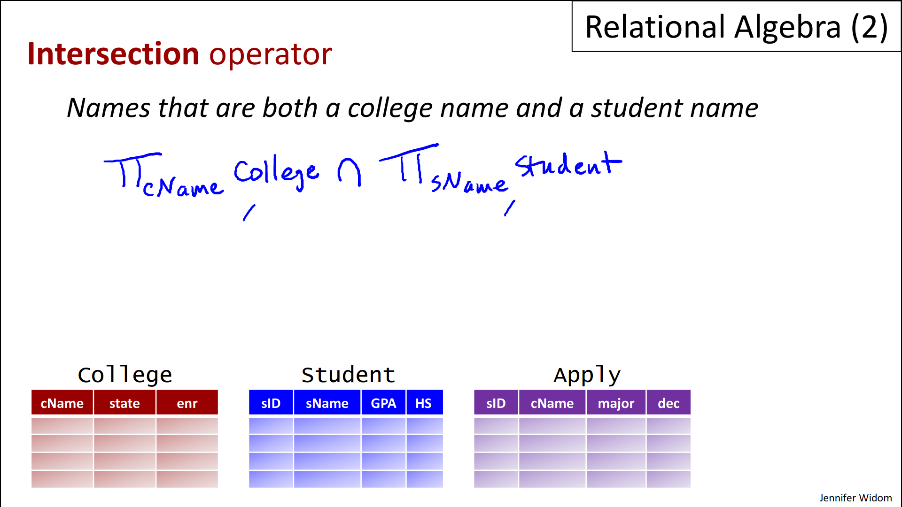{width="2.7968755468066493in"
        > height="1.5749846894138233in"}

        -   To find those, we\'re going to do something similar to what
            > we\'ve done in the previous examples. Let\'s start by
            > getting the college names. Then let\'s get the student
            > names, and then what we\'re going to do is just perform an
            > intersection of those two expressions and that will give
            > us the result that we want. Now like our previous example,
            > technically speaking, the **two expressions on the two
            > sides of the intersection ought to have the same schema**
            > and again, I\'ll show you just a little bit later, how we
            > take care of that (→rename operator).

-   Now, it turns out that **intersection** actually **doesn\'t add any
    > expressive power** to our language and I\'m going to show that
    > actually in **two different ways**.

    -   1\. The first way is that if we have two expressions, let\'s say E1 and
        > E2 and we perform their **intersection**, that is **exactly equivalent
        > to writing E1 minus, using the difference operator, E1 minus E2**.

        -   Now if you\'re not convinced of that immediately, let\'s go
            > back to **Venn diagrams**, again a concept you probably
            > learned early in your schooling. So let\'s make a picture
            > of two circles. And let\'s say that the first circle
            > Circle represents the result of expression E1 and the
            > second rear circle represents the result of expression E2.
            > Now if we take the entire circle E1. Let\'s shade that in
            > purple. And then we take the result, so that\'s E1 here,
            > and then we take E1, the result of the expression E1 minus
            > E2 here, we\'ll write that in green, so that\'s everything
            > in E1 that\'s not in E2. And if we take the purple minus
            > the green you will see that we actually do get the
            > intersection here.
            > 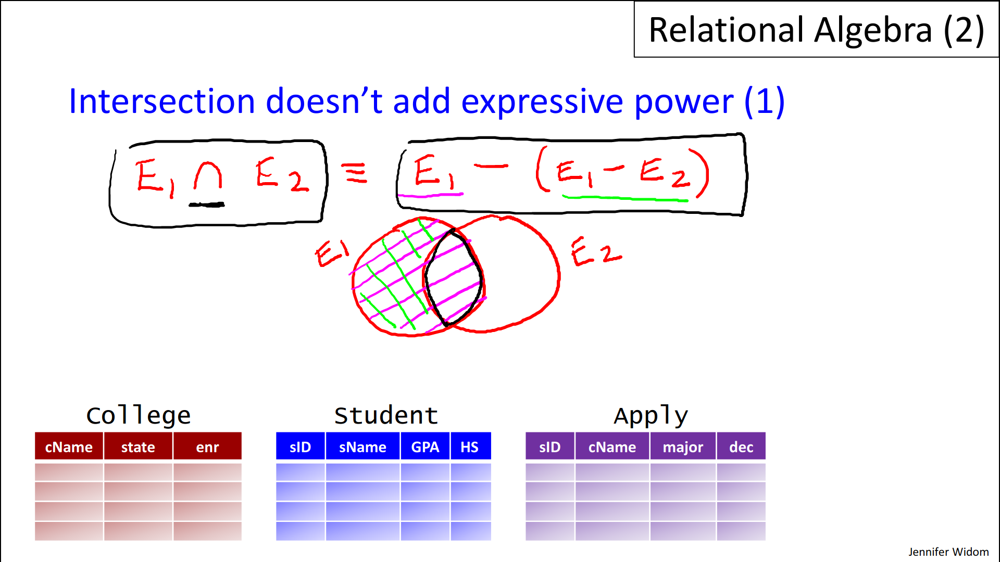{width="2.5611318897637796in"
            > height="1.4391119860017498in"}

        -   So that\'s a simple **property of set operations** but what
            > that\'s telling us is that this intersection operator here
            > isn\'t giving us more expressive power because any
            > expression that we can write in this fashion, **we can
            > equivalently write with the difference operator** in this
            > fashion.

    -   2\. Let me show you a completely different way in which intersection
        > doesn\'t add any expressive power. So, let\'s go back to E1 intersect E2
        > and as a reminder for this to be completely correct **these have to have
        > the same schema as equal between the two**. E1 **intersect** E2 turns
        > out to be exactly the same as E1 **natural join** E2 in this particular
        > case because the schema is the same. (Remember what natural join does.
        > Natural join says that you match up all columns that are equal and you
        > eliminate duplicate values of
        > columns.)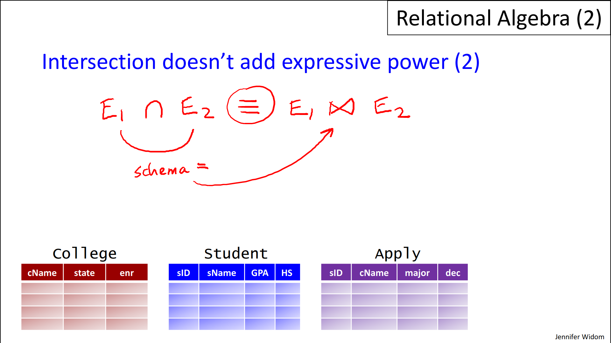{width="3.0364588801399823in"
        > height="1.709899387576553in"}

-   Nevertheless, the intersection can be very useful to use in queries.

-   Our last operator is the **rename operator**. The rename operator is
    > necessary to express certain queries in relational algebra.

-   Let me first show the form of the operator and then we\'ll see it in
    > use. The rename operator uses the Greek symbol **rho**. And like
    > all of our other operators, it **applies to the result of any
    > expression** of relational algebra.

-   And what the rename operator does is **it reassigns the schema in
    > the result of E**.

    -   zu 1. So we compute E, we get a relation as a result, and it
        > says that I\'m going to call the result of that, relation R
        > with attributes A1 through An and then when this expression
        > itself is embedded in a more complex expression, we can use
        > this schema to describe the result of the E. Again we\'ll see
        > shortly why that\'s useful.
        > 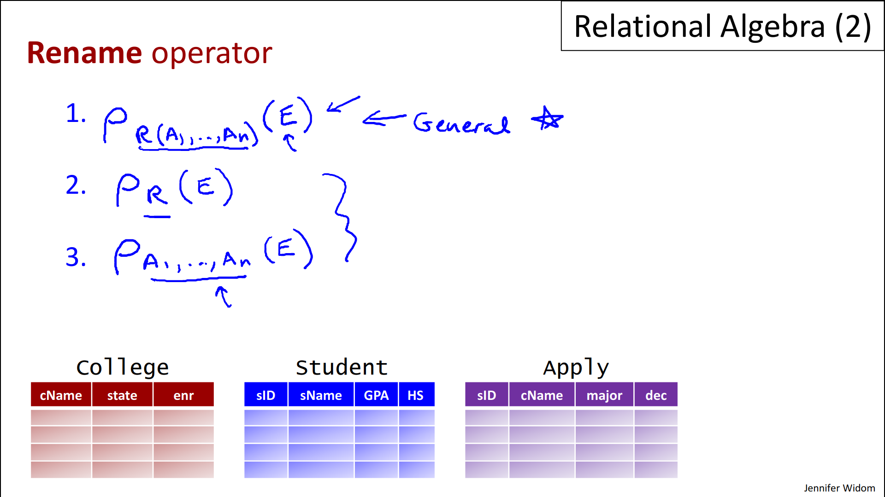{width="3.1927088801399823in"
        > height="1.7978871391076114in"}

-   There are a couple of the **abbreviations that are used in the
    > rename operator**, this form is the general form here.

    -   zu 2. One abbreviation is if we just want to use the same
        > attribute names that came out of E, but **change the relation
        > name**, we write row sub R applied to E,

    -   zu 3. and similarly, if we want to **change just the attribute
        > names** then we write attribute list here and it would keep
        > the same relation name. This form of course has to have a list
        > of attributes or we would not be able to distinguish it from
        > the previous form.

    -   But again these are just abbreviations and the general form is
        > the one up here.

-   Okay, so now let\'s see the rename operator in use.

-   The **first use** of the rename operator is something I alluded to
    > earlier in this video which is the fact that **when we do the set
    > operators, the union, difference, and intersect operators, we do
    > expect the schemas on the two the sides of the operator to
    > match**, and in a couple of our examples they didn\'t match, and
    > the rename operator will allow us to fix that.

    -   So, for example, if we\'re doing the list of college and student
        > names, and let me just remind you how we wrote that query. We
        > took the C name from college and we took the s name from
        > students and we did the big union of those. Now, **to make
        > this technically correct**, these two attribute names would
        > have to be the same. So we\'re just going to apply the rename
        > operator. Let\'s say that we\'re gonna rename the result of
        > this first expression to say the relation name C with
        > attribute name. And let\'s make the result of the second
        > expression similarly be the relation C with attribute name.
        > And now we have two matching schemas and then we can properly
        > perform the union operator.
        > 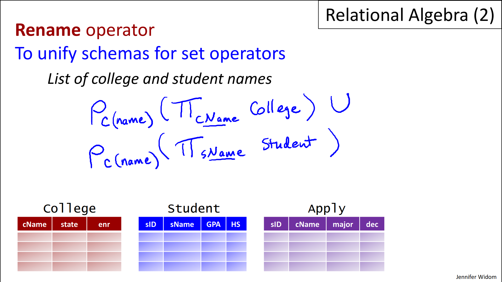{width="3.4531255468066493in"
        > height="1.944534120734908in"}

    -   Again, this is **just a syntactic necessity to have well-formed
        > relational algebra expressions**.

-   Now, the **second use** of the rename operator is a little more
    > complicated and quite a bit more important actually which is
    > **disambiguation in "self-joins"** and you probably have no idea
    > what I\'m talking about when I say that, but let me give an
    > example.

    -   Let\'s suppose that we wanted to have a query that finds "pairs
        > of colleges in the same state". Now, think about that. So we
        > want to have, for example, Stanford and Berkeley and Berkeley
        > and UCLA and so on. So that, as you can see, unlike the union
        > operator, we\'re looking for this **horizontal joining** here.
        > So we\'re going to have to combine essentially two instances
        > of the college relation. And that\'s exactly what we\'re going
        > to do. We\'re effectively going to do college join college
        > making the state equal.

    -   So, let\'s work on that a little bit. So, what we wanna do is we
        > wanna have college and we want to, let\'s just start with,
        > say, the **cross-product** of college. And then we want to
        > somehow say, \"Well, the state equals the state.\" **But
        > that\'s not gonna work**. Which state are these? And how do we
        > describe the two instances of college?
        > 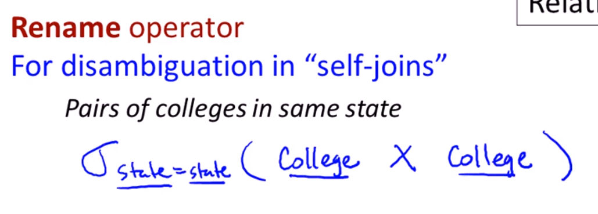{width="2.8281255468066493in"
        > height="1.0088123359580052in"}

    -   So what we\'re going to do and let me just erase this, is we\'re
        > going to rename those two instances of colleges so they have
        > different names. So we\'re going to take the first instance of
        > college here and we\'re going to apply a rename operator to
        > that. And we\'ll call it C1 and we\'ll say that it has name1,
        > state1, and enrollment1. And then we\'ll take the second
        > instance here. We\'ll call it C2, so N2, S2, E2 of college and
        > now we have two different relations. So what we can do is we
        > can take the cross-product of those two like that, and then we
        > can select where S1 equals S2, okay? And that gives us "pairs
        > of colleges in the same state".
        > 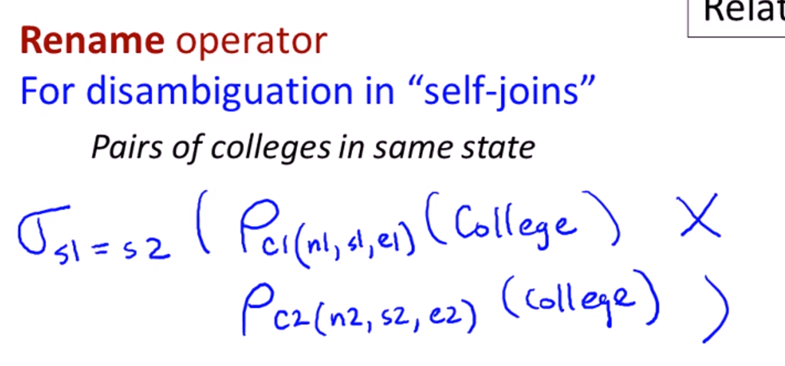{width="2.817509842519685in"
        > height="1.3151498250218723in"}

    -   Actually, let me show you an even trickier, **simpler way of
        > doing this**. Let\'s take away the selection operator here,
        > okay? And let\'s take away this. And let\'s make this into a
        > **natural join**. Now that\'s not gonna work quite yet because
        > the natural join requires attribute names to be the same, and
        > we don\'t have any attribute names that are the same. So the
        > last little trick we\'re gonna do is we\'re gonna make those
        > two attribute names, S, be the same. And now when we do the
        > natural join, it\'s gonna require equality on those two S\'s
        > and everything is gonna be great.
        > 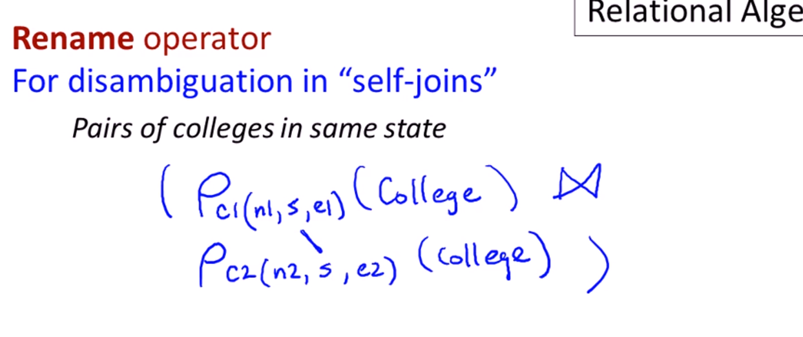{width="2.7162543744531935in"
        > height="1.1427001312335958in"}

    -   Now, things are still a little bit more complicated. One problem
        > with this query is that we are going to get colleges paired
        > with themselves. So we\'re going to get from this, for
        > example, Stanford Stanford. If you think about it, right?
        > Berkeley Berkeley, as well as Stanford Berkeley. Now, that\'s
        > not really what we want presumably. Presumably we actually
        > want different colleges. but that\'s pretty easy to handle,
        > actually.
        > {width="3.2656255468066493in"
        > height="1.2096916010498688in"}

        -   Let\'s put a **selection condition** here so that the name
            > one is "**not equal to**" name two. Great. We took care of
            > that. So in that case we will no longer get Stanford
            > Stanford and Berkeley Berkeley.

    -   Ah, but there\'s still one more problem. We\'ll get Stanford
        > Berkeley but we\'ll also get Berkeley Stanford.

        -   Actually, there\'s a surprisingly simple way, kind of
            > clever. We\'re gonna take away this "not equals" and
            > we\'re going to replace it with a "**less than**". And now
            > we\'ll only get pairs where the first one is less than the
            > second. So Stanford and Berkeley goes away and we get
            > Berkeley Stanford. And this is our final query for what we
            > wanted to do here.
            > 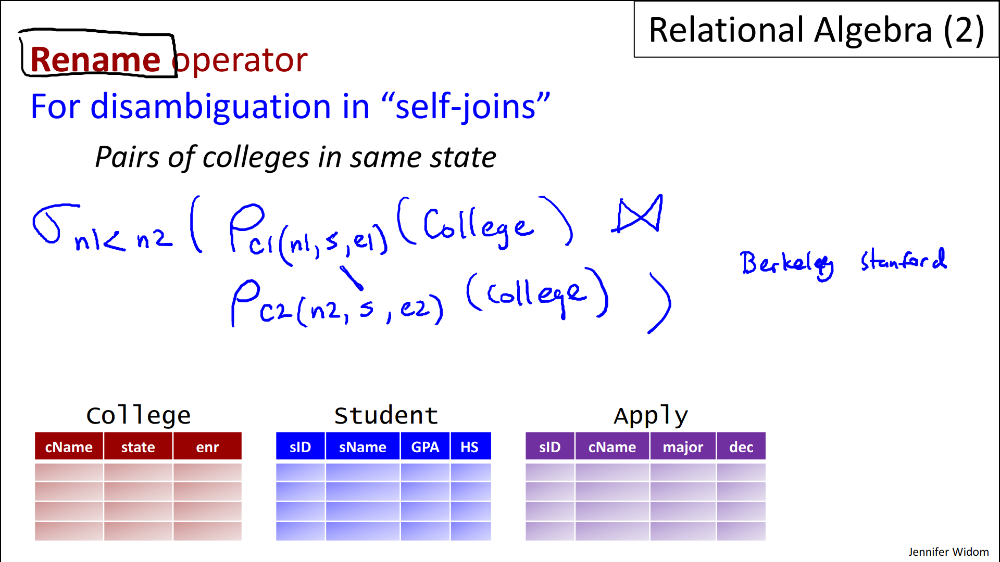{width="3.1718755468066493in"
            > height="1.786155949256343in"}

-   Now what I really wanted to show, aside from some of the uses of
    > relational algebra, is the fact that the **rename operator was
    > absolutely necessary for this query. We could not have done this
    > query without the rename operator**.

-   Now we\'ve seen all the operators of relational algebra. Before we
    > wrap up the video I did want to mention that there are some
    > **other notations that can be used for relational algebra
    > expressions**.

    -   So far we\'ve just been writing our expressions in a **standard
        > form** with relation names and operators between those names
        > and applying to those names.

    -   But sometimes people prefer to write using a more linear
        > notation of **assignment statements** and

    -   sometimes people like to write the **expressions as trees**.

-   So I\'m just gonna briefly show a couple of examples of those and
    > then we\'ll wrap up.

-   So **assignment statements** are **a way to break down relational
    > algebra expressions into their parts**. Let\'s do the same query
    > we just finished as a big expression which is "the pairs of
    > colleges that are in the same state". We\'ll start by writing two
    > assignment statements that do the rename of the two instances of
    > the college relation. So we\'ll start with C1 colon equals and
    > we\'ll use a rename operator and now we use the abbreviated form
    > that just lists attribute names. So we\'ll see say C1, S, E1 of
    > college and we\'ll similarly say that C2 gets the rename, and
    > we\'ll call it C2, S, E2 of college, and remember we use the same
    > S here so that we can do the natural join. So, now we\'ll say that
    > college pairs gets C1 natural join C2, and then finally we\'ll do
    > our selection condition. So our final answer will be the selection
    > where N1 is less than N2 of CP.
    > {width="3.3745767716535435in"
    > height="1.9010422134733158in"}

    -   And again, this is equivalent to the expression that we saw on
        > the earlier slide. It\'s **just a notation that sometimes
        > people prefer to modularize their expressions**.

-   The second alternate notation I\'m going to show is **expression
    > trees**. And expression trees are actually commonly used in
    > relational algebra.

    -   They **allow you to visualize the structure of the expression a
        > little bit better**.

    -   And as it turns out **when SQL is compiled in database systems,
        > it\'s often compiled into an expression tree** that looks very
        > much like what I\'m gonna show you right now.

    -   So for this example let\'s suppose that we want to "find the
        > GPAs of students who are applying to CS in California". So
        > that\'s going to involve all three relations because we\'re
        > looking at the state is in California, and we\'re looking at
        > the student GPA\'s and we\'re looking at them applying to CS.
        > So what we\'re going to do is we\'re going to make a little
        > tree notation here where we\'re going to first do the natural
        > join of these three relations. So technically the expression
        > I\'m going to show you is going to stop down here. It\'s not
        > going to actually have the tables. So the **leaves** of the
        > expression are going to be the three relations: college,
        > students, and apply. And in relational algebra trees, the
        > **leaves are always relation names**. And we\'re going to do
        > the natural join of those three which as a reminder enforces
        > equality of the college name against the college name here
        > against the college name here, and the student ID here and the
        > student ID here. That enforcement means that we get triples
        > that are talking about a student applying to a particular
        > college. And then we\'re going to apply to that - and that\'s
        > going to be written as a new **node** above this one in the
        > tree - the selection condition that says that the state equals
        > California and the major equals CS. And finally, we\'ll put on
        > top of that the projection that gets the GPA. okay?
        > 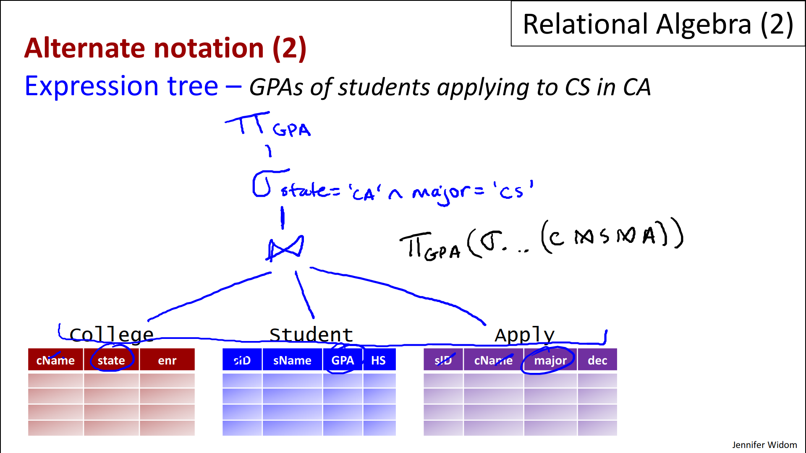{width="3.619792213473316in"
        > height="2.0383880139982504in"}

    -   Now actually this expression is **exactly equivalent to if we
        > wrote it linearly**, project the GPA, select etc. of the three
        > college join student, join apply. I\'m just abbreviating here.
        > That would be an equivalent expression.

    -   But again, people often like to use the tree notation because it
        > does allow you to visualize the structure of the expression,
        > and it is used inside implementations of the SQL language.

-   Let me finish up by **summarizing relational algebra**.

-   Let\'s start with the **core constructs** of the language.

    -   So a **relation name** is a query in relational algebra,
        > 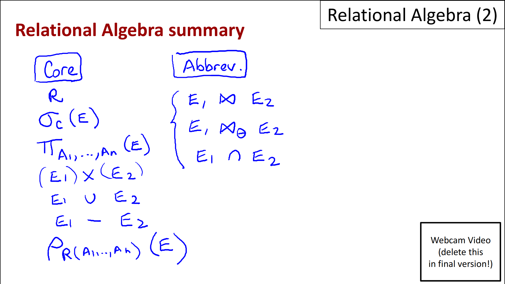{width="3.3802088801399823in"
        > height="1.9034733158355206in"}

    -   and then we use **operators** that combine relations and filter
        > relations.

        -   So we have the **select** operator that applies a condition
            > to the result of an expression.

        -   We have the **project** operator that gives us a set of
            > attributes that we take from the result of an expression.

        -   We have the expression one **cross-product** expression two.
            > And again those can be any expressions.

        -   Then we have expression one **union** expression two.

        -   And we have expression one **minus** expression two.

        -   And finally we have the **rename** operator that takes an
            > expression and renames the result of that, the schema in
            > the result of that expression.

-   Now, you probably noticed that I skipped a few of our favorite
    > operators, but this is the core of the language and all the other
    > operators are actually **abbreviations** that don\'t increase the
    > expressive power of the language but they can be very useful
    > performing queries. And the abbreviations that we learned were

    -   expression one **natural join** expression two.

    -   They were expression one **theta join** expression two.

    -   And, finally, expression one **intersect** expression two.

-   All of those where we had a method of rewriting them using the core
    > operators.

-   Just a small aside about **parentheses**. Parentheses are **used**
    > in relational expressions for, relational algebraic expressions,
    > **for disambiguation**, similarly to arithmetic expressions. I was
    > a little cavalier about whether I included parentheses or not, but
    > as you write your relational algebra expressions you will see that
    > it\'s pretty straightforward to figure out when disambiguation is
    > needed.

-   So to conclude relational algebra entirely

    -   It\'s a formal language.

    -   It\'s based on sets, set operators and other operators that
        > combine data from multiple relations.

    -   It takes relations as input, it produces relations as answers
        > and

    -   it does form the formal foundation of implemented relational
        > database management systems.

6.1 Introduction to SQL
=======================

Intro
-----

-   SQL, like the relational model, **has been around for decades** and
    > supports a many **billion dollar market**.

-   The first thing you might be wondering is how you **pronounce** it.
    > Is it \"SQL,\" or is it \"sequel\"? My friends in industry tell me
    > that \"sequel\" is the "in" pronunciation, so that\'s the one
    > I\'ll be using.

-   Now SQL is **supported by all major commercial database systems**.

-   It has been around a long time and it is a **standardized
    > language**. The standard started out relatively simple but over
    > the decades it\'s really ballooned. There are currently
    > **thousands of pages in the SQL standard**. But the essence of the
    > language, which is what we\'ll be learning in these videos, is
    > still relatively simple. We will be learning primarily the **SQL2
    > standard** also known as **SQL 92** along with some constructs
    > from the **SQL3 standard**.

-   When SQL is used, it can be used in a database system
    > **interactively**

    -   through a **graphical user interface** or

    -   **a prompt** so you type SQL queries or commands and you get
        > results back, or

    -   SQL can be **embedded in programs**.

-   So, the **most common use** is to **embed SQL in programs,** but for
    > the demos in our videos, naturally, we\'ll be submitting queries
    > through a GUI interface.

-   The last thing I wanted to mention about SQL is that it is a
    > **declarative language**. That means that in SQL, you\'ll write
    > pretty simple queries that say exactly what you want out of the
    > database, and the queries do not need to describe how to get the
    > data out of the database.

-   The language is also **based on relational algebra**, and I hope
    > you\'ve watched the relational algebra videos.

-   Now, the declarative nature of SQL leads to the component of the
    > database system called the **query optimizer** to be extremely
    > important. What the query optimizer does is it takes a query
    > written in a SQL language and it figures out the best way, the
    > fastest way, to execute that on the database.

-   Now let\'s talk briefly about some **terminology** and the
    > **commands** that are in the SQL language. There\'s two parts of
    > the language, the **Data Definition Language** or **DDL**, and the
    > **Data Manipulation** or **DML**:

    -   The **Data Definition Language** includes commands to create a
        > table. We saw that in a previous video. It also includes
        > commands to drop table and to create and drop other aspects of
        > databases that we\'ll be learning about in later videos, such
        > as indexes and views.

    -   The **Data Manipulation Language** is the language that\'s used
        > to query and modify the database. So in the SQL language the
        > Data Manipulation Language includes for querying the database,
        > the select statement and then for modifying the database: an
        > insert statement, a delete statement, and an update statement.

    -   There are many **other commands** in SQL for indexes,
        > constraints, views, triggers, transactions, authorization, all
        > of which we\'ll be learning about in later videos.

-   For now, let\'s just take a look in a little more detail at the
    > **select statement** which is really the bread and butter of the
    > SQL language and it\'s what we use to query the database. So the
    > select statement **consists of three basic clauses**.

    -   There\'s the SELECT clause,

    -   the FROM clause and

    -   the WHERE clause.

-   The **best order to think of these** actually, is first the FROM
    > clause, then the WHERE and then the SELECT and just the basic idea
    > is that the FROM identifies the relations that you want to query
    > over, the condition is used to combine the relations and to filter
    > the relations. And finally, the SELECT tells you what to return.

-   Now, if you\'re familiar with relational algebra, this expression
    > here, this SQL query, is **equivalent to the relational algebra
    > expression** that you project the set of attributes A1 through AN.
    > And then you select and, by the way, it\'s different from this
    > select here. In fact, this selection corresponds to the WHERE. You
    > select the condition on the cross-product of the relations that
    > are listed in the from clause. So that\'s the equivalent in
    > relational algebra.

-   And the last thing I wanted to mention is that, as you know, the
    > relational query languages are **compositional**. That means when
    > you run a query over relations, **you get a relation as a
    > result**. So the result of this select statement is a relation. It
    > doesn\'t have a name but the schema of that relation is the set of
    > attributes that are returned.

-   In **conclusion**, the SQL language is very prominent. It\'s
    > supported by all major commercial database systems. It\'s been
    > standardized over time. It can be used through programs. It can be
    > used interactively and it\'s a declarative high-level language
    > whose foundations are based on the relational algebra.

SELECT statement
----------------

-   As a reminder, the **SELECT statement** selects a set of attributes
    > from a set of relations satisfying a particular condition. We will
    > see in the demo that even with these three clauses, we can write
    > quite powerful queries.

-   All of the seven demos are going to be using the simple **college
    > admissions database** that we learned about in the relational
    > algebra videos. As a reminder, we have **three relations**:

    -   We have the **college relation**: college relation contains
        > information about the name of the colleges, the state, and the
        > enrollment of those colleges.

    -   We have the **student relation**, which contains student IDs,
        > their names, their GPA, and the size of the high school that
        > they come from.

    -   And finally, the **application information**, that tells us that
        > a particular student applied to a particular college for a
        > particular major and there was a decision of that application

-   Now as a reminder, in the relational model, when we **underline
    > attributes**, that means we\'re **designating a key for the
    > relation**.

    -   So, the underlined attributes in our example say that the
        > college name is going to be **unique within the college
        > relation**. The student\'s idea is unique within the student
        > relation and in the apply relation, the combination of these
        > three attributes is unique. That means that student can, if he
        > or she wishes, apply to a college many times, or apply for a
        > major many times, but can only apply to a college for a
        > particular major once.

-   Let\'s turn to the demo. WATCH !

+-----------------------------------------------------------------------+
| /\*\*\*\*\*\*\*\*\*\*\*\*\*\*\*\*\*\*\*\*\*\*\*\*\*\*\*\*\*\*\*\*\*\* |
| \*\*\*\*\*\*\*\*\*\*\*\*\*\*\*\*\*\*\*\*\*\*\*\*\*\*\*\*\             |
| BASIC SELECT STATEMENTS\                                              |
| Works for SQLite, MySQL, Postgres\                                    |
| \*\*\*\*\*\*\*\*\*\*\*\*\*\*\*\*\*\*\*\*\*\*\*\*\*\*\*\*\*\*\*\*\*\*\ |
| *\*\*\*\*\*\*\*\*\*\*\*\*\*\*\*\*\*\*\*\*\*\*\*\*\*\*\*/\             |
| \                                                                     |
| /\*\*\*\*\*\*\*\*\*\*\*\*\*\*\*\*\*\*\*\*\*\*\*\*\*\*\*\*\*\*\*\*\*\* |
| \*\*\*\*\*\*\*\*\*\*\*\*\*\*\*\*\*\*\*\*\*\*\*\*\*\*\*\*\             |
| IDs, names, and GPAs of students with GPA \> 3.6\                     |
| \*\*\*\*\*\*\*\*\*\*\*\*\*\*\*\*\*\*\*\*\*\*\*\*\*\*\*\*\*\*\*\*\*\*\ |
| *\*\*\*\*\*\*\*\*\*\*\*\*\*\*\*\*\*\*\*\*\*\*\*\*\*\*\*/\             |
| \                                                                     |
| select sID, sName, GPA\                                               |
| from Student\                                                         |
| where GPA \> 3.6;\                                                    |
| \                                                                     |
| /\*\*\* Same query without GPA \*\*\*/\                               |
| \                                                                     |
| select sID, sName\                                                    |
| from Student\                                                         |
| where GPA \> 3.6;\                                                    |
| \                                                                     |
| /\*\*\*\*\*\*\*\*\*\*\*\*\*\*\*\*\*\*\*\*\*\*\*\*\*\*\*\*\*\*\*\*\*\* |
| \*\*\*\*\*\*\*\*\*\*\*\*\*\*\*\*\*\*\*\*\*\*\*\*\*\*\*\*\             |
| Student names and majors for which they\'ve applied\                  |
| \*\*\*\*\*\*\*\*\*\*\*\*\*\*\*\*\*\*\*\*\*\*\*\*\*\*\*\*\*\*\*\*\*\*\ |
| *\*\*\*\*\*\*\*\*\*\*\*\*\*\*\*\*\*\*\*\*\*\*\*\*\*\*\*/\             |
| \                                                                     |
| select sName, major\                                                  |
| from Student, Apply\                                                  |
| where Student.sID = Apply.sID;\                                       |
| \                                                                     |
| /\*\*\* Same query with Distinct, note difference from algebra        |
| \*\*\*/\                                                              |
| \                                                                     |
| select distinct sName, major\                                         |
| from Student, Apply\                                                  |
| where Student.sID = Apply.sID;\                                       |
| \                                                                     |
| /\*\*\*\*\*\*\*\*\*\*\*\*\*\*\*\*\*\*\*\*\*\*\*\*\*\*\*\*\*\*\*\*\*\* |
| \*\*\*\*\*\*\*\*\*\*\*\*\*\*\*\*\*\*\*\*\*\*\*\*\*\*\*\*\             |
| Names and GPAs of students with sizeHS \< 1000 applying to\           |
| CS at Stanford, and the application decision\                         |
| \*\*\*\*\*\*\*\*\*\*\*\*\*\*\*\*\*\*\*\*\*\*\*\*\*\*\*\*\*\*\*\*\*\*\ |
| *\*\*\*\*\*\*\*\*\*\*\*\*\*\*\*\*\*\*\*\*\*\*\*\*\*\*\*/\             |
| \                                                                     |
| select sname, GPA, decision\                                          |
| from Student, Apply\                                                  |
| where Student.sID = Apply.sID\                                        |
| and sizeHS \< 1000 and major = \'CS\' and cname = \'Stanford\';\      |
| \                                                                     |
| /\*\*\*\*\*\*\*\*\*\*\*\*\*\*\*\*\*\*\*\*\*\*\*\*\*\*\*\*\*\*\*\*\*\* |
| \*\*\*\*\*\*\*\*\*\*\*\*\*\*\*\*\*\*\*\*\*\*\*\*\*\*\*\*\             |
| All large campuses with CS applicants\                                |
| \*\*\*\*\*\*\*\*\*\*\*\*\*\*\*\*\*\*\*\*\*\*\*\*\*\*\*\*\*\*\*\*\*\*\ |
| *\*\*\*\*\*\*\*\*\*\*\*\*\*\*\*\*\*\*\*\*\*\*\*\*\*\*\*/\             |
| \                                                                     |
| select cName\                                                         |
| from College, Apply\                                                  |
| where College.cName = Apply.cName\                                    |
| and enrollment \> 20000 and major = \'CS\';\                          |
| \                                                                     |
| /\*\*\* Fix error \*\*\*/\                                            |
| \                                                                     |
| select College.cName\                                                 |
| from College, Apply\                                                  |
| where College.cName = Apply.cName\                                    |
| and enrollment \> 20000 and major = \'CS\';\                          |
| \                                                                     |
| /\*\*\* Add Distinct \*\*\*/\                                         |
| \                                                                     |
| select distinct College.cName\                                        |
| from College, Apply\                                                  |
| where College.cName = Apply.cName\                                    |
| and enrollment \> 20000 and major = \'CS\';\                          |
| \                                                                     |
| /\*\*\*\*\*\*\*\*\*\*\*\*\*\*\*\*\*\*\*\*\*\*\*\*\*\*\*\*\*\*\*\*\*\* |
| \*\*\*\*\*\*\*\*\*\*\*\*\*\*\*\*\*\*\*\*\*\*\*\*\*\*\*\*\             |
| Application information\                                              |
| \*\*\*\*\*\*\*\*\*\*\*\*\*\*\*\*\*\*\*\*\*\*\*\*\*\*\*\*\*\*\*\*\*\*\ |
| *\*\*\*\*\*\*\*\*\*\*\*\*\*\*\*\*\*\*\*\*\*\*\*\*\*\*\*/\             |
| \                                                                     |
| select Student.sID, sName, GPA, Apply.cName, enrollment\              |
| from Student, College, Apply\                                         |
| where Apply.sID = Student.sID and Apply.cName = College.cName;\       |
| \                                                                     |
| /\*\*\* Sort by decreasing GPA \*\*\*/\                               |
| \                                                                     |
| select Student.sID, sName, GPA, Apply.cName, enrollment\              |
| from Student, College, Apply\                                         |
| where Apply.sID = Student.sID and Apply.cName = College.cName\        |
| order by GPA desc;\                                                   |
| \                                                                     |
| /\*\*\* Then by increasing enrollment                                 |
|                                                                       |
| (primary sort order: GPA desc + secondary sort order \[within each    |
| tie in primary sort order\]: enroll asc)                              |
|                                                                       |
| (asc is default in order by clause) \*\*\*/\                          |
| \                                                                     |
| select Student.sID, sName, GPA, Apply.cName, enrollment\              |
| from Student, College, Apply\                                         |
| where Apply.sID = Student.sID and Apply.cName = College.cName\        |
| order by GPA desc, enrollment;\                                       |
| \                                                                     |
| /\*\*\*\*\*\*\*\*\*\*\*\*\*\*\*\*\*\*\*\*\*\*\*\*\*\*\*\*\*\*\*\*\*\* |
| \*\*\*\*\*\*\*\*\*\*\*\*\*\*\*\*\*\*\*\*\*\*\*\*\*\*\*\*\             |
| Applicants to bio majors\                                             |
| \*\*\*\*\*\*\*\*\*\*\*\*\*\*\*\*\*\*\*\*\*\*\*\*\*\*\*\*\*\*\*\*\*\*\ |
| *\*\*\*\*\*\*\*\*\*\*\*\*\*\*\*\*\*\*\*\*\*\*\*\*\*\*\*/\             |
| \                                                                     |
| select sID, major\                                                    |
| from Apply\                                                           |
| where major like \'%bio%\';\                                          |
| \                                                                     |
| /\*\*\* Same query with Select \* \*\*\*/\                            |
| \                                                                     |
| select \*\                                                            |
| from Apply\                                                           |
| where major like \'%bio%\';\                                          |
| \                                                                     |
| /\*\*\*\*\*\*\*\*\*\*\*\*\*\*\*\*\*\*\*\*\*\*\*\*\*\*\*\*\*\*\*\*\*\* |
| \*\*\*\*\*\*\*\*\*\*\*\*\*\*\*\*\*\*\*\*\*\*\*\*\*\*\*\*\             |
| Select \* cross-product\                                              |
| \*\*\*\*\*\*\*\*\*\*\*\*\*\*\*\*\*\*\*\*\*\*\*\*\*\*\*\*\*\*\*\*\*\*\ |
| *\*\*\*\*\*\*\*\*\*\*\*\*\*\*\*\*\*\*\*\*\*\*\*\*\*\*\*/\             |
| \                                                                     |
| select \*\                                                            |
| from Student, College;\                                               |
| \                                                                     |
| /\*\*\*\*\*\*\*\*\*\*\*\*\*\*\*\*\*\*\*\*\*\*\*\*\*\*\*\*\*\*\*\*\*\* |
| \*\*\*\*\*\*\*\*\*\*\*\*\*\*\*\*\*\*\*\*\*\*\*\*\*\*\*\*\             |
| Add scaled GPA based on sizeHS\                                       |
| Also note missing Where clause\                                       |
| \*\*\*\*\*\*\*\*\*\*\*\*\*\*\*\*\*\*\*\*\*\*\*\*\*\*\*\*\*\*\*\*\*\*\ |
| *\*\*\*\*\*\*\*\*\*\*\*\*\*\*\*\*\*\*\*\*\*\*\*\*\*\*\*/\             |
| \                                                                     |
| select sID, sName, GPA, sizeHS, GPA\*(sizeHS/1000.0)\                 |
| from Student;\                                                        |
| \                                                                     |
| /\*\*\* Rename result attribute \*\*\*/\                              |
| \                                                                     |
| select sID, sName, GPA, sizeHS, GPA\*(sizeHS/1000.0) as scaledGPA\    |
| from Student;                                                         |
+-----------------------------------------------------------------------+

Table variables and Set operators
---------------------------------

-   In this demo, we\'ll be learning some more features of the SQL
    > language. Specifically, we\'ll be learning about **table
    > variables** and about **set operators**.

-   The first construct is **table variables**. Table variables are in
    > the FROM clause, and they actually serve **two uses**:

    -   One is simply to **make queries more readable**, as we\'ll see.

    -   But a second purpose is **to rename relations that are used in
        > the FROM clause, particularly when we have two instances of
        > the same relation**. This is exactly what we needed in the
        > relational algebra when we wrote joins that included two
        > instances of the same relation.

-   The second construct we\'ll be learning, actually a set of
    > constructs, in this video, are the **set operators**. And we\'ll
    > be learning the same three set operators we had in relational
    > algebra:

    -   the **union** operator,

    -   the **intersect** operator, and

    -   the **except** operator which is the **minus** operator.

-   Let\'s move to the demo.

+-----------------------------------------------------------------------+
| /\*\*\*\*\*\*\*\*\*\*\*\*\*\*\*\*\*\*\*\*\*\*\*\*\*\*\*\*\*\*\*\*\*\* |
| \*\*\*\*\*\*\*\*\*\*\*\*\*\*\*\*\*\*\*\*\*\*\*\*\*\*\*\*\             |
| TABLE VARIABLES AND SET OPERATORS\                                    |
| Works for SQLite, Postgres\                                           |
| MySQL doesn\'t support Intersect or Except\                           |
| \*\*\*\*\*\*\*\*\*\*\*\*\*\*\*\*\*\*\*\*\*\*\*\*\*\*\*\*\*\*\*\*\*\*\ |
| *\*\*\*\*\*\*\*\*\*\*\*\*\*\*\*\*\*\*\*\*\*\*\*\*\*\*\*/\             |
| \                                                                     |
| /\*\*\*\*\*\*\*\*\*\*\*\*\*\*\*\*\*\*\*\*\*\*\*\*\*\*\*\*\*\*\*\*\*\* |
| \*\*\*\*\*\*\*\*\*\*\*\*\*\*\*\*\*\*\*\*\*\*\*\*\*\*\*\*\             |
| Application information\                                              |
| \*\*\*\*\*\*\*\*\*\*\*\*\*\*\*\*\*\*\*\*\*\*\*\*\*\*\*\*\*\*\*\*\*\*\ |
| *\*\*\*\*\*\*\*\*\*\*\*\*\*\*\*\*\*\*\*\*\*\*\*\*\*\*\*/\             |
| \                                                                     |
| select Student.sID, sName, GPA, Apply.cName, enrollment\              |
| from Student, College, Apply\                                         |
| where Apply.sID = Student.sID and Apply.cName = College.cName;\       |
| \                                                                     |
| /\*\*\* Introduce table variables \*\*\*/\                            |
| \                                                                     |
| select S.sID, S.sName, S.GPA, A.cName, C.enrollment\                  |
| from Student S, College C, Apply A\                                   |
| where A.sID = S.sID and A.cName = C.cName;\                           |
| \                                                                     |
| /\*\*\*\*\*\*\*\*\*\*\*\*\*\*\*\*\*\*\*\*\*\*\*\*\*\*\*\*\*\*\*\*\*\* |
| \*\*\*\*\*\*\*\*\*\*\*\*\*\*\*\*\*\*\*\*\*\*\*\*\*\*\*\*\             |
| Pairs of students with same GPA\                                      |
| \*\*\*\*\*\*\*\*\*\*\*\*\*\*\*\*\*\*\*\*\*\*\*\*\*\*\*\*\*\*\*\*\*\*\ |
| *\*\*\*\*\*\*\*\*\*\*\*\*\*\*\*\*\*\*\*\*\*\*\*\*\*\*\*/\             |
| \                                                                     |
| select S1.sID, S1.sName, S1.GPA, S2.sID, S2.sName, S2.GPA\            |
| from Student S1, Student S2\                                          |
| where S1.GPA = S2.GPA;\                                               |
| \                                                                     |
| /\*\*\* Get rid of self-pairings \*\*\*/\                             |
| \                                                                     |
| select S1.sID, S1.sName, S1.GPA, S2.sID, S2.sName, S2.GPA\            |
| from Student S1, Student S2\                                          |
| where S1.GPA = S2.GPA and S1.sID \<\> S2.sID;\                        |
| \                                                                     |
| /\*\*\* Get rid of reverse-pairings \*\*\*/\                          |
| \                                                                     |
| select S1.sID, S1.sName, S1.GPA, S2.sID, S2.sName, S2.GPA\            |
| from Student S1, Student S2\                                          |
| where S1.GPA = S2.GPA and S1.sID \< S2.sID;\                          |
| \                                                                     |
| /\*\*\*\*\*\*\*\*\*\*\*\*\*\*\*\*\*\*\*\*\*\*\*\*\*\*\*\*\*\*\*\*\*\* |
| \*\*\*\*\*\*\*\*\*\*\*\*\*\*\*\*\*\*\*\*\*\*\*\*\*\*\*\*\             |
| List of college names and student names\                              |
| \*\*\*\*\*\*\*\*\*\*\*\*\*\*\*\*\*\*\*\*\*\*\*\*\*\*\*\*\*\*\*\*\*\*\ |
| *\*\*\*\*\*\*\*\*\*\*\*\*\*\*\*\*\*\*\*\*\*\*\*\*\*\*\*/\             |
| \                                                                     |
| select cName from College\                                            |
| union\                                                                |
| select sName from Student;\                                           |
| \                                                                     |
| /\*\*\* Add \'As name\' to both sides \[weil sonst nur cName als      |
| Spaltenlabel\] \*\*\*/\                                               |
| \                                                                     |
| select cName as name from College\                                    |
| union \-- set operator\                                               |
| select sName as name from Student;                                    |
|                                                                       |
| /\*\*\* phth:                                                         |
|                                                                       |
| 1.  in SQLite results are sorted (depends on DBMS)                    |
|                                                                       |
| 2\. in SQLite union by default eliminates duplicates in its result;   |
| in general, elimination of duplicates depends on DBMS; if             |
| duplicates shall not be eliminated use "union all" \*\*\*/\           |
| /\*\*\* Change to Union All \*\*\*/\                                  |
| \                                                                     |
| select cName as name from College\                                    |
| union all \-- multiset operator\                                      |
| select sName as name from Student;\                                   |
| \                                                                     |
| /\*\*\* Notice not sorted any more (SQLite), add order by name        |
| \*\*\*/\                                                              |
| \                                                                     |
| select cName as name from College\                                    |
| union all\                                                            |
| select sName as name from Student\                                    |
| order by name;\                                                       |
| \                                                                     |
| /\*\*\*\*\*\*\*\*\*\*\*\*\*\*\*\*\*\*\*\*\*\*\*\*\*\*\*\*\*\*\*\*\*\* |
| \*\*\*\*\*\*\*\*\*\*\*\*\*\*\*\*\*\*\*\*\*\*\*\*\*\*\*\*\             |
| IDs of students who applied to both CS and EE\                        |
| \*\*\*\*\*\*\*\*\*\*\*\*\*\*\*\*\*\*\*\*\*\*\*\*\*\*\*\*\*\*\*\*\*\*\ |
| *\*\*\*\*\*\*\*\*\*\*\*\*\*\*\*\*\*\*\*\*\*\*\*\*\*\*\*/\             |
| \                                                                     |
| select sID from Apply where major = \'CS\'\                           |
| intersect\                                                            |
| select sID from Apply where major = \'EE\';\                          |
| \                                                                     |
| /\*\*\*\*\*\*\*\*\*\*\*\*\*\*\*\*\*\*\*\*\*\*\*\*\*\*\*\*\*\*\*\*\*\* |
| \*\*\*\*\*\*\*\*\*\*\*\*\*\*\*\*\*\*\*\*\*\*\*\*\*\*\*\*\             |
| IDs of students who applied to both CS and EE\                        |
| Some systems don\'t support intersect\                                |
| \*\*\*\*\*\*\*\*\*\*\*\*\*\*\*\*\*\*\*\*\*\*\*\*\*\*\*\*\*\*\*\*\*\*\ |
| *\*\*\*\*\*\*\*\*\*\*\*\*\*\*\*\*\*\*\*\*\*\*\*\*\*\*\*/\             |
| \                                                                     |
| select A1.sID\                                                        |
| from Apply A1, Apply A2\                                              |
| where A1.sID = A2.sID and A1.major = \'CS\' and A2.major = \'EE\';\   |
| \                                                                     |
| /\*\*\* Why so many duplicates? Look at Apply table \[student 123     |
| hat sich bei stanford für CS und EE, bei berkeley für CS und bei      |
| cornell für EE beworben, dh. die obige query gibt sID 123 vier mal    |
| zurück \*\*\*/\                                                       |
| /\*\*\* Add Distinct \*\*\*/\                                         |
| \                                                                     |
| select distinct A1.sID\                                               |
| from Apply A1, Apply A2\                                              |
| where A1.sID = A2.sID and A1.major = \'CS\' and A2.major = \'EE\';\   |
| \                                                                     |
| /\*\*\*\*\*\*\*\*\*\*\*\*\*\*\*\*\*\*\*\*\*\*\*\*\*\*\*\*\*\*\*\*\*\* |
| \*\*\*\*\*\*\*\*\*\*\*\*\*\*\*\*\*\*\*\*\*\*\*\*\*\*\*\*\             |
| IDs of students who applied to CS but not EE\                         |
| \*\*\*\*\*\*\*\*\*\*\*\*\*\*\*\*\*\*\*\*\*\*\*\*\*\*\*\*\*\*\*\*\*\*\ |
| *\*\*\*\*\*\*\*\*\*\*\*\*\*\*\*\*\*\*\*\*\*\*\*\*\*\*\*/\             |
| \                                                                     |
| select sID from Apply where major = \'CS\'\                           |
| except\                                                               |
| select sID from Apply where major = \'EE\';                           |
|                                                                       |
| =\> gibt 3 results                                                    |
|                                                                       |
| /\*\*\*\*\*\*\*\*\*\*\*\*\*\*\*\*\*\*\*\*\*\*\*\*\*\*\*\*\*\*\*\*\*\* |
| \*\*\*\*\*\*\*\*\*\*\*\*\*\*\*\*\*\*\*\*\*\*\*\*\*\*\*\*\             |
| IDs of students who applied to CS but not EE\                         |
| Some systems don\'t support except\                                   |
| \*\*\*\*\*\*\*\*\*\*\*\*\*\*\*\*\*\*\*\*\*\*\*\*\*\*\*\*\*\*\*\*\*\*\ |
| *\*\*\*\*\*\*\*\*\*\*\*\*\*\*\*\*\*\*\*\*\*\*\*\*\*\*\*/\             |
| \                                                                     |
| select A1.sID\                                                        |
| from Apply A1, Apply A2\                                              |
| where A1.sID = A2.sID and A1.major = \'CS\' and A2.major \<\> \'EE\'; |
|                                                                       |
| =\> gibt viel mehr als 3 results                                      |
|                                                                       |
| /\*\*\* Add Distinct \*\*\*/\                                         |
| \                                                                     |
| select distinct A1.sID\                                               |
| from Apply A1, Apply A2\                                              |
| where A1.sID = A2.sID and A1.major = \'CS\' and A2.major \<\> \'EE\'; |
|                                                                       |
| =\> gibt 5 results                                                    |
|                                                                       |
| /\*\*\* Can\'t do it with constructs we have so far \*\*\*/           |
+-----------------------------------------------------------------------+

Subqueries in WHERE Clause
--------------------------

+-----------------------------------------------------------------------+
| /\*\*\*\*\*\*\*\*\*\*\*\*\*\*\*\*\*\*\*\*\*\*\*\*\*\*\*\*\*\*\*\*\*\* |
| \*\*\*\*\*\*\*\*\*\*\*\*\*\*\*\*\*\*\*\*\*\*\*\*\*\*\*\*\             |
| SUBQUERIES IN THE WHERE CLAUSE\                                       |
| Works for MySQL, Postgres\                                            |
| SQLite doesn\'t support All or Any\                                   |
| \*\*\*\*\*\*\*\*\*\*\*\*\*\*\*\*\*\*\*\*\*\*\*\*\*\*\*\*\*\*\*\*\*\*\ |
| *\*\*\*\*\*\*\*\*\*\*\*\*\*\*\*\*\*\*\*\*\*\*\*\*\*\*\*/\             |
| \                                                                     |
| /\*\*\*\*\*\*\*\*\*\*\*\*\*\*\*\*\*\*\*\*\*\*\*\*\*\*\*\*\*\*\*\*\*\* |
| \*\*\*\*\*\*\*\*\*\*\*\*\*\*\*\*\*\*\*\*\*\*\*\*\*\*\*\*\             |
| Query 1                                                               |
|                                                                       |
| IDs and names of students applying to CS\                             |
| \*\*\*\*\*\*\*\*\*\*\*\*\*\*\*\*\*\*\*\*\*\*\*\*\*\*\*\*\*\*\*\*\*\*\ |
| *\*\*\*\*\*\*\*\*\*\*\*\*\*\*\*\*\*\*\*\*\*\*\*\*\*\*\*/\             |
| \                                                                     |
| select sID, sName\                                                    |
| from Student\                                                         |
| where sID in (select sID from Apply where major = \'CS\');\           |
| \                                                                     |
| /\*\*\*\*\*\*\*\*\*\*\*\*\*\*\*\*\*\*\*\*\*\*\*\*\*\*\*\*\*\*\*\*\*\* |
| \*\*\*\*\*\*\*\*\*\*\*\*\*\*\*\*\*\*\*\*\*\*\*\*\*\*\*\*\             |
| Same query written without \'In\'\                                    |
| \*\*\*\*\*\*\*\*\*\*\*\*\*\*\*\*\*\*\*\*\*\*\*\*\*\*\*\*\*\*\*\*\*\*\ |
| *\*\*\*\*\*\*\*\*\*\*\*\*\*\*\*\*\*\*\*\*\*\*\*\*\*\*\*/\             |
| \                                                                     |
| select sID, sName\                                                    |
| from Student, Apply\                                                  |
| where Student.sID = Apply.sID and major = \'CS\';\                    |
| \                                                                     |
| /\*\*\* Fix error \*\*\*/\                                            |
| \                                                                     |
| select Student.sID, sName\                                            |
| from Student, Apply\                                                  |
| where Student.sID = Apply.sID and major = \'CS\';\                    |
| \                                                                     |
| /\*\*\* Remove duplicates \*\*\*/\                                    |
| \                                                                     |
| select distinct Student.sID, sName\                                   |
| from Student, Apply\                                                  |
| where Student.sID = Apply.sID and major = \'CS\';\                    |
| \                                                                     |
| /\*\*\*\*\*\*\*\*\*\*\*\*\*\*\*\*\*\*\*\*\*\*\*\*\*\*\*\*\*\*\*\*\*\* |
| \*\*\*\*\*\*\*\*\*\*\*\*\*\*\*\*\*\*\*\*\*\*\*\*\*\*\*\*\             |
| Just names of students applying to CS\                                |
| \*\*\*\*\*\*\*\*\*\*\*\*\*\*\*\*\*\*\*\*\*\*\*\*\*\*\*\*\*\*\*\*\*\*\ |
| *\*\*\*\*\*\*\*\*\*\*\*\*\*\*\*\*\*\*\*\*\*\*\*\*\*\*\*/\             |
| \                                                                     |
| select sName\                                                         |
| from Student\                                                         |
| where sID in (select sID from Apply where major = \'CS\');\           |
| \                                                                     |
| /\*\*\*\*\*\*\*\*\*\*\*\*\*\*\*\*\*\*\*\*\*\*\*\*\*\*\*\*\*\*\*\*\*\* |
| \*\*\*\*\*\*\*\*\*\*\*\*\*\*\*\*\*\*\*\*\*\*\*\*\*\*\*\*\             |
| Same query written without \'In\'\                                    |
| \*\*\*\*\*\*\*\*\*\*\*\*\*\*\*\*\*\*\*\*\*\*\*\*\*\*\*\*\*\*\*\*\*\*\ |
| *\*\*\*\*\*\*\*\*\*\*\*\*\*\*\*\*\*\*\*\*\*\*\*\*\*\*\*/\             |
| \                                                                     |
| select sName\                                                         |
| from Student, Apply\                                                  |
| where Student.sID = Apply.sID and major = \'CS\';\                    |
| \                                                                     |
| /\*\*\* Remove duplicates (still incorrect) phth: weil nur ein        |
| "Craig" statt richtig "345 Craig" und "543 Craig" wie in Query 1. Dh. |
| "distinct" löscht ALLE gleichen Namen trotz unterschiedlicher keys,   |
| wenn kein key im result angegeben wird ! \*\*\*/\                     |
| \                                                                     |
| select distinct sName\                                                |
| from Student, Apply\                                                  |
| where Student.sID = Apply.sID and major = \'CS\';\                    |
| \                                                                     |
| /\*\*\*\*\*\*\*\*\*\*\*\*\*\*\*\*\*\*\*\*\*\*\*\*\*\*\*\*\*\*\*\*\*\* |
| \*\*\*\*\*\*\*\*\*\*\*\*\*\*\*\*\*\*\*\*\*\*\*\*\*\*\*\*\             |
| Duplicates are important: average GPA of CS applicants\               |
| \*\*\*\*\*\*\*\*\*\*\*\*\*\*\*\*\*\*\*\*\*\*\*\*\*\*\*\*\*\*\*\*\*\*\ |
| *\*\*\*\*\*\*\*\*\*\*\*\*\*\*\*\*\*\*\*\*\*\*\*\*\*\*\*/\             |
| \                                                                     |
| select GPA\                                                           |
| from Student\                                                         |
| where sID in (select sID from Apply where major = \'CS\');\           |
| \                                                                     |
| /\*\*\*\*\*\*\*\*\*\*\*\*\*\*\*\*\*\*\*\*\*\*\*\*\*\*\*\*\*\*\*\*\*\* |
| \*\*\*\*\*\*\*\*\*\*\*\*\*\*\*\*\*\*\*\*\*\*\*\*\*\*\*\*\             |
| Alternative (incorrect) queries without \'In\'                        |
|                                                                       |
| weil "distinct" wie oben beschrieben alle gleichen Noten löscht und   |
| kein key für die Noten angegeben wurde\                               |
| \*\*\*\*\*\*\*\*\*\*\*\*\*\*\*\*\*\*\*\*\*\*\*\*\*\*\*\*\*\*\*\*\*\*\ |
| *\*\*\*\*\*\*\*\*\*\*\*\*\*\*\*\*\*\*\*\*\*\*\*\*\*\*\*/\             |
| \                                                                     |
| select GPA\                                                           |
| from Student, Apply\                                                  |
| where Student.sID = Apply.sID and major = \'CS\';\                    |
| \                                                                     |
| select distinct GPA\                                                  |
| from Student, Apply\                                                  |
| where Student.sID = Apply.sID and major = \'CS\';\                    |
| \                                                                     |
| /\*\*\*\*\*\*\*\*\*\*\*\*\*\*\*\*\*\*\*\*\*\*\*\*\*\*\*\*\*\*\*\*\*\* |
| \*\*\*\*\*\*\*\*\*\*\*\*\*\*\*\*\*\*\*\*\*\*\*\*\*\*\*\*\             |
| Students who applied to CS but not EE\                                |
| (query we used \'Except\' for earlier)                                |
|                                                                       |
| was aber nicht ohne "Except" ging bisher\                             |
| \*\*\*\*\*\*\*\*\*\*\*\*\*\*\*\*\*\*\*\*\*\*\*\*\*\*\*\*\*\*\*\*\*\*\ |
| *\*\*\*\*\*\*\*\*\*\*\*\*\*\*\*\*\*\*\*\*\*\*\*\*\*\*\*/\             |
| \                                                                     |
| select sID, sName\                                                    |
| from Student\                                                         |
| where sID in (select sID from Apply where major = \'CS\')\            |
| and sID not in (select sID from Apply where major = \'EE\');\         |
| \                                                                     |
| /\*\*\* Change to \'not sID in\' aber gleiches query \*\*\*/\         |
| \                                                                     |
| select sID, sName\                                                    |
| from Student\                                                         |
| where sID in (select sID from Apply where major = \'CS\')\            |
| and not sID in (select sID from Apply where major = \'EE\');\         |
| \                                                                     |
| /\*\*\*\*\*\*\*\*\*\*\*\*\*\*\*\*\*\*\*\*\*\*\*\*\*\*\*\*\*\*\*\*\*\* |
| \*\*\*\*\*\*\*\*\*\*\*\*\*\*\*\*\*\*\*\*\*\*\*\*\*\*\*\*\             |
| Colleges such that some other college is in the same state            |
|                                                                       |
| -"exists" checks if empty or not                                      |
|                                                                       |
| -example is similar to self-join example above\                       |
| \*\*\*\*\*\*\*\*\*\*\*\*\*\*\*\*\*\*\*\*\*\*\*\*\*\*\*\*\*\*\*\*\*\*\ |
| *\*\*\*\*\*\*\*\*\*\*\*\*\*\*\*\*\*\*\*\*\*\*\*\*\*\*\*/\             |
| \                                                                     |
| select cName, state\                                                  |
| from College C1\                                                      |
| where exists (select \* from College C2\                              |
| where C2.state = C1.state); \-- "correlated reference": C1 refers to  |
| relation outside the query\                                           |
| \                                                                     |
| /\*\*\* Fix error                                                     |
|                                                                       |
| \- every college in C1 was returned because, of course, C1 and C2     |
| contain the same colleges, so "exists" condition was always satisfied |
| \*\*\*/\                                                              |
| \                                                                     |
| select cName, state\                                                  |
| from College C1\                                                      |
| where exists (select \* from College C2\                              |
| where C2.state = C1.state and C2.cName \<\> C1.cName);\               |
| \                                                                     |
| /\*\*\*\*\*\*\*\*\*\*\*\*\*\*\*\*\*\*\*\*\*\*\*\*\*\*\*\*\*\*\*\*\*\* |
| \*\*\*\*\*\*\*\*\*\*\*\*\*\*\*\*\*\*\*\*\*\*\*\*\*\*\*\*\             |
| Biggest college (without max operator)\                               |
| \*\*\*\*\*\*\*\*\*\*\*\*\*\*\*\*\*\*\*\*\*\*\*\*\*\*\*\*\*\*\*\*\*\*\ |
| *\*\*\*\*\*\*\*\*\*\*\*\*\*\*\*\*\*\*\*\*\*\*\*\*\*\*\*/\             |
| \                                                                     |
| select cName\                                                         |
| from College C1\                                                      |
| where not exists (select \* from College C2\                          |
| where C2.enrollment \> C1.enrollment);\                               |
| \                                                                     |
| /\*\*\* Similar: student with highest GPA \*\*\*/\                    |
| \                                                                     |
| select sName\                                                         |
| from Student C1\                                                      |
| where not exists (select \* from Student C2\                          |
| where C2.GPA \> C1.GPA);                                              |
|                                                                       |
| /\*\*\* 4 students in result because all 4 students have highest GPA  |
| 3.9. \*\*\*/                                                          |
|                                                                       |
| /\*\*\* Add GPA \*\*\*/\                                              |
| \                                                                     |
| select sName, GPA\                                                    |
| from Student C1\                                                      |
| where not exists (select \* from Student C2\                          |
| where C2.GPA \> C1.GPA);\                                             |
| \                                                                     |
| /\*\*\*\*\*\*\*\*\*\*\*\*\*\*\*\*\*\*\*\*\*\*\*\*\*\*\*\*\*\*\*\*\*\* |
| \*\*\*\*\*\*\*\*\*\*\*\*\*\*\*\*\*\*\*\*\*\*\*\*\*\*\*\*\             |
| Highest GPA with no subquery (aka wir brauchen EIN[^4] "join")        |
|                                                                       |
| (incorrect)\                                                          |
| \*\*\*\*\*\*\*\*\*\*\*\*\*\*\*\*\*\*\*\*\*\*\*\*\*\*\*\*\*\*\*\*\*\*\ |
| *\*\*\*\*\*\*\*\*\*\*\*\*\*\*\*\*\*\*\*\*\*\*\*\*\*\*\*/\             |
| \                                                                     |
| select S1.sName, S1.GPA\                                              |
| from Student S1, Student S2 \-- cross-product join\                   |
| where S1.GPA \> S2.GPA;\                                              |
| \                                                                     |
| /\*\*\* Remove duplicates (still incorrect) \*\*\*/                   |
|                                                                       |
| /\*\*\* -instead finds all students except those with lowest GPA      |
| \*\*\*/\                                                              |
| \                                                                     |
| select distinct S1.sName, S1.GPA\                                     |
| from Student S1, Student S2\                                          |
| where S1.GPA \> S2.GPA;\                                              |
| \                                                                     |
| /\*\*\*\*\*\*\*\*\*\*\*\*\*\*\*\*\*\*\*\*\*\*\*\*\*\*\*\*\*\*\*\*\*\* |
| \*\*\*\*\*\*\*\*\*\*\*\*\*\*\*\*\*\*\*\*\*\*\*\*\*\*\*\*\             |
| Highest GPA using \"\>= all\"\                                        |
| \*\*\*\*\*\*\*\*\*\*\*\*\*\*\*\*\*\*\*\*\*\*\*\*\*\*\*\*\*\*\*\*\*\*\ |
| *\*\*\*\*\*\*\*\*\*\*\*\*\*\*\*\*\*\*\*\*\*\*\*\*\*\*\*/\             |
| \                                                                     |
| select sName, GPA\                                                    |
| from Student\                                                         |
| where GPA \>= all (select GPA from Student);\                         |
| \                                                                     |
| /\*\*\*\*\*\*\*\*\*\*\*\*\*\*\*\*\*\*\*\*\*\*\*\*\*\*\*\*\*\*\*\*\*\* |
| \*\*\*\*\*\*\*\*\*\*\*\*\*\*\*\*\*\*\*\*\*\*\*\*\*\*\*\*\             |
| Higher GPA than all other students                                    |
|                                                                       |
| -incorrect formulation of "\>= all" query oben drüber: gibt empty     |
| result, weil 3 andere auch größtes GPA 3.9 haben (vgl oben), sodass   |
| es keine students gibt für die gilt GPA \> all                        |
|                                                                       |
| -funktioniert nur, wenn GPAs unique (wie in nächstem Bsp)\            |
| \*\*\*\*\*\*\*\*\*\*\*\*\*\*\*\*\*\*\*\*\*\*\*\*\*\*\*\*\*\*\*\*\*\*\ |
| *\*\*\*\*\*\*\*\*\*\*\*\*\*\*\*\*\*\*\*\*\*\*\*\*\*\*\*/\             |
| \                                                                     |
| select sName, GPA\                                                    |
| from Student S1\                                                      |
| where GPA \> all (select GPA from Student S2\                         |
| where S2.sID \<\> S1.sID);\                                           |
| \                                                                     |
| /\*\*\* Similar: higher enrollment than all other colleges \*\*\*/    |
|                                                                       |
| /\*\*\* hier funktioniert obige query, weil enrollment unique         |
| \*\*\*/\                                                              |
| \                                                                     |
| select cName\                                                         |
| from College S1\                                                      |
| where enrollment \> all (select enrollment from College S2\           |
| where S2.cName \<\> S1.cName);\                                       |
| \                                                                     |
| /\*\*\* Same query using \'Not \<= Any\' \*\*\*/\                     |
| \                                                                     |
| select cName\                                                         |
| from College S1\                                                      |
| where not enrollment \<= any (select enrollment from College S2\      |
| where S2.cName \<\> S1.cName);\                                       |
| \                                                                     |
| /\*\*\*\*\*\*\*\*\*\*\*\*\*\*\*\*\*\*\*\*\*\*\*\*\*\*\*\*\*\*\*\*\*\* |
| \*\*\*\*\*\*\*\*\*\*\*\*\*\*\*\*\*\*\*\*\*\*\*\*\*\*\*\*\             |
| Students not from the smallest HS\                                    |
| \*\*\*\*\*\*\*\*\*\*\*\*\*\*\*\*\*\*\*\*\*\*\*\*\*\*\*\*\*\*\*\*\*\*\ |
| *\*\*\*\*\*\*\*\*\*\*\*\*\*\*\*\*\*\*\*\*\*\*\*\*\*\*\*/\             |
| \                                                                     |
| select sID, sName, sizeHS\                                            |
| from Student\                                                         |
| where sizeHS \> any (select sizeHS from Student);\                    |
| \                                                                     |
| /\*\*\*\*\*\*\*\*\*\*\*\*\*\*\*\*\*\*\*\*\*\*\*\*\*\*\*\*\*\*\*\*\*\* |
| \*\*\*\*\*\*\*\*\*\*\*\*\*\*\*\*\*\*\*\*\*\*\*\*\*\*\*\*\             |
| Students not from the smallest HS\                                    |
| Some systems don\'t support Any/All                                   |
|                                                                       |
| -use "exists"/"not exists" instead of any/all\                        |
| \*\*\*\*\*\*\*\*\*\*\*\*\*\*\*\*\*\*\*\*\*\*\*\*\*\*\*\*\*\*\*\*\*\*\ |
| *\*\*\*\*\*\*\*\*\*\*\*\*\*\*\*\*\*\*\*\*\*\*\*\*\*\*\*/\             |
| \                                                                     |
| select sID, sName, sizeHS\                                            |
| from Student S1\                                                      |
| where exists (select \* from Student S2\                              |
| where S2.sizeHS \< S1.sizeHS);\                                       |
| \                                                                     |
| /\*\*\*\*\*\*\*\*\*\*\*\*\*\*\*\*\*\*\*\*\*\*\*\*\*\*\*\*\*\*\*\*\*\* |
| \*\*\*\*\*\*\*\*\*\*\*\*\*\*\*\*\*\*\*\*\*\*\*\*\*\*\*\*\             |
| Students who applied to CS but not EE (wie oben)                      |
|                                                                       |
| -incorrect\                                                           |
| \*\*\*\*\*\*\*\*\*\*\*\*\*\*\*\*\*\*\*\*\*\*\*\*\*\*\*\*\*\*\*\*\*\*\ |
| *\*\*\*\*\*\*\*\*\*\*\*\*\*\*\*\*\*\*\*\*\*\*\*\*\*\*\*/\             |
| \                                                                     |
| select sID, sName\                                                    |
| from Student\                                                         |
| where sID = any (select sID from Apply where major = \'CS\')\         |
| and sID \<\> any (select sID from Apply where major = \'EE\');\       |
| \                                                                     |
| /\*\*\* Subtle error, fix \*\*\*/\                                    |
| \                                                                     |
| select sID, sName\                                                    |
| from Student\                                                         |
| where sID = any (select sID from Apply where major = \'CS\')\         |
| and not sID = any (select sID from Apply where major = \'EE\');       |
+=======================================================================+
|                                                                       |
+-----------------------------------------------------------------------+

Subqueries in FROM and SELECT
-----------------------------

  --------------------------------------------------------------------------------------------------------------------------------
  /\*\*\*\*\*\*\*\*\*\*\*\*\*\*\*\*\*\*\*\*\*\*\*\*\*\*\*\*\*\*\*\*\*\*\*\*\*\*\*\*\*\*\*\*\*\*\*\*\*\*\*\*\*\*\*\*\*\*\*\*\*\*\
  SUBQUERIES IN THE FROM AND SELECT CLAUSES\
  Works for MySQL and Postgres\
  SQLite doesn\'t support All\
  \*\*\*\*\*\*\*\*\*\*\*\*\*\*\*\*\*\*\*\*\*\*\*\*\*\*\*\*\*\*\*\*\*\*\*\*\*\*\*\*\*\*\*\*\*\*\*\*\*\*\*\*\*\*\*\*\*\*\*\*\*\*/\
  \
  /\*\*\*\*\*\*\*\*\*\*\*\*\*\*\*\*\*\*\*\*\*\*\*\*\*\*\*\*\*\*\*\*\*\*\*\*\*\*\*\*\*\*\*\*\*\*\*\*\*\*\*\*\*\*\*\*\*\*\*\*\*\*\
  Students whose scaled GPA changes GPA by more than 1\
  \*\*\*\*\*\*\*\*\*\*\*\*\*\*\*\*\*\*\*\*\*\*\*\*\*\*\*\*\*\*\*\*\*\*\*\*\*\*\*\*\*\*\*\*\*\*\*\*\*\*\*\*\*\*\*\*\*\*\*\*\*\*/\
  \
  select sID, sName, GPA, GPA\*(sizeHS/1000.0) as scaledGPA\
  from Student\
  where GPA\*(sizeHS/1000.0) - GPA \> 1.0\
  or GPA - GPA\*(sizeHS/1000.0) \> 1.0;\
  \
  /\*\*\* Can simplify using absolute value function \*\*\*/\
  \
  select sID, sName, GPA, GPA\*(sizeHS/1000.0) as scaledGPA\
  from Student\
  where abs(GPA\*(sizeHS/1000.0) - GPA) \> 1.0;\
  \
  /\*\*\* Can further simplify using subquery in From \*\*\*/\
  \
  select \*\
  from (select sID, sName, GPA, GPA\*(sizeHS/1000.0) as scaledGPA\
  from Student) G\
  where abs(scaledGPA - GPA) \> 1.0;\
  \
  /\*\*\*\*\*\*\*\*\*\*\*\*\*\*\*\*\*\*\*\*\*\*\*\*\*\*\*\*\*\*\*\*\*\*\*\*\*\*\*\*\*\*\*\*\*\*\*\*\*\*\*\*\*\*\*\*\*\*\*\*\*\*\
  Colleges paired with the highest GPA of their applicants\
  \*\*\*\*\*\*\*\*\*\*\*\*\*\*\*\*\*\*\*\*\*\*\*\*\*\*\*\*\*\*\*\*\*\*\*\*\*\*\*\*\*\*\*\*\*\*\*\*\*\*\*\*\*\*\*\*\*\*\*\*\*\*/\
  \
  select College.cName, state, GPA\
  from College, Apply, Student\
  where College.cName = Apply.cName\
  and Apply.sID = Student.sID\
  and GPA \>= all\
  (select GPA from Student, Apply\
  where Student.sID = Apply.sID\
  and Apply.cName = College.cName);\
  \
  /\*\*\* Add Distinct to remove duplicates \*\*\*/\
  \
  select distinct College.cName, state, GPA\
  from College, Apply, Student\
  where College.cName = Apply.cName\
  and Apply.sID = Student.sID\
  and GPA \>= all\
  (select GPA from Student, Apply\
  where Student.sID = Apply.sID\
  and Apply.cName = College.cName);\
  \
  /\*\*\* Use subquery in Select \*\*\*/\
  \
  select distinct cName, state,\
  (select distinct GPA\
  from Apply, Student\
  where College.cName = Apply.cName\
  and Apply.sID = Student.sID\
  and GPA \>= all\
  (select GPA from Student, Apply\
  where Student.sID = Apply.sID\
  and Apply.cName = College.cName)) as GPA\
  from College;\
  \
  /\*\*\* Now pair colleges with names of their applicants\
  (doesn\'t work due to multiple rows in subquery result) \*\*\*/\
  \
  select distinct cName, state,\
  (select distinct sName\
  from Apply, Student\
  where College.cName = Apply.cName\
  and Apply.sID = Student.sID) as sName\
  from College;

  --------------------------------------------------------------------------------------------------------------------------------

The JOIN Family of Operators
----------------------------

  --------------------------------------------------------------------------------------------------------------------------------
  /\*\*\*\*\*\*\*\*\*\*\*\*\*\*\*\*\*\*\*\*\*\*\*\*\*\*\*\*\*\*\*\*\*\*\*\*\*\*\*\*\*\*\*\*\*\*\*\*\*\*\*\*\*\*\*\*\*\*\*\*\*\*\
  JOIN OPERATORS\
  Works for Postgres\
  MySQL doesn\'t support FULL OUTER JOIN\
  SQLite doesn\'t support RIGHT or FULL OUTER JOIN\
  \*\*\*\*\*\*\*\*\*\*\*\*\*\*\*\*\*\*\*\*\*\*\*\*\*\*\*\*\*\*\*\*\*\*\*\*\*\*\*\*\*\*\*\*\*\*\*\*\*\*\*\*\*\*\*\*\*\*\*\*\*\*/\
  \
  /\*\*\*\*\*\*\*\*\*\*\*\*\*\*\*\*\*\*\*\*\*\*\*\*\*\*\*\*\*\*\*\*\*\*\*\*\*\*\*\*\*\*\*\*\*\*\*\*\*\*\*\*\*\*\*\*\*\*\*\*\*\*\
  INNER JOIN\
  Student names and majors for which they\'ve applied\
  \*\*\*\*\*\*\*\*\*\*\*\*\*\*\*\*\*\*\*\*\*\*\*\*\*\*\*\*\*\*\*\*\*\*\*\*\*\*\*\*\*\*\*\*\*\*\*\*\*\*\*\*\*\*\*\*\*\*\*\*\*\*/\
  \
  select distinct sName, major\
  from Student, Apply\
  where Student.sID = Apply.sID;\
  \
  /\*\*\* Rewrite using INNER JOIN \*\*\*/\
  \
  select distinct sName, major\
  from Student inner join Apply\
  on Student.sID = Apply.sID;\
  \
  /\*\*\* Abbreviation is JOIN \*\*\*/\
  \
  select distinct sName, major\
  from Student join Apply\
  on Student.sID = Apply.sID;\
  \
  /\*\*\*\*\*\*\*\*\*\*\*\*\*\*\*\*\*\*\*\*\*\*\*\*\*\*\*\*\*\*\*\*\*\*\*\*\*\*\*\*\*\*\*\*\*\*\*\*\*\*\*\*\*\*\*\*\*\*\*\*\*\*\
  INNER JOIN WITH ADDITIONAL CONDITIONS\
  Names and GPAs of students with sizeHS \< 1000 applying to\
  CS at Stanford\
  \*\*\*\*\*\*\*\*\*\*\*\*\*\*\*\*\*\*\*\*\*\*\*\*\*\*\*\*\*\*\*\*\*\*\*\*\*\*\*\*\*\*\*\*\*\*\*\*\*\*\*\*\*\*\*\*\*\*\*\*\*\*/\
  \
  select sName, GPA\
  from Student, Apply\
  where Student.sID = Apply.sID\
  and sizeHS \< 1000 and major = \'CS\' and cName = \'Stanford\';\
  \
  /\*\*\* Rewrite using JOIN \*\*\*/\
  \
  select sName, GPA\
  from Student join Apply\
  on Student.sID = Apply.sID\
  where sizeHS \< 1000 and major = \'CS\' and cName = \'Stanford\';\
  \
  /\*\*\* Can move everything into JOIN ON condition \*\*\*/\
  \
  select sName, GPA\
  from Student join Apply\
  on Student.sID = Apply.sID\
  and sizeHS \< 1000 and major = \'CS\' and cName = \'Stanford\';\
  \
  /\*\*\*\*\*\*\*\*\*\*\*\*\*\*\*\*\*\*\*\*\*\*\*\*\*\*\*\*\*\*\*\*\*\*\*\*\*\*\*\*\*\*\*\*\*\*\*\*\*\*\*\*\*\*\*\*\*\*\*\*\*\*\
  THREE-WAY INNER JOIN\
  Application info: ID, name, GPA, college name, enrollment\
  \*\*\*\*\*\*\*\*\*\*\*\*\*\*\*\*\*\*\*\*\*\*\*\*\*\*\*\*\*\*\*\*\*\*\*\*\*\*\*\*\*\*\*\*\*\*\*\*\*\*\*\*\*\*\*\*\*\*\*\*\*\*/\
  \
  select Apply.sID, sName, GPA, Apply.cName, enrollment\
  from Apply, Student, College\
  where Apply.sID = Student.sID and Apply.cName = College.cName;\
  \
  /\*\*\* Rewrite using three-way JOIN \*\*\*/\
  /\*\*\* Works in SQLite and MySQL but not Postgres \*\*\*/\
  \
  select Apply.sID, sName, GPA, Apply.cName, enrollment\
  from Apply join Student join College\
  on Apply.sID = Student.sID and Apply.cName = College.cName;\
  \
  /\*\*\* Rewrite using binary JOIN \*\*\*/\
  \
  select Apply.sID, sName, GPA, Apply.cName, enrollment\
  from (Apply join Student on Apply.sID = Student.sID) join College on Apply.cName = College.cName;\
  \
  /\*\*\*\*\*\*\*\*\*\*\*\*\*\*\*\*\*\*\*\*\*\*\*\*\*\*\*\*\*\*\*\*\*\*\*\*\*\*\*\*\*\*\*\*\*\*\*\*\*\*\*\*\*\*\*\*\*\*\*\*\*\*\
  NATURAL JOIN\
  Student names and majors for which they\'ve applied\
  \*\*\*\*\*\*\*\*\*\*\*\*\*\*\*\*\*\*\*\*\*\*\*\*\*\*\*\*\*\*\*\*\*\*\*\*\*\*\*\*\*\*\*\*\*\*\*\*\*\*\*\*\*\*\*\*\*\*\*\*\*\*/\
  \
  select distinct sName, major\
  from Student inner join Apply\
  on Student.sID = Apply.sID;\
  \
  /\*\*\* Rewrite using NATURAL JOIN \*\*\*/\
  \
  select distinct sName, major\
  from Student natural join Apply;\
  \
  /\*\*\* Like relational algebra, eliminates duplicate columns \*\*\*/\
  \
  select \*\
  from Student natural join Apply;\
  \
  select distinct sID\
  from Student natural join Apply;\
  \
  /\*\*\* Would get ambiguity error with cross-product \*\*\*/\
  \
  select distinct sID\
  from Student, Apply;\
  \
  /\*\*\*\*\*\*\*\*\*\*\*\*\*\*\*\*\*\*\*\*\*\*\*\*\*\*\*\*\*\*\*\*\*\*\*\*\*\*\*\*\*\*\*\*\*\*\*\*\*\*\*\*\*\*\*\*\*\*\*\*\*\*\
  NATURAL JOIN WITH ADDITIONAL CONDITIONS\
  Names and GPAs of students with sizeHS \< 1000 applying to\
  CS at Stanford\
  \*\*\*\*\*\*\*\*\*\*\*\*\*\*\*\*\*\*\*\*\*\*\*\*\*\*\*\*\*\*\*\*\*\*\*\*\*\*\*\*\*\*\*\*\*\*\*\*\*\*\*\*\*\*\*\*\*\*\*\*\*\*/\
  \
  select sName, GPA\
  from Student join Apply\
  on Student.sID = Apply.sID\
  where sizeHS \< 1000 and major = \'CS\' and cName = \'Stanford\';\
  \
  /\*\*\* Rewrite using NATURAL JOIN \*\*\*/\
  \
  select sName, GPA\
  from Student natural join Apply\
  where sizeHS \< 1000 and major = \'CS\' and cName = \'Stanford\';\
  \
  /\*\*\* USING clause considered safer \*\*\*/\
  \
  select sName, GPA\
  from Student join Apply using(sID)\
  where sizeHS \< 1000 and major = \'CS\' and cName = \'Stanford\';\
  \
  /\*\*\*\*\*\*\*\*\*\*\*\*\*\*\*\*\*\*\*\*\*\*\*\*\*\*\*\*\*\*\*\*\*\*\*\*\*\*\*\*\*\*\*\*\*\*\*\*\*\*\*\*\*\*\*\*\*\*\*\*\*\*\
  SELF-JOIN\
  Pairs of students with same GPA\
  \*\*\*\*\*\*\*\*\*\*\*\*\*\*\*\*\*\*\*\*\*\*\*\*\*\*\*\*\*\*\*\*\*\*\*\*\*\*\*\*\*\*\*\*\*\*\*\*\*\*\*\*\*\*\*\*\*\*\*\*\*\*/\
  \
  select S1.sID, S1.sName, S1.GPA, S2.sID, S2.sName, S2.GPA\
  from Student S1, Student S2\
  where S1.GPA = S2.GPA and S1.sID \< S2.sID;\
  \
  /\*\*\* Rewrite using JOIN and USING (disallowed) \*\*\*/\
  \
  select S1.sID, S1.sName, S1.GPA, S2.sID, S2.sName, S2.GPA\
  from Student S1 join Student S2 on S1.sID \< S2.sID using(GPA);\
  \
  /\*\*\* Without ON clause \*\*\*/\
  \
  select S1.sID, S1.sName, S1.GPA, S2.sID, S2.sName, S2.GPA\
  from Student S1 join Student S2 using(GPA)\
  where S1.sID \< S2.sID;\
  \
  /\*\*\*\*\*\*\*\*\*\*\*\*\*\*\*\*\*\*\*\*\*\*\*\*\*\*\*\*\*\*\*\*\*\*\*\*\*\*\*\*\*\*\*\*\*\*\*\*\*\*\*\*\*\*\*\*\*\*\*\*\*\*\
  SELF NATURAL JOIN\
  \*\*\*\*\*\*\*\*\*\*\*\*\*\*\*\*\*\*\*\*\*\*\*\*\*\*\*\*\*\*\*\*\*\*\*\*\*\*\*\*\*\*\*\*\*\*\*\*\*\*\*\*\*\*\*\*\*\*\*\*\*\*/\
  \
  select \*\
  from Student S1 natural join Student S2;\
  \
  /\*\*\* Verify equivalence to Student \*\*\*/\
  \
  select \* from Student;\
  \
  /\*\*\*\*\*\*\*\*\*\*\*\*\*\*\*\*\*\*\*\*\*\*\*\*\*\*\*\*\*\*\*\*\*\*\*\*\*\*\*\*\*\*\*\*\*\*\*\*\*\*\*\*\*\*\*\*\*\*\*\*\*\*\
  LEFT OUTER JOIN\
  Student application info: name, ID, college name, major\
  \*\*\*\*\*\*\*\*\*\*\*\*\*\*\*\*\*\*\*\*\*\*\*\*\*\*\*\*\*\*\*\*\*\*\*\*\*\*\*\*\*\*\*\*\*\*\*\*\*\*\*\*\*\*\*\*\*\*\*\*\*\*/\
  \
  select sName, sID, cName, major\
  from Student inner join Apply using(sID);\
  \
  /\*\*\* Include students who haven\'t applied anywhere \*\*\*/\
  \
  select sName, sID, cName, major\
  from Student left outer join Apply using(sID);\
  \
  /\*\*\* Abbreviation is LEFT JOIN \*\*\*/\
  \
  select sName, sID, cName, major\
  from Student left join Apply using(sID);\
  \
  /\*\*\* Using NATURAL OUTER JOIN \*\*\*/\
  \
  select sName, sID, cName, major\
  from Student natural left outer join Apply;\
  \
  /\*\*\* Can simulate without any JOIN operators \*\*\*/\
  \
  select sName, Student.sID, cName, major\
  from Student, Apply\
  where Student.sID = Apply.sID\
  union\
  select sName, sID, NULL, NULL\
  from Student\
  where sID not in (select sID from Apply);\
  \
  /\*\*\* Instead include applications without matching students \*\*\*/\
  \
  insert into Apply values (321, \'MIT\', \'history\', \'N\');\
  insert into Apply values (321, \'MIT\', \'psychology\', \'Y\');\
  \
  select sName, sID, cName, major\
  from Apply natural left outer join Student;\
  \
  /\*\*\*\*\*\*\*\*\*\*\*\*\*\*\*\*\*\*\*\*\*\*\*\*\*\*\*\*\*\*\*\*\*\*\*\*\*\*\*\*\*\*\*\*\*\*\*\*\*\*\*\*\*\*\*\*\*\*\*\*\*\*\
  RIGHT OUTER JOIN\
  Student application info: name, ID, college name, major\
  \*\*\*\*\*\*\*\*\*\*\*\*\*\*\*\*\*\*\*\*\*\*\*\*\*\*\*\*\*\*\*\*\*\*\*\*\*\*\*\*\*\*\*\*\*\*\*\*\*\*\*\*\*\*\*\*\*\*\*\*\*\*/\
  \
  /\*\*\* Include applications without matching students \*\*\*/\
  \
  select sName, sID, cName, major\
  from Student natural right outer join Apply;\
  \
  /\*\*\*\*\*\*\*\*\*\*\*\*\*\*\*\*\*\*\*\*\*\*\*\*\*\*\*\*\*\*\*\*\*\*\*\*\*\*\*\*\*\*\*\*\*\*\*\*\*\*\*\*\*\*\*\*\*\*\*\*\*\*\
  FULL OUTER JOIN\
  Student application info\
  \*\*\*\*\*\*\*\*\*\*\*\*\*\*\*\*\*\*\*\*\*\*\*\*\*\*\*\*\*\*\*\*\*\*\*\*\*\*\*\*\*\*\*\*\*\*\*\*\*\*\*\*\*\*\*\*\*\*\*\*\*\*/\
  \
  /\*\*\* Include students who haven\'t applied anywhere \*\*\*/\
  /\*\*\* and applications without matching students \*\*\*/\
  \
  select sName, sID, cName, major\
  from Student full outer join Apply using(sID);\
  \
  /\*\*\* Can simulate with LEFT and RIGHT outerjoins \*\*\*/\
  /\*\*\* Note UNION eliminates duplicates \*\*\*/\
  \
  select sName, sID, cName, major\
  from Student left outer join Apply using(sID)\
  union\
  select sName, sID, cName, major\
  from Student right outer join Apply using(sID);\
  \
  /\*\*\* Can simulate without any JOIN operators \*\*\*/\
  \
  select sName, Student.sID, cName, major\
  from Student, Apply\
  where Student.sID = Apply.sID\
  union\
  select sName, sID, NULL, NULL\
  from Student\
  where sID not in (select sID from Apply)\
  union\
  select NULL, sID, cName, major\
  from Apply\
  where sID not in (select sID from Student);\
  \
  /\*\*\*\*\*\*\*\*\*\*\*\*\*\*\*\*\*\*\*\*\*\*\*\*\*\*\*\*\*\*\*\*\*\*\*\*\*\*\*\*\*\*\*\*\*\*\*\*\*\*\*\*\*\*\*\*\*\*\*\*\*\*\
  THREE-WAY OUTER JOIN\
  Not associative\
  \*\*\*\*\*\*\*\*\*\*\*\*\*\*\*\*\*\*\*\*\*\*\*\*\*\*\*\*\*\*\*\*\*\*\*\*\*\*\*\*\*\*\*\*\*\*\*\*\*\*\*\*\*\*\*\*\*\*\*\*\*\*/\
  \
  create table T1 (A int, B int);\
  create table T2 (B int, C int);\
  create table T3 (A int, C int);\
  insert into T1 values (1,2);\
  insert into T2 values (2,3);\
  insert into T3 values (4,5);\
  \
  select A,B,C\
  from (T1 natural full outer join T2) natural full outer join T3;\
  \
  select A,B,C\
  from T1 natural full outer join (T2 natural full outer join T3);\
  \
  drop table T1;\
  drop table T2;\
  drop table T3;

  --------------------------------------------------------------------------------------------------------------------------------

Aggregation
-----------

  --------------------------------------------------------------------------------------------------------------------------------
  /\*\*\*\*\*\*\*\*\*\*\*\*\*\*\*\*\*\*\*\*\*\*\*\*\*\*\*\*\*\*\*\*\*\*\*\*\*\*\*\*\*\*\*\*\*\*\*\*\*\*\*\*\*\*\*\*\*\*\*\*\*\*\
  AGGREGATION\
  Works for SQLite, MySQL\
  Postgres doesn\'t allow ambiguous Select columns in Group-by queries\
  \*\*\*\*\*\*\*\*\*\*\*\*\*\*\*\*\*\*\*\*\*\*\*\*\*\*\*\*\*\*\*\*\*\*\*\*\*\*\*\*\*\*\*\*\*\*\*\*\*\*\*\*\*\*\*\*\*\*\*\*\*\*/\
  \
  /\*\*\*\*\*\*\*\*\*\*\*\*\*\*\*\*\*\*\*\*\*\*\*\*\*\*\*\*\*\*\*\*\*\*\*\*\*\*\*\*\*\*\*\*\*\*\*\*\*\*\*\*\*\*\*\*\*\*\*\*\*\*\
  Average GPA of all students\
  \*\*\*\*\*\*\*\*\*\*\*\*\*\*\*\*\*\*\*\*\*\*\*\*\*\*\*\*\*\*\*\*\*\*\*\*\*\*\*\*\*\*\*\*\*\*\*\*\*\*\*\*\*\*\*\*\*\*\*\*\*\*/\
  \
  select avg(GPA)\
  from Student;\
  \
  /\*\*\*\*\*\*\*\*\*\*\*\*\*\*\*\*\*\*\*\*\*\*\*\*\*\*\*\*\*\*\*\*\*\*\*\*\*\*\*\*\*\*\*\*\*\*\*\*\*\*\*\*\*\*\*\*\*\*\*\*\*\*\
  Lowest GPA of students applying to CS\
  \*\*\*\*\*\*\*\*\*\*\*\*\*\*\*\*\*\*\*\*\*\*\*\*\*\*\*\*\*\*\*\*\*\*\*\*\*\*\*\*\*\*\*\*\*\*\*\*\*\*\*\*\*\*\*\*\*\*\*\*\*\*/\
  \
  select min(GPA)\
  from Student, Apply\
  where Student.sID = Apply.sID and major = \'CS\';\
  \
  /\*\*\* Average GPA of students applying to CS \*\*\*/\
  \
  select avg(GPA)\
  from Student, Apply\
  where Student.sID = Apply.sID and major = \'CS\';\
  \
  /\*\*\* Fix incorrect counting of GPAs \*\*\*/\
  \
  select avg(GPA)\
  from Student\
  where sID in (select sID from Apply where major = \'CS\');\
  \
  /\*\*\*\*\*\*\*\*\*\*\*\*\*\*\*\*\*\*\*\*\*\*\*\*\*\*\*\*\*\*\*\*\*\*\*\*\*\*\*\*\*\*\*\*\*\*\*\*\*\*\*\*\*\*\*\*\*\*\*\*\*\*\
  Number of colleges bigger than 15,000\
  \*\*\*\*\*\*\*\*\*\*\*\*\*\*\*\*\*\*\*\*\*\*\*\*\*\*\*\*\*\*\*\*\*\*\*\*\*\*\*\*\*\*\*\*\*\*\*\*\*\*\*\*\*\*\*\*\*\*\*\*\*\*/\
  \
  select count(\*)\
  from College\
  where enrollment \> 15000;\
  \
  /\*\*\*\*\*\*\*\*\*\*\*\*\*\*\*\*\*\*\*\*\*\*\*\*\*\*\*\*\*\*\*\*\*\*\*\*\*\*\*\*\*\*\*\*\*\*\*\*\*\*\*\*\*\*\*\*\*\*\*\*\*\*\
  Number of students applying to Cornell\
  \*\*\*\*\*\*\*\*\*\*\*\*\*\*\*\*\*\*\*\*\*\*\*\*\*\*\*\*\*\*\*\*\*\*\*\*\*\*\*\*\*\*\*\*\*\*\*\*\*\*\*\*\*\*\*\*\*\*\*\*\*\*/\
  \
  select count(\*)\
  from Apply\
  where cName = \'Cornell\';\
  \
  /\*\*\* Show why incorrect result, fix using Count Distinct \*\*\*/\
  \
  select \*\
  from Apply\
  where cName = \'Cornell\';\
  \
  select Count(Distinct sID)\
  from Apply\
  where cName = \'Cornell\';\
  \
  /\*\*\*\*\*\*\*\*\*\*\*\*\*\*\*\*\*\*\*\*\*\*\*\*\*\*\*\*\*\*\*\*\*\*\*\*\*\*\*\*\*\*\*\*\*\*\*\*\*\*\*\*\*\*\*\*\*\*\*\*\*\*\
  Students such that number of other students with same GPA is\
  equal to number of other students with same sizeHS\
  \*\*\*\*\*\*\*\*\*\*\*\*\*\*\*\*\*\*\*\*\*\*\*\*\*\*\*\*\*\*\*\*\*\*\*\*\*\*\*\*\*\*\*\*\*\*\*\*\*\*\*\*\*\*\*\*\*\*\*\*\*\*/\
  \
  select \*\
  from Student S1\
  where (select count(\*) from Student S2\
  where S2.sID \<\> S1.sID and S2.GPA = S1.GPA) =\
  (select count(\*) from Student S2\
  where S2.sID \<\> S1.sID and S2.sizeHS = S1.sizeHS);\
  \
  /\*\*\*\*\*\*\*\*\*\*\*\*\*\*\*\*\*\*\*\*\*\*\*\*\*\*\*\*\*\*\*\*\*\*\*\*\*\*\*\*\*\*\*\*\*\*\*\*\*\*\*\*\*\*\*\*\*\*\*\*\*\*\
  Amount by which average GPA of students applying to CS\
  exceeds average of students not applying to CS\
  \*\*\*\*\*\*\*\*\*\*\*\*\*\*\*\*\*\*\*\*\*\*\*\*\*\*\*\*\*\*\*\*\*\*\*\*\*\*\*\*\*\*\*\*\*\*\*\*\*\*\*\*\*\*\*\*\*\*\*\*\*\*/\
  \
  select CS.avgGPA - NonCS.avgGPA\
  from (select avg(GPA) as avgGPA from Student\
  where sID in (\
  select sID from Apply where major = \'CS\')) as CS,\
  (select avg(GPA) as avgGPA from Student\
  where sID not in (\
  select sID from Apply where major = \'CS\')) as NonCS;\
  \
  /\*\*\* Same using subqueries in Select \*\*\*/\
  \
  select (select avg(GPA) as avgGPA from Student\
  where sID in (\
  select sID from Apply where major = \'CS\')) -\
  (select avg(GPA) as avgGPA from Student\
  where sID not in (\
  select sID from Apply where major = \'CS\')) as d\
  from Student;\
  \
  /\*\*\* Remove duplicates \*\*\*/\
  \
  select distinct (select avg(GPA) as avgGPA from Student\
  where sID in (\
  select sID from Apply where major = \'CS\')) -\
  (select avg(GPA) as avgGPA from Student\
  where sID not in (\
  select sID from Apply where major = \'CS\')) as d\
  from Student;\
  \
  /\*\*\*\*\*\*\*\*\*\*\*\*\*\*\*\*\*\*\*\*\*\*\*\*\*\*\*\*\*\*\*\*\*\*\*\*\*\*\*\*\*\*\*\*\*\*\*\*\*\*\*\*\*\*\*\*\*\*\*\*\*\*\
  Number of applications to each college\
  \*\*\*\*\*\*\*\*\*\*\*\*\*\*\*\*\*\*\*\*\*\*\*\*\*\*\*\*\*\*\*\*\*\*\*\*\*\*\*\*\*\*\*\*\*\*\*\*\*\*\*\*\*\*\*\*\*\*\*\*\*\*/\
  \
  select cName, count(\*)\
  from Apply\
  group by cName;\
  \
  /\*\*\* First do query to picture grouping \*\*\*/\
  \
  select \*\
  from Apply\
  order by cName;\
  \
  /\*\*\* Now back to query we want \*\*\*/\
  \
  select cName, count(\*)\
  from Apply\
  group by cName;\
  \
  /\*\*\*\*\*\*\*\*\*\*\*\*\*\*\*\*\*\*\*\*\*\*\*\*\*\*\*\*\*\*\*\*\*\*\*\*\*\*\*\*\*\*\*\*\*\*\*\*\*\*\*\*\*\*\*\*\*\*\*\*\*\*\
  College enrollments by state\
  \*\*\*\*\*\*\*\*\*\*\*\*\*\*\*\*\*\*\*\*\*\*\*\*\*\*\*\*\*\*\*\*\*\*\*\*\*\*\*\*\*\*\*\*\*\*\*\*\*\*\*\*\*\*\*\*\*\*\*\*\*\*/\
  \
  select state, sum(enrollment)\
  from College\
  group by state;\
  \
  /\*\*\*\*\*\*\*\*\*\*\*\*\*\*\*\*\*\*\*\*\*\*\*\*\*\*\*\*\*\*\*\*\*\*\*\*\*\*\*\*\*\*\*\*\*\*\*\*\*\*\*\*\*\*\*\*\*\*\*\*\*\*\
  Minimum + maximum GPAs of applicants to each college & major\
  \*\*\*\*\*\*\*\*\*\*\*\*\*\*\*\*\*\*\*\*\*\*\*\*\*\*\*\*\*\*\*\*\*\*\*\*\*\*\*\*\*\*\*\*\*\*\*\*\*\*\*\*\*\*\*\*\*\*\*\*\*\*/\
  \
  select cName, major, min(GPA), max(GPA)\
  from Student, Apply\
  where Student.sID = Apply.sID\
  group by cName, major;\
  \
  /\*\*\* First do query to picture grouping \*\*\*/\
  \
  select cName, major, GPA\
  from Student, Apply\
  where Student.sID = Apply.sID\
  order by cName, major;\
  \
  /\*\*\* Now back to query we want \*\*\*/\
  \
  select cName, major, min(GPA), max(GPA)\
  from Student, Apply\
  where Student.sID = Apply.sID\
  group by cName, major;\
  \
  /\*\*\* Widest spread \*\*\*/\
  \
  select max(mx-mn)\
  from (select cName, major, min(GPA) as mn, max(GPA) as mx\
  from Student, Apply\
  where Student.sID = Apply.sID\
  group by cName, major) M;\
  \
  /\*\*\*\*\*\*\*\*\*\*\*\*\*\*\*\*\*\*\*\*\*\*\*\*\*\*\*\*\*\*\*\*\*\*\*\*\*\*\*\*\*\*\*\*\*\*\*\*\*\*\*\*\*\*\*\*\*\*\*\*\*\*\
  Number of colleges applied to by each student\
  \*\*\*\*\*\*\*\*\*\*\*\*\*\*\*\*\*\*\*\*\*\*\*\*\*\*\*\*\*\*\*\*\*\*\*\*\*\*\*\*\*\*\*\*\*\*\*\*\*\*\*\*\*\*\*\*\*\*\*\*\*\*/\
  \
  select Student.sID, count(distinct cName)\
  from Student, Apply\
  where Student.sID = Apply.sID\
  group by Student.sID;\
  \
  /\*\*\* First do query to picture grouping \*\*\*/\
  \
  select Student.sID, cName\
  from Student, Apply\
  where Student.sID = Apply.sID\
  order by Student.sID;\
  \
  /\*\*\* Now back to query we want \*\*\*/\
  \
  select Student.sID, count(distinct cName)\
  from Student, Apply\
  where Student.sID = Apply.sID\
  group by Student.sID;\
  \
  /\*\*\* Add student name \*\*\*/\
  \
  select Student.sID, sName, count(distinct cName)\
  from Student, Apply\
  where Student.sID = Apply.sID\
  group by Student.sID;\
  \
  /\*\*\* First do query to picture grouping \*\*\*/\
  \
  select Student.sID, sName, cName\
  from Student, Apply\
  where Student.sID = Apply.sID\
  order by Student.sID;\
  \
  /\*\*\* Now back to query we want \*\*\*/\
  \
  select Student.sID, sName, count(distinct cName)\
  from Student, Apply\
  where Student.sID = Apply.sID\
  group by Student.sID;\
  \
  /\*\*\* Add college (shouldn\'t work but does in some systems) \*\*\*/\
  \
  select Student.sID, sName, count(distinct cName), cName\
  from Student, Apply\
  where Student.sID = Apply.sID\
  group by Student.sID;\
  \
  /\*\*\* Back to query to picture grouping \*\*\*/\
  \
  select Student.sID, sName, cName\
  from Student, Apply\
  where Student.sID = Apply.sID\
  order by Student.sID;\
  \
  /\*\*\*\*\*\*\*\*\*\*\*\*\*\*\*\*\*\*\*\*\*\*\*\*\*\*\*\*\*\*\*\*\*\*\*\*\*\*\*\*\*\*\*\*\*\*\*\*\*\*\*\*\*\*\*\*\*\*\*\*\*\*\
  Number of colleges applied to by each student, including\
  0 for those who applied nowhere\
  \*\*\*\*\*\*\*\*\*\*\*\*\*\*\*\*\*\*\*\*\*\*\*\*\*\*\*\*\*\*\*\*\*\*\*\*\*\*\*\*\*\*\*\*\*\*\*\*\*\*\*\*\*\*\*\*\*\*\*\*\*\*/\
  \
  select Student.sID, count(distinct cName)\
  from Student, Apply\
  where Student.sID = Apply.sID\
  group by Student.sID;\
  \
  /\*\*\* Now add 0 counts \*\*\*/\
  \
  select Student.sID, count(distinct cName)\
  from Student, Apply\
  where Student.sID = Apply.sID\
  group by Student.sID\
  union\
  select sID, 0\
  from Student\
  where sID not in (select sID from Apply);\
  \
  /\*\*\*\*\*\*\*\*\*\*\*\*\*\*\*\*\*\*\*\*\*\*\*\*\*\*\*\*\*\*\*\*\*\*\*\*\*\*\*\*\*\*\*\*\*\*\*\*\*\*\*\*\*\*\*\*\*\*\*\*\*\*\
  Colleges with fewer than 5 applications\
  \*\*\*\*\*\*\*\*\*\*\*\*\*\*\*\*\*\*\*\*\*\*\*\*\*\*\*\*\*\*\*\*\*\*\*\*\*\*\*\*\*\*\*\*\*\*\*\*\*\*\*\*\*\*\*\*\*\*\*\*\*\*/\
  \
  select cName\
  from Apply\
  group by cName\
  having count(\*) \< 5;\
  \
  /\*\*\* Same query without Group-by or Having \*\*\*/\
  \
  select cName\
  from Apply A1\
  where 5 \> (select count(\*) from Apply A2 where A2.cName = A1.cName);\
  \
  /\*\*\* Remove duplicates \*\*\*/\
  \
  select distinct cName\
  from Apply A1\
  where 5 \> (select count(\*) from Apply A2 where A2.cName = A1.cName);\
  \
  /\*\*\* Back to original Group-by form, fewer than 5 applicants \*\*\*/\
  \
  select cName\
  from Apply\
  group by cName\
  having count(distinct sID) \< 5;\
  \
  /\*\*\*\*\*\*\*\*\*\*\*\*\*\*\*\*\*\*\*\*\*\*\*\*\*\*\*\*\*\*\*\*\*\*\*\*\*\*\*\*\*\*\*\*\*\*\*\*\*\*\*\*\*\*\*\*\*\*\*\*\*\*\
  Majors whose applicant\'s maximum GPA is below the average\
  \*\*\*\*\*\*\*\*\*\*\*\*\*\*\*\*\*\*\*\*\*\*\*\*\*\*\*\*\*\*\*\*\*\*\*\*\*\*\*\*\*\*\*\*\*\*\*\*\*\*\*\*\*\*\*\*\*\*\*\*\*\*/\
  \
  select major\
  from Student, Apply\
  where Student.sID = Apply.sID\
  group by major\
  having max(GPA) \< (select avg(GPA) from Student);

  --------------------------------------------------------------------------------------------------------------------------------

NULL values
-----------

  --------------------------------------------------------------------------------------------------------------------------------
  /\*\*\*\*\*\*\*\*\*\*\*\*\*\*\*\*\*\*\*\*\*\*\*\*\*\*\*\*\*\*\*\*\*\*\*\*\*\*\*\*\*\*\*\*\*\*\*\*\*\*\*\*\*\*\*\*\*\*\*\*\*\*\
  NULL VALUES\
  Works for SQLite, MySQL, Postgres\
  \*\*\*\*\*\*\*\*\*\*\*\*\*\*\*\*\*\*\*\*\*\*\*\*\*\*\*\*\*\*\*\*\*\*\*\*\*\*\*\*\*\*\*\*\*\*\*\*\*\*\*\*\*\*\*\*\*\*\*\*\*\*/\
  \
  insert into Student values (432, \'Kevin\', null, 1500);\
  insert into Student values (321, \'Lori\', null, 2500);\
  \
  select \* from Student;\
  \
  /\*\*\*\*\*\*\*\*\*\*\*\*\*\*\*\*\*\*\*\*\*\*\*\*\*\*\*\*\*\*\*\*\*\*\*\*\*\*\*\*\*\*\*\*\*\*\*\*\*\*\*\*\*\*\*\*\*\*\*\*\*\*\
  All students with high GPA\
  \*\*\*\*\*\*\*\*\*\*\*\*\*\*\*\*\*\*\*\*\*\*\*\*\*\*\*\*\*\*\*\*\*\*\*\*\*\*\*\*\*\*\*\*\*\*\*\*\*\*\*\*\*\*\*\*\*\*\*\*\*\*/\
  \
  select sID, sName, GPA\
  from Student\
  where GPA \> 3.5;\
  \
  /\*\*\* Now low GPA \*\*\*/\
  \
  select sID, sName, GPA\
  from Student\
  where GPA \<= 3.5;\
  \
  /\*\*\* Now either high or low GPA \*\*\*/\
  \
  select sID, sName, GPA\
  from Student\
  where GPA \> 3.5 or GPA \<= 3.5;\
  \
  /\*\*\* Now all students \*\*\*/\
  \
  select sID, sName from Student;\
  \
  /\*\*\* Now use \'is null\' \*\*\*/\
  \
  select sID, sName, GPA\
  from Student\
  where GPA \> 3.5 or GPA \<= 3.5 or GPA is null;\
  \
  /\*\*\*\*\*\*\*\*\*\*\*\*\*\*\*\*\*\*\*\*\*\*\*\*\*\*\*\*\*\*\*\*\*\*\*\*\*\*\*\*\*\*\*\*\*\*\*\*\*\*\*\*\*\*\*\*\*\*\*\*\*\*\
  All students with high GPA or small HS\
  \*\*\*\*\*\*\*\*\*\*\*\*\*\*\*\*\*\*\*\*\*\*\*\*\*\*\*\*\*\*\*\*\*\*\*\*\*\*\*\*\*\*\*\*\*\*\*\*\*\*\*\*\*\*\*\*\*\*\*\*\*\*/\
  \
  select sID, sName, GPA, sizeHS\
  from Student\
  where GPA \> 3.5 or sizeHS \< 1600;\
  \
  /\*\*\* Add large HS \*\*\*/\
  \
  select sID, sName, GPA, sizeHS\
  from Student\
  where GPA \> 3.5 or sizeHS \< 1600 or sizeHS \>= 1600;\
  \
  /\*\*\*\*\*\*\*\*\*\*\*\*\*\*\*\*\*\*\*\*\*\*\*\*\*\*\*\*\*\*\*\*\*\*\*\*\*\*\*\*\*\*\*\*\*\*\*\*\*\*\*\*\*\*\*\*\*\*\*\*\*\*\
  Number of students with non-null GPAs\
  \*\*\*\*\*\*\*\*\*\*\*\*\*\*\*\*\*\*\*\*\*\*\*\*\*\*\*\*\*\*\*\*\*\*\*\*\*\*\*\*\*\*\*\*\*\*\*\*\*\*\*\*\*\*\*\*\*\*\*\*\*\*/\
  \
  select count(\*)\
  from Student\
  where GPA is not null;\
  \
  /\*\*\* Number of distinct GPA values among them \*\*\*/\
  \
  select count(distinct GPA)\
  from Student\
  where GPA is not null;\
  \
  /\*\*\* Drop non-null condition \*\*\*/\
  \
  select count(distinct GPA)\
  from Student;\
  \
  /\*\*\* Drop count \*\*\*/\
  \
  select distinct GPA\
  from Student;

  --------------------------------------------------------------------------------------------------------------------------------

Data Modification Statements
----------------------------

  --------------------------------------------------------------------------------------------------------------------------------
  /\*\*\*\*\*\*\*\*\*\*\*\*\*\*\*\*\*\*\*\*\*\*\*\*\*\*\*\*\*\*\*\*\*\*\*\*\*\*\*\*\*\*\*\*\*\*\*\*\*\*\*\*\*\*\*\*\*\*\*\*\*\*\
  INSERT, DELETE, AND UPDATE STATEMENTS\
  Works for Postgres\
  SQLite doesn\'t support All\
  MySQL doesn\'t allow deletes from Apply with subquery on\
  Apply (then College deletion behaves differently)\
  \*\*\*\*\*\*\*\*\*\*\*\*\*\*\*\*\*\*\*\*\*\*\*\*\*\*\*\*\*\*\*\*\*\*\*\*\*\*\*\*\*\*\*\*\*\*\*\*\*\*\*\*\*\*\*\*\*\*\*\*\*\*/\
  \
  /\*\*\*\*\*\*\*\*\*\*\*\*\*\*\*\*\*\*\*\*\*\*\*\*\*\*\*\*\*\*\*\*\*\*\*\*\*\*\*\*\*\*\*\*\*\*\*\*\*\*\*\*\*\*\*\*\*\*\*\*\*\*\
  Insert new college\
  \*\*\*\*\*\*\*\*\*\*\*\*\*\*\*\*\*\*\*\*\*\*\*\*\*\*\*\*\*\*\*\*\*\*\*\*\*\*\*\*\*\*\*\*\*\*\*\*\*\*\*\*\*\*\*\*\*\*\*\*\*\*/\
  \
  insert into College values (\'Carnegie Mellon\', \'PA\', 11500);\
  \
  /\*\*\*\*\*\*\*\*\*\*\*\*\*\*\*\*\*\*\*\*\*\*\*\*\*\*\*\*\*\*\*\*\*\*\*\*\*\*\*\*\*\*\*\*\*\*\*\*\*\*\*\*\*\*\*\*\*\*\*\*\*\*\
  Have all students who didn\'t apply anywhere apply to\
  CS at Carnegie Mellon\
  \*\*\*\*\*\*\*\*\*\*\*\*\*\*\*\*\*\*\*\*\*\*\*\*\*\*\*\*\*\*\*\*\*\*\*\*\*\*\*\*\*\*\*\*\*\*\*\*\*\*\*\*\*\*\*\*\*\*\*\*\*\*/\
  \
  /\*\*\* First see who will be inserted \*\*\*/\
  \
  select \*\
  from Student\
  where sID not in (select sID from Apply);\
  \
  /\*\*\* Then insert them \*\*\*/\
  \
  insert into Apply\
  select sID, \'Carnegie Mellon\', \'CS\', null\
  from Student\
  where sID not in (select sID from Apply);\
  \
  /\*\*\* Admit to Carnegie Mellon EE all students who were turned down\
  in EE elsewhere \*\*\*/\
  \
  /\*\*\* First see who will be inserted \*\*\*/\
  \
  select \*\
  from Student\
  where sID in (select sID from Apply\
  where major = \'EE\' and decision = \'N\');\
  \
  /\*\*\* Then insert them \*\*\*/\
  \
  insert into Apply\
  select sID, \'Carnegie Mellon\', \'EE\', \'Y\'\
  from Student\
  where sID in (select sID from Apply\
  where major = \'EE\' and decision = \'N\');\
  \
  /\*\*\*\*\*\*\*\*\*\*\*\*\*\*\*\*\*\*\*\*\*\*\*\*\*\*\*\*\*\*\*\*\*\*\*\*\*\*\*\*\*\*\*\*\*\*\*\*\*\*\*\*\*\*\*\*\*\*\*\*\*\*\
  Delete all students who applied to more than two different\
  majors\
  \*\*\*\*\*\*\*\*\*\*\*\*\*\*\*\*\*\*\*\*\*\*\*\*\*\*\*\*\*\*\*\*\*\*\*\*\*\*\*\*\*\*\*\*\*\*\*\*\*\*\*\*\*\*\*\*\*\*\*\*\*\*/\
  \
  /\*\*\* First see who will be deleted \*\*\*/\
  \
  select sID, count(distinct major)\
  from Apply\
  group by sID\
  having count(distinct major) \> 2;\
  \
  /\*\*\* Then delete them \*\*\*/\
  \
  delete from Student\
  where sID in\
  (select sID\
  from Apply\
  group by sID\
  having count(distinct major) \> 2);\
  \
  /\*\*\* Delete same ones from Apply \*\*\*/\
  /\*\*\* NOTE SOME SYSTEMS DISALLOW \*\*\*/\
  \
  delete from Apply\
  where sID in\
  (select sID\
  from Apply\
  group by sID\
  having count(distinct major) \> 2);\
  \
  /\*\*\*\*\*\*\*\*\*\*\*\*\*\*\*\*\*\*\*\*\*\*\*\*\*\*\*\*\*\*\*\*\*\*\*\*\*\*\*\*\*\*\*\*\*\*\*\*\*\*\*\*\*\*\*\*\*\*\*\*\*\*\
  Delete colleges with no CS applicants\
  \*\*\*\*\*\*\*\*\*\*\*\*\*\*\*\*\*\*\*\*\*\*\*\*\*\*\*\*\*\*\*\*\*\*\*\*\*\*\*\*\*\*\*\*\*\*\*\*\*\*\*\*\*\*\*\*\*\*\*\*\*\*/\
  \
  /\*\*\* First see who will be deleted \*\*\*/\
  \
  select \* from College\
  where cName not in (select cName from Apply where major = \'CS\');\
  \
  /\*\*\* Then delete them \*\*\*/\
  \
  delete from College\
  where cName not in (select cName from Apply where major = \'CS\');\
  \
  /\*\*\*\*\*\*\*\*\*\*\*\*\*\*\*\*\*\*\*\*\*\*\*\*\*\*\*\*\*\*\*\*\*\*\*\*\*\*\*\*\*\*\*\*\*\*\*\*\*\*\*\*\*\*\*\*\*\*\*\*\*\*\
  Accept applicants to Carnegie Mellon with GPA \< 3.6 but turn\
  them into economics majors\
  \*\*\*\*\*\*\*\*\*\*\*\*\*\*\*\*\*\*\*\*\*\*\*\*\*\*\*\*\*\*\*\*\*\*\*\*\*\*\*\*\*\*\*\*\*\*\*\*\*\*\*\*\*\*\*\*\*\*\*\*\*\*/\
  \
  /\*\*\* First see who will be updated \*\*\*/\
  \
  select \* from Apply\
  where cName = \'Carnegie Mellon\'\
  and sID in (select sID from Student where GPA \< 3.6);\
  \
  /\*\*\* Then update them \*\*\*/\
  \
  update Apply\
  set decision = \'Y\', major = \'economics\'\
  where cName = \'Carnegie Mellon\'\
  and sID in (select sID from Student where GPA \< 3.6);\
  \
  /\*\*\*\*\*\*\*\*\*\*\*\*\*\*\*\*\*\*\*\*\*\*\*\*\*\*\*\*\*\*\*\*\*\*\*\*\*\*\*\*\*\*\*\*\*\*\*\*\*\*\*\*\*\*\*\*\*\*\*\*\*\*\
  Turn the highest-GPA EE applicant into a CSE applicant\
  \*\*\*\*\*\*\*\*\*\*\*\*\*\*\*\*\*\*\*\*\*\*\*\*\*\*\*\*\*\*\*\*\*\*\*\*\*\*\*\*\*\*\*\*\*\*\*\*\*\*\*\*\*\*\*\*\*\*\*\*\*\*/\
  \
  /\*\*\* First see who will be updated \*\*\*/\
  \
  select \* from Apply\
  where major = \'EE\'\
  and sID in\
  (select sID from Student\
  where GPA \>= all\
  (select GPA from Student\
  where sID in (select sID from Apply where major = \'EE\')));\
  \
  /\*\*\* Then update them \*\*\*/\
  \
  update Apply\
  set major = \'CSE\'\
  where major = \'EE\'\
  and sID in\
  (select sID from Student\
  where GPA \>= all\
  (select GPA from Student\
  where sID in (select sID from Apply where major = \'EE\')));\
  \
  /\*\*\*\*\*\*\*\*\*\*\*\*\*\*\*\*\*\*\*\*\*\*\*\*\*\*\*\*\*\*\*\*\*\*\*\*\*\*\*\*\*\*\*\*\*\*\*\*\*\*\*\*\*\*\*\*\*\*\*\*\*\*\
  Give everyone the highest GPA and smallest HS\
  \*\*\*\*\*\*\*\*\*\*\*\*\*\*\*\*\*\*\*\*\*\*\*\*\*\*\*\*\*\*\*\*\*\*\*\*\*\*\*\*\*\*\*\*\*\*\*\*\*\*\*\*\*\*\*\*\*\*\*\*\*\*/\
  \
  update Student\
  set GPA = (select max(GPA) from Student),\
  sizeHS = (select min(sizeHS) from Student);\
  \
  /\*\*\*\*\*\*\*\*\*\*\*\*\*\*\*\*\*\*\*\*\*\*\*\*\*\*\*\*\*\*\*\*\*\*\*\*\*\*\*\*\*\*\*\*\*\*\*\*\*\*\*\*\*\*\*\*\*\*\*\*\*\*\
  Accept everyone\
  \*\*\*\*\*\*\*\*\*\*\*\*\*\*\*\*\*\*\*\*\*\*\*\*\*\*\*\*\*\*\*\*\*\*\*\*\*\*\*\*\*\*\*\*\*\*\*\*\*\*\*\*\*\*\*\*\*\*\*\*\*\*/\
  \
  update Apply\
  set decision = \'Y\';

  --------------------------------------------------------------------------------------------------------------------------------

7.1 Relational Design Theory
============================

-   Now the reality is that

    -   people often use **higher level tools to design** relational
        > databases and don\'t design the schemas directly themselves.

    -   But some designers do **go straight to relations**,

-   and furthermore, it\'s **useful to understand why the relations that
    > are produced by design tools are what they are**.

-   Furthermore, from an academic point of view, it turns out there\'s a
    > very nice **theory for relational data base design**.

Design Anomalies
----------------

-   So let\'s consider the process of designing the schema for our
    > database about students applying to colleges. Specifically, for a
    > given student, let\'s suppose we have

    -   their social security number and

    -   their name,

    -   the colleges that student is applying to,

    -   the high schools they attended and

    -   what city those high schools were in, and

    -   the student\'s hobbies.

-   **\[Design 1:\]** So if that\'s what we want we can create a
    > **single relation** called apply, that has one attribute for each
    > of those pieces of information. Now let\'s take a look at how that
    > database would be populated.

    -   Let\'s suppose that we have a student, Anne, with Social
        > Security number 123, she went to 2 different high schools in
        > Palo Alto, she plays tennis and the trumpet, and she\'s
        > applying to Stanford, Berkeley, and MIT. So let\'s look at
        > some of the tuples that we would be having in the apply
        > relation to represent this information about Anne. So we\'ll
        > have 123, Anne, her name, she\'s applying to Stanford, she
        > went to Palo Alto High School, and that\'s in Palo Alto, and
        > one of her hobbies is tennis. And then we also have 123 and
        > she applied to Berkeley and went to Palo Alto High School in
        > Palo Alto and tennis there as well. Of course she also has a
        > tuple representing the fact that she\'s applying to Berkeley
        > and and we\'ll stick with Palo Alto High School, and she
        > played the trumpet. And as you can see we\'ll have more
        > tuples, we\'ll have various Stanford and Berkeleys, we\'ll
        > have some for her other high schools called Gunn High School
        > also in Palo Alto, and so on. So if we think about it we will
        > **need a total of 12 tuples** to represent this information
        > about Ann.

    -   Now do we think that\'s a good design? I\'m going to argue no,
        > **it\'s not a good design**.

    -   There are several types of **anomalies** in that design:

        -   First of all, we capture **information multiple times
            > \[redundancy\]** in that design, and I\'ll give some
            > examples of that.

            -   For example how many times do we capture the fact that
                > 123 the Social Security number is associated with a
                > student named Ann? We capture that twelve times in our
                > twelve tuples.

            -   How many times do we capture that Anne went to Palo Alto
                > High School? We\'re going to capture that six times.

            -   And we\'re going to capture the fact that she plays
                > tennis six times.

            -   And we\'re going to capture the fact that she went to
                > apply to MIT four times,

            -   so for each piece of information, in fact, we\'re
                > capturing it many, many times. So that doesn\'t seem
                > like a good feature of the design.

        -   The second type is an **update anomaly**, and that\'s really
            > a direct effect of redundancy. What update anomalies say
            > is that you can update facts in some places but not all
            > all or differently in different places.

            -   So let\'s take the fact for example that Ann plays the
                > trumpet. I might decide to call that the coronet
                > instead but I can go ahead and I can modify, say,
                > three of the incidences where we captured the fact
                > about her playing the trumpet and not the fourth one
                > and then we end up with what\'s effectively an
                > **inconsistent database**.

        -   And the third type of anomaly is called a **deletion
            > anomaly**, and there\'s a case where we could
            > inadvertently completely do a complete deletion of
            > somebody in the database.

            -   Let\'s say for example that we decide that surfing is an
                > unacceptable hobby for our college applicants, and we
                > go ahead and we delete the tuples about surfing. If we
                > have students who have surfing as their only hobby,
                > then those students will be deleted completely. Now
                > you may argue that\'s the right thing to do, but
                > probably that isn\'t what was intended.

-   **\[Design 2:\]** So now let\'s take a look at a very different
    > design for the same data. Here we have **five different
    > relations**, one with the information about students and their
    > names, one where they\'ve applied to colleges, one where they went
    > to high school, where their high schools are located and what
    > hobbies the students have.

    -   In this case we have **no anomalies**.

        -   If we go back and look at the three different types, they
            > don\'t occur in this design. We don\'t have redundant
            > information, we don\'t have the update anomaly or the
            > deletion anomaly.

    -   Furthermore, we **can reconstruct all of the original data from
        > our first design**, so we haven\'t lost any information by
        > breaking it up this way.

    -   So in fact this looks like a much **better design**.

-   **\[Design 2 + constraints:\]** Now let me mention a couple of
    > **modifications to this design** that might occur.

    -   Let\'s suppose, for example, that the high school name alone is
        > not a key. So when we break up the high school name and high
        > school city, we no longer can identify the high school.

        -   In that case, the preferred design would be to move the high
            > school up here so we\'ll have that together with the high
            > school name and then we don\'t need this relation here.
            > And actually that\'s a fine design. It does not introduce
            > any anomalies, that\'s just based on the fact that we need
            > the name of the high school together with the city to
            > identify it.

    -   As another example, suppose a student doesn\'t want all of their
        > hobbies revealed to all of the colleges that they are applying
        > to. For example, maybe they don\'t want Stanford to know about
        > their surfing.

        -   If that\'s the case then we can modify the design again, and
            > in that case we would put the hobby up here with where
            > they\'re applying to college. And so that would include
            > the hobbies that they want to reveal to those particular
            > colleges, and we\'ll take away this one.

-   So it looked like we were taking our nice, small relations, and
    > **moving back to a design that had bigger relations**. But in this
    > case it was very well motivated. We needed these attributes
    > together to identify the high school and we want it to have our
    > hobbies specific to the colleges.

-   So what that shows is that the **best design for an application for
    > relational databases depends not only on constructing the
    > relations well, but also on what the data is representing in the
    > real world.**

Design by Decomposition
-----------------------

-   So the basic of idea of what we\'re going to do is **design by
    > decomposition**, specifically,

    -   we\'re going to do what we did at the very beginning of this
        > example, which is start by **creating mega-relations** that
        > just contain attributes for everything that we want to
        > represent in our database,

    -   then we\'re going to **decompose those mega relations** into
        > smaller ones that are better, but still capture the same
        > information. And most importantly we can do this decomposition
        > automatically.

-   So **how does automatic decomposition work**?

    -   In addition to the mega relations, we\'re going to **specify
        > formally properties of the data**.

    -   The **system is going to use the properties to decompose** the
        > relations, and

    -   then it\'s going to guarantee that the final set of relations
        > satisfies what\'s called a **normal form**.

-   And we\'ll be formalizing all of this. But the **basic idea behind
    > normal forms** is

    -   that they **don\'t have any of those anomalies** that I showed
        > and

    -   they **don\'t lose any information**.

-   So specifically **for specification of properties**, we\'re going to
    > begin by looking at something called **functional dependencies**.
    > And once we specify functional dependencies, the system will
    > generate relations that are in what\'s called **Boyce-Codd normal
    > form**.

    -   And Boyce and Codd by the way were two early pioneers in
        > relational databases in general.

-   Then we\'re going to look at another type of specification called
    > **multivalued dependencies** which will add to functional
    > dependencies and when we have both functional and multivalued
    > dependencies, then we can have what\'s called **fourth normal
    > form**, and again, that would be relations that are generated by
    > the system that satisfy the normal form.

-   **fourth normal form is stricter than Boyce-Codd normal form**.

    -   Specifically if we make a big **Venn diagram** here of all the
        > relational designs that satisfied Boyce-Codd Normal Form,
        > which by the way is very often abbreviated **BCNF**, then that
        > contains all of the relations that satisfy fourth normal form,
        > normally abbreviated **4NF**.

    -   **So every relation that\'s in fourth normal form is also in
        > Boyce-Codd normal form, but not vice versa**.

-   You might be wondering what happened to **first, second and third
    > normal forms**.

    -   So **first normal form** is pretty much just a specification
        > that relations are real relations with atomic values in each
        > cell.

    -   **Second normal form** is specifying something about the way
        > relations are structured with respect to their keys.

    -   Neither of those is discussed very much anymore.

    -   **Third normal form** is a slight weakening of Boyce-Codd normal
        > form and sometimes people do like to talk about third normal
        > form. So you can think of third normal form as a little bit of
        > an even bigger circle here.

    -   We\'re not going to cover third normal form in this video
        > because **Boyce-Codd normal form is the most common normal
        > form used if we have functional dependencies only, and fourth
        > normal form if we have functional and multivalued
        > dependencies**.

Functional Dependencies, BCNF
-----------------------------

-   So what\'s going to happen next is I\'m going to give some
    > **examples to motivate these four concepts**:

    -   functional dependencies,

    -   Boyce-Codd normal form,

    -   multivalued dependencies

    -   fourth normal form,

    -   and then later videos will go into each one in much greater
        > depth.

-   So let me just give the general idea of **functional dependencies**
    > and **Boyce-Codd Normal Form**.

-   And we\'ll use a very simple for example, an abbreviated version of
    > our apply relation that has students\' social security numbers,
    > the student\'s name and their colleges that the student is
    > applying to.

    -   Even this small relation actually has **redundancy** and
        > **update** and **deletion anomalies**.

        -   Specifically, let\'s say that our student, 123 Ann, applies
            > to 7 colleges. Then there will be 7 tuples and there will
            > be 7 instances where we know that a student with the
            > social security number 123 is named Ann. Specifically,
            > we\'re going to store for every student the name and
            > social security number pair **once for each college
            > (→redundancy)** that they apply to.

-   So now let me explain what a **functional dependency** is and then
    > we\'ll see how functional dependencies are **used to recognize
    > when we have a bad design** like this one, and to see how we can
    > fix it.

-   A **functional dependency**, in this case from social security
    > number to name (and we\'re saying social security number
    > functionally determines the student name) **says:**
    > 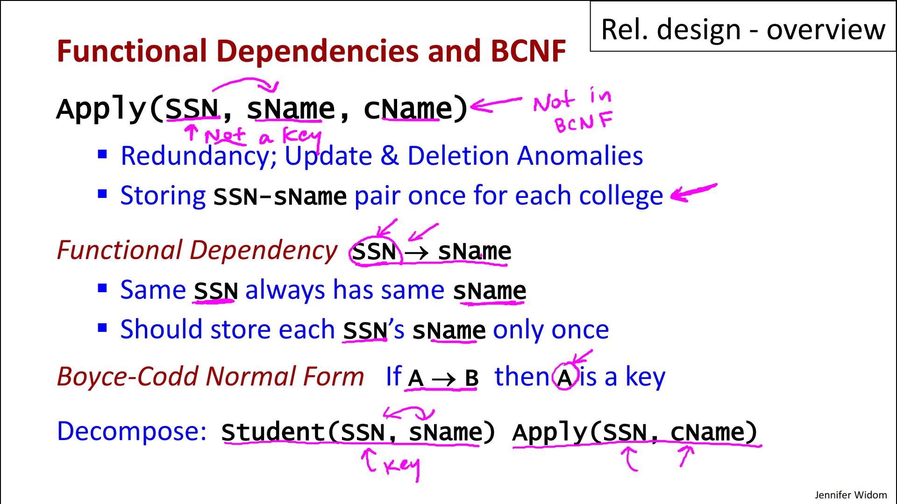{width="4.109375546806649in"
    > height="2.314083552055993in"}

    -   **1. that the same social security number always has the same
        > name.** In other words, every time we see 123, we\'re going to
        > see Ann. Now it doesn\'t necessarily go in the other
        > direction. It might not be that whenever we see Ann, it\'s
        > 123, but whenever we see 123, it is Ann.

    -   **2.** And so what we\'d like to do is **store that relationship
        > just one time**. One time say that for 123, the name is Ann.

-   Now **what Boyce Codd Normal Form says** is that

    -   **whenever we have one of these [functional
        > dependencies]{.underline}, then the left hand side of that
        > functional dependency must be a [key]{.underline}**.

        -   And think about what that\'s saying. Remember a key says
            > that we have just one tuple with each value for that
            > attribute.

        -   So if we have social security number to name as a functional
            > dependency and we satisfy Boyce-Codd Normal Form, then
            > we\'re going to say that social security number has to be
            > a key in our relation, and we\'ll only have one tuple for
            > each social security number.

-   Specifically, we can go back to our original relation. We have this
    > functional dependency social security number here is not a key,
    > right? So then we know that this is **[not]{.underline}** in
    > Boyce-Codd Normal Form. So we\'re going to use functional
    > dependencies to help us decompose our relation so that the
    > decomposed relations **[are]{.underline}** in Boyce-Codd Normal
    > Form.

-   And here\'s **what would happen in this example**:

    -   Our **functional dependency would tell us to pull out the social
        > security number and student name into its own relation** where
        > the social security number is a key and then we have just one
        > time for each social security number that student's name, and
        > then separately we\'ll have the information about the students
        > and which colleges they applied to.

-   Again, we\'ll completely formalize this whole idea, the definition
    > of functional dependencies, their properties, the normal form, and
    > how we do the decomposition in a later video.

Multivalued Dependencies, 4NF
-----------------------------

-   Now, let\'s similarly motivate the concept of **multivalued
    > dependencies**, and **fourth normal form**. It is actually a
    > little bit more complicated, but it follows the same rough
    > outline.

-   Now let\'s look at a different portion of the information about
    > applying and let\'s suppose, for now, that we\'re just concerned
    > about students, what colleges they\'re applying to, and what high
    > schools they went to. \[also Apply(SSN, cName, HS)\]

-   We still have **redundancy** and **update** and **deletion
    > anomalies**.

    -   For example, a student who applies to Stanford is going to have
        > that fact captured once for every high school that they went
        > to. A student who went to Palo Alto high School will have that
        > fact captured once for every college they apply to.

-   In addition, we get a kind of **multiplicative effect** here.

    -   Because let\'s say a student applies to C colleges and they went
        > to H high schools; I know students don\'t go to a lot of high
        > schools but let\'s suppose that this is one that had moved a
        > lot. In that case, we\'re going to have **C times H** tuples.
        > What we\'d really like to have is something more on the order
        > of **C plus H**, because then we\'d be capturing each piece of
        > information just once.

-   Now the interesting thing is that the badness of this particular
    > design is **not addressed by Boyce-Codd Normal Form**, in fact
    > this relation **[is]{.underline} in Boyce-Codd Normal Form**,
    > because it **has no functional dependencies**. It\'s not the case
    > that every instance of a social security number is associated with
    > a single college name or a single high school. As we will see
    > later, **if there are no functional dependencies, then the
    > relation is automatically in Boyce-Codd Normal Form**, **but it\'s
    > not in fourth normal form**.

-   So **fourth normal form** is associated with what are called
    > **multivalued dependencies**.

-   When we **specify a multivalued dependency** as we\'ve done here
    > with the **double arrow**, what this is saying is that if we take
    > a particular social security number in the relation, we will have
    > **every combination** of college names that are associated with
    > that social security number **with every** high school that\'s
    > associated with that social security number.
    > 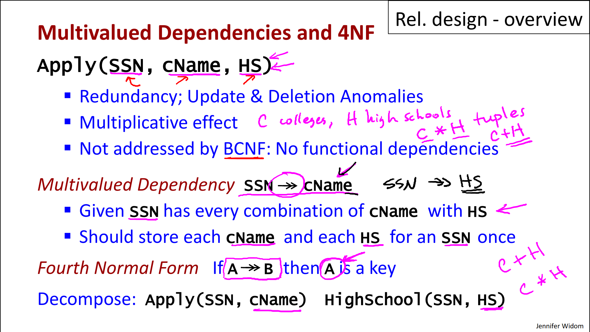{width="3.4531255468066493in"
    > height="1.944534120734908in"}

-   We\'ll actually see that **when we have this \[SSN** ↠ **cName\]
    > multivalued dependency, we automatically have this one \[SSN** ↠
    > **HS\], too**.

-   I know it seems a bit complicated, and we will formalize it
    > completely, but for now just think about the English statement
    > that **multivalued dependency is saying that** we are going to
    > have **every combination** of those two attributes and values in
    > those attributes for a given social security number. **In other
    > words**, those values are really independent of each other.

-   So if we have that situation, then what we should really do is store
    > each college name and each high school for each social security
    > number one time, and that\'s **what fourth normal form will do**
    > for us.

-   **Fourth normal form**, similarly to Boyce-Codd normal form,
    > **says** if we have a dependency, then **the left hand side must
    > be a key**.

    -   In this case, it\'s a multivalued dependency we\'re looking at,
        > so it\'s really saying something different but the basic idea
        > is the same which is that

    -   **we want only one tuple that has each value that appears on the
        > left hand side of a multivalued dependency**

-   So let\'s see **what would happen in this example**, if we use our
    > multivalued dependencies to decompose the relation, based on the
    > idea of fourth Normal Form.

    -   Well it is the intuitive thing that happens. We separate the
        > information about the college names that a student applies to
        > from the information about the high schools themselves, and
        > then we\'ll see that we only store each fact once and we do
        > get the behavior of having **C plus H tuples instead of having
        > C times H tuples**.

-   Like with functional dependencies and Boyce-Codd Normal Form we\'ll
    > be completely formalizing all of this reasoning and the
    > definitions in later videos.

Summary
-------

-   To summarize, we\'re going to do relational **design by
    > decomposition**.
    > 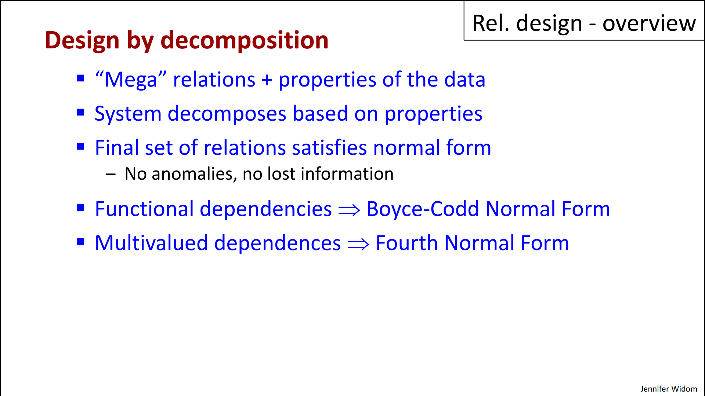{width="3.7604166666666665in"
    > height="2.1195078740157482in"}

-   We\'re going to start by specifying **mega relations** that contain
    > all the information that we want to capture, as well as specifying
    > **properties of the data** usually reflecting the real world in
    > some fashion.

-   The system can automatically **decompose** the mega-relations into
    > smaller relations **based on the properties** we specify, and
    > guarantee that the **final set of relations have** certain good
    > properties captured in a **normal form**.

    -   They will have **no anomalies**, and they\'ll be guaranteed
        > **not to lose information**.

-   We\'ll start by specifying properties as **functional dependencies**
    > and from there the system will guarantee **Boyce-Codd Normal
    > Form**

-   and then we\'ll add to that properties specified as **multivalued
    > dependencies**, and from there the system will guarantee **fourth
    > normal form**, which is even stronger than Boyce-Codd Normal Form
    > and is generally thought to be good relational design.

7.2 Functional Dependencies
===========================

-   watch

7.3 BCNF
========

-   watch

zu Quiz Q1
----------

For the relation Apply(SSN,cName,state,date,major), suppose college
names are unique and **students may apply to each college only once**,
so we have two FDs: cName state and SSN,cName date,major. Is Apply in
BCNF?

-   **Answer:** No

-   **Explanation:** {SSN,cName} is a key \[weil s. **gelb** in Frage\]
    > so only cName→state is a BCNF violation. Based on this violation
    > we decompose into A1(cName,state), A2(SSN,cName,date,major) \[s.
    > nächstes Video\]. Now both FDs have keys on their left-hand-side
    > so we\'re done.

-   \["college names are unique" heißt **nicht**, dass es nur ein Tupel
    > pro cName geben muss ! cName kann also **in Apply** kein key
    > sein.\]

Part 3
------

-   The only way we would decompose with \"B\" as the shared attribute
    > were if we have a functional dependency from **B to A** or **B to
    > C**. And we don\'t.

    -   In both cases, there\'s two values of B that are the same where
        > here the A values are not the same and here the C values are
        > not the same. So **neither of these functional dependencies
        > hold** \[weil sowohl bei B→A als auch bei B→C beide B values
        > gleich, aber die rechten Seiten A bzw. C [nicht]{.underline}
        > gleich sind, sodass laut Definition B→A und B→C keine FDs sein
        > können\] and BCNF would not perform this decomposition.

7.4 Multivalued Dependencies, 4NF
=================================

8.1 XPath
=========

XPath vs XSLT vs XQuery
-----------------------

-   Now let\'s turn to the subject of **querying XML**.

-   First of all, let me say right up front that **querying XML is not
    > nearly as mature as querying relational databases**. And there is
    > a couple of **reasons** for that:

    -   First of all it\'s just much, **much newer**.

    -   Second of all it\'s not quite as clean, there\'s **no underlying
        > algebra for XML** that\'s similar to the relational algebra
        > for querying relational databases.

-   Let\'s talk about the **sequence of development of query languages
    > for XML** up until the present time.

    -   The first language to be developed was **XPath**.

        -   XPath consists of **path expressions** and **conditions**
            > and that\'s what we\'ll be covering in this video once we
            > finish the introductory material.

    -   The next thing to be developed was **XSLT**.

        -   XSLT **has XPath as a component** but

        -   it **also has transformations**, and that\'s what the T
            > stands for, and

        -   it also **has constructs for output formatting**.

        -   XSLT is often **used to translate XML into HTML** for
            > rendering.

    -   And finally, the latest language and the most expressive
        > language is **XQuery**.

        -   So that also **has XPath as a component**, plus what I would
            > call a **full featured query language**. So it\'s **most
            > similar to SQL** in a way, as we\'ll be seeing.

-   The order that we\'re going to cover them in is first XPath and then
    > actually second XQuery and finally XSLT.

-   There are a couple of **other languages**, **XLink** and
    > **XPointer**.

    -   Those languages are **for specifying links and pointers**.

    -   They also **use the XPath language as a component**.

    -   We won\'t be covering those in this video.

-   Now we\'ll be covering XPath, XQuery, and XSLT in moderate detail.
    > We\'re not going to cover every single construct of the languages,
    > but we will be covering enough to write a wide variety of queries
    > using those languages.

XML as a tree
-------------

-   To understand **how XPath works**, it\'s good to **think of the XML
    > as a tree**:

    -   So I\'d like you to bear with me for a moment while I write a
        > little bit of a tree that would be the tree encoding of the
        > book store data that we\'ve been working with.

    -   So we would write as our root the book store element, and then
        > we\'ll have sub-elements that would contain the books that are
        > the sub elements of our bookstore. We might have another book.
        > We might have over here a magazine and within the books then
        > we had, as you might remember some attributes and some sub
        > elements. We had for example the ISBN number I\'ll write as an
        > attribute here. We had a price and we also had of course the
        > title of the book and we had the author, excuse me, over here,
        > I\'m obviously not going to be filling in the subelement
        > structure here we are just going to look at one book as an
        > example. The ISBN number - we now are at the leaf of the tree,
        > so we could have a string value \[ie. the ISBN\] here to
        > denote the leaf. Maybe 100 for the price \[leaf\], for the
        > title \[leaf\]: \"A First Course in Database Systems\", then
        > our authors had further sub-elements. We had maybe two
        > authors\' sub elements here, I\'m abbreviating a bit, below
        > here, a first name and a last name, again abbreviating so that
        > might have been Jeff Ullman, and so on.
        > 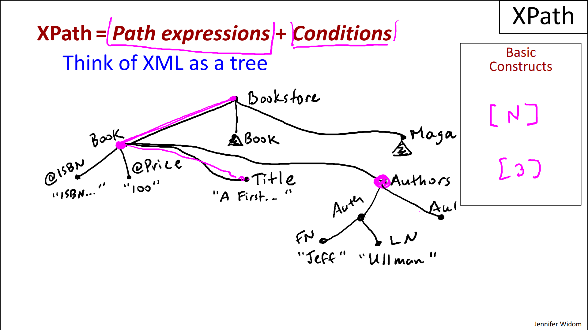{width="3.2968755468066493in"
        > height="1.8565463692038495in"}

-   I think you get the idea of how we render our **XML as a tree**.

-   And the reason we\'re doing that is so that we can **think of the
    > expressions we have in XPath as navigations down the tree**.

    -   Specifically, **what XML consists of is path expressions that
        > describe navigation down and sometimes across and up a tree**.

    -   And then we also have **conditions** that we evaluate **to pick
        > out the components of the XML that we\'re interested in**.

XPath: Basic Constructs
-----------------------

-   So let me just go through a few of the **basic constructs** that we
    > have in XPath.

    -   So the first construct is simply a **slash**, and the slash is
        > for

        -   designating the root element. So we\'ll put the slash at the
            > beginning of an XPath query to say we want to start at the
            > root.

        -   A slash is also used as a separator. So we\'re going to
            > write paths that are going to navigate down the tree and
            > we\'re going to put a \'/\' between the elements of the
            > path.

    -   The next construct is simply writing the **name of an element**.

        -   We might for example write \'book\'. When we write \'book\'
            > in an XPath expression, we\'re saying that we want to
            > navigate say we\'re up here at the bookstore down to the
            > 'book' sub-element as part of our path expression.

    -   We can also write the special element symbol **\* (star)**
        > and \* matches anything.

        -   So if we write **/\* (slash star)** then we\'ll match any
            > sub-element of our current element.

        -   When we execute XPath, there\'s sort of **a notion** as
            > we\'re writing the path expressions **of being at a
            > particular place**.

            -   So we might have navigated from bookstore to book and
                > then we would navigate say further down to title or if
                > we put a \* then we navigate to any sub-element.

    -   If we want to match an attribute, we write **@** and then the
        > attribute name.

        -   So for example, if we\'re at the book and we want to match
            > down to the ISBN number, we\'ll write ISBN in our query,
            > our path expression.

    -   We saw the single slash for navigating one step down. There\'s
        > also a **double slash** construct. The double slash matches
        > any descendant of our current element.

        -   So, for example, if we\'re here at the book and we write
            > double slash, we\'ll match the title, the authors, the
            > off, the first name and the last name, every descendant,
            > and actually we\'ll also match ourselves. So this symbol
            > here means any descendant, including the element where we
            > currently are.

-   What about **conditions**? If we want to evaluate a condition at the
    > current point in the path, we **put it in a square bracket** and
    > we write the condition here.

    -   So, for example, if we wanted our price to be less than 50, that
        > would be a condition we could put in square brackets if we
        > were (actually, better be the attribute) at this point in the
        > navigation.

    -   **Warning:** Now we shouldn\'t confuse putting a condition in a
        > square bracket with **putting a number in a square bracket**.
        > If we put a number in a square bracket, N, for example, if I
        > write three, that is **[not a condition]{.underline}** but
        > rather it matches the Nth sub element of the current element.

        -   For example, if we were here at authors and we put off
            > square bracket two, then we would match the second off sub
            > element of the authors.

-   There are many, many other constructs. This just gives the basic
    > flavor of the constructs for creating path expressions and
    > evaluating conditions.

-   XPath also has lots of **built in functions**. I\'ll just mention
    > two of them as somewhat random examples:

    -   There\'s a function that you can use in XPath called
        > **contains**. If you write contains and then you write two
        > expressions, each of which has a string value - this is
        > actually a predicate - will return true, if the first string
        > contains the second string.

    -   As a second example of a function, there\'s a function called
        > **name**. If we write name in a path, that returns the tag of
        > the current element in the path.

-   The last concept that I want to talk about is what\'s known as
    > **navigation axes**, and there\'s **13 axes** in XPath. And what
    > an axis is, it\'s sort of a key word that allows us to navigate
    > around the XML tree.

    -   So, for example, one axis is called **parent::**. You might have
        > noticed that when we talked about the basic constructs, most
        > of them were about going down a tree. If you want to
        > **navigate [up]{.underline} the tree**, then you can use the
        > parent access that tells you to go up to the parent.

    -   There\'s an access called **following-sibling::**. The following
        > sibling says, match actually all of the following siblings of
        > the current element. So if we have a tree and we\'re sitting
        > at this point in the tree, then the following-sibling axis
        > will match all of the siblings that are after the current one
        > in the tree.

    -   There\'s an axis called **descendant::.** \[This\] matches all
        > the descendants of the current element.

        -   Now it\'s not quite the same as //, because as a reminder,
            > slash, slash also matches the current element as well as
            > the descendants. Actually as it happens, there is a
            > navigation axis called **descendant-or-self::** that is
            > equivalent to slash, slash.

    -   And by the way, there\'s also one called **self::** that will
        > match the current element.

        -   And that may not seem to be useful, but we'll see uses for
            > that, for example, **in conjunction with the name
            > function** that we talked about up here, that would give
            > us the tag of the current element.

-   Just a few details to wrap up.

-   **XPath queries** technically **operate on and return a sequence of
    > elements**. That\'s their formal semantics.

-   **There is a specification** for how **XML documents** and XML
    > streams **map to** **sequences of elements** and you\'ll see that
    > it\'s quite natural.

-   When we run an XPath query, sometimes the **result can be expressed
    > as XML, but not always**. But as we\'ll see again, that\'s fairly
    > natural as well.

8.2 Demo
========

8.3 XQuery
==========

Compositionality
----------------

-   XQuery is an **expression language**, also known as a
    > **compositional language**. And we\'ve seen that already with
    > relational algebra. What that means is, when we run an expression
    > of the language on a type of data the answer to that expression or
    > query is the same type of data.

    -   So let me just draw the picture here. We have some data. We run
        > an expression or query over that data and we get a result back
        > and that result is also going to be in the same type of data.
        > That means we can run another query or expression over the
        > same type of data that was the result of the previous one. And
        > again, we get a result of the same type of data. Now that also
        > means that we can sort of put these together. And when we put
        > them together, that will give us additional expressions or
        > queries that are valid in the language.

    -   When we talked about compositionality **in the relational
        > model**, the types of data we were using were **relations**.
        > We would have maybe some relations here, we run a query over
        > those relations the result itself is a relation and we can run
        > further queries over that relation that\'s the answer. And
        > then when we looked at **relational algebra**, we saw a
        > composing the expressions of relational algebra into more
        > complicated expressions and everything worked together
        > \[→compositional language\].

    -   **In XML**, it\'s similar, except the expressions operate on and
        > return what are known as **sequences of elements**. As we
        > mentioned for XPath, the sequences of elements can be
        > generated from an XML document.They can also be generated from
        > an XML stream and the interpretation is quite natural. Now let
        > me mention that one of the basic types of expressions in
        > XQuery is XPath. So **every XPath expression is in fact an
        > XQuery expression** or a valid query in XQuery. Then we can
        > use XPath and other constructs of XQuery to put together into
        > more complicated queries \[→compositional language\].

XQuery: Basic Constructs
------------------------

-   Now, one of the most commonly used expressions in XQuery is what\'s
    > known as the **FLWOR expression**, and it looks closest to SQL of
    > any of the constructs in XQuery. Let me explain how it works. We
    > have **up to five clauses** in that FLWOR expression and that\'s
    > where the FLWOR comes from.

    -   The first, the **FOR clause**, sets up what are known as
        > iterator variables. So the idea here is that in the for
        > clause, this expression is evaluated and it will produce
        > potentially a set result. And then the variable will be backed
        > Count to each element of the set one at a time and then the
        > rest of the expression will be evaluated for each element. So
        > in other words if this produces a set of end results. Then we
        > will effectively evaluate the rest of the queries N times. We
        > will see that much more clearly when we do the demonstration.

    -   The **LET clause** is more of a typical assignment. So it\'s
        > only run once, each time the rest of the query is run. And so
        > this expression is evaluated and even if it\'s a set, it\'s
        > assigned once to this variable. So it\'s not iterating now,
        > it\'s just doing an assignment. Again, it\'ll become quite
        > clear when we do the demonstration.

    -   The **WHERE clause** specifies a condition and it\'s a filter
        > very similar to the filters that we\'ve seen in SQL.

    -   The **ORDER BY** is also sort of similar to SQL. It sorts the
        > results so that you can get the result in a particular order.

    -   And finally the **RETURN clause** says what we want to actually
        > get in the result of our query.

-   And just as a reminder, when we start the query with the for, if we
    > are effectively executing the query N times then each one of those
    > N executions may result in one of the elements in the result.

-   The FLWOR expression has up to five clauses, but actually **all of
    > the clauses except the return clause are optional**. The return is
    > the only one that\'s required to have a well-formed query and to
    > get a result.

-   I also want to mention that the **for and let clause can be repeated
    > multiple times** if we want to set up multiple variables or
    > multiple assignments and **they can be interleaved with each
    > other**. They don\'t need to be in a particular order.

-   Our next query, it\'s possible to **mix query evaluation with simply
    > writing down the XML data that we want in the result**.

    -   And here\'s an example. In this case, we\'re writing the opening
        > and closing tags that we want to be in the result of our
        > query. And then inside **curly braces**, we write the query
        > itself. And what these **curly braces** effectively say are
        > **"evaluate me"**. The curly braces are an **indicator to the
        > XQuery processor** that what\'s inside them needs to be run as
        > a query, is **replaced** with the XML that\'s the query
        > result, and the final output is our opening and closing tags
        > with the XML query result inside.

8.4 Demo
========

10.1 Indexes
============

-   The reason indexes are so important is that they are the **primary
    > way of getting improved performance** out of a database.

-   Indexes **are a persistent data structure**.

-   They\'re stored together with the database itself.

-   Now, there are many very interesting implementation issues in
    > indexes, but in this video and in this course in general, we\'re
    > focusing on the perspective of the user and application. So,
    > we\'ll talk about how applications will use indexes to speed up
    > performance.

-   So, let\'s suppose we have a very simple table T that has three
    > columns, but we\'re going to focus on columns A and columns B. And
    > we can see that Column A is a string valued column with animal
    > names, and Column B is an integer column.

-   Now, we\'re gonna be asking **queries that involve conditions over
    > these two columns**:

    -   **In order to speed up those queries**, if we\'re concerned
        > about **evaluating conditions on column A**, then we can
        > **build an index on that column**. So we call that an index on
        > column T.A. What that index allows us to do - and \"us\" in
        > this case is actually the **query processor** - is ask
        > questions, for example,

        -   let\'s ask what tuples have \"cow\" in the value of T.A. If
            > we ask that question of our index, that index will quickly
            > tell us that tuple 3 and tuple 7 have a value \"cow\",
            > without scanning the entire table.

        -   We could also ask the index what tuples have, say the value
            > \"cat\". And if we ask the index that question, it will
            > tell us tuple 1 and tuple 5 and tuple 6 have the value
            > \"cat.\"

    -   If we\'re interested in **evaluating conditions in column B**
        > then we can also **build an index on column B**. For example

        -   now we could ask questions like, when is T.B equal to the
            > value two? We asked the index and the index will tell us
            > that tuple 1 and tuple 5 have the value two.

        -   We could also ask, for example, when the value in T.B is
            > less than six? And the index in that case would tell us
            > that tuple 1 is less than six, two\...wow, most of them:
            > three, five, and seven.

        -   We could ask an even more complicated question. We could ask
            > when the value for T.B is, say, greater than four and less
            > than or equal to eight. Again, we ask the index, and in
            > this case the index would tell us that it is tuple two and
            > tuple seven in that case.

    -   Lastly, suppose we\'re interested in having **conditions that
        > are on both columns A and B**. Then we can **build an index
        > that is on both columns together**.

        -   Now we could ask questions, for example, like, when is T.A
            > equal to cat and T.B, say, greater than five? Do we have
            > any of those? Well, we have just one of them there.
            > That\'s tuple six.

        -   We could also have **inequalities**, by the way, on the
            > first column. So we might ask, when is T.A less than, say
            > the value D, and T.B equal to say the value 1, and in that
            > case we\'ll get the tuple 3 as a result.

-   So I think this gives an idea with a simple table of how indexes are
    > **used to go directly to the tuples that satisfy conditions rather
    > than scanning the entire table**. So that\'s the main utility of
    > an index.

-   Again, the tables can be absolutely gigantic in databases and the
    > difference between scanning an entire table to find that tuples
    > that match a condition and locating the tuples, more or less
    > immediately using an index, can be orders of magnitude in
    > performance difference.

-   So really it\'s quite important to take a look at the database and
    > **build indexes on those attributes that are going to be used
    > frequently in conditions, especially conditions that are very
    > selective**.

-   Now I mentioned that we\'re not covering the implementation of
    > indexes in this video, but it is important to understand the
    > **basic data structures that are used**. Specifically there are
    > **two** different structures:

    -   One of them is **balanced trees** and substantiation of that is
        > typically what\'s called a **B tree** or a **B+ tree**.

    -   And the other is **hash tables**.

        -   Now **balanced trees indexes** can be used to help with
            > conditions of the form \"attribute equals value.\" They
            > can also be used for \"attribute **less than** value,\"
            > for \"attribute **between** two values\" and so on, as we
            > have shown earlier.

        -   **Hash tables**, on the other hand, **can only be used for
            > equality conditions**. So only attribute equal value.

    -   And if you\'re familiar with these structures then you\'ll know
        > why there\'s the limit on hash tables. So balanced tree
        > indexes are certainly more flexible.

    -   Now there is one small downside. For those of you who are
        > familiar with the structures and with the **running time**,

        -   the **operations on the balance trees tend to be
            > [logarithmic]{.underline} in their running time**,

        -   while well designed **hash tables can have more or less
            > [constant]{.underline} running time**.

        -   Even in large databases, logarithmic is okay, although when
            > only equality conditions are being used, then a hash table
            > index might be preferred.

-   Now, let\'s take a look at a few SQL queries and see how indexes
    > might allow the query execution engine to speed up processing.
    > We\'ll use our usual student and college database.

    -   The first one is a very simple query, it\'s looking for the
        > student with a particular student ID. So if we have an index
        > on the student ID then again the index will allow the query
        > execution engine to go pretty much straight to that tuple,
        > whereas without an index the entire student table would have
        > to be scanned.

Now let me mention that **many database systems do automatically build
indexes on primary keys**. So it\'s likely that in an application the
student ID would be declared as a primary key and there would be an
index automatically. But it\'s a good thing to check if this type of
query is common. **And some systems even also build indexes
automatically on attributes that are declared as UNIQUE**.

-   As a reminder from the constraint video, every table can have **one
    > primary key**, and then **any number of additional keys labeled as
    > unique**.

    -   Now let\'s take a look at a slightly more complicated example.
        > Here we\'re looking for students whose name is Mary and whose
        > GPA is greater than 3.9, and there may be a few of those
        > students.

        -   So one possibility is that we have an index on the student
            > name and if that is the case, then the query processing
            > can find quickly the tuples whose student name is Mary,
            > and then check each one of those to see if the GPA is
            > greater than 3.9.

        -   Alternatively we might have an index on the GPA. In that
            > case, the system will use the index to find the students
            > whose GPA is greater than 3.9 and then look to see if
            > their name is Mary.

        -   Finally, it is possible we can have an index on the two
            > attributes together so we can have S name and GPA together
            > and then this index can be used to simultaneously find
            > students that have the name Mary and the GPA greater than
            > 3.9.

        -   Now, I should mention that

            -   because this is an inequality condition, it is important
                > that the **GPA is a tree based index** in order to
                > support that evaluation of this condition

            -   whereas the **student name** is an equality condition so
                > that could be a **hash based index or a tree based
                > index**.

    -   Now let\'s look at a query that involves a join. We\'re joining
        > the student and apply tables in order to find the names of the
        > colleges that each student has applied to. And we\'re
        > returning the student name and the college name.

        -   So let\'s suppose for starters that we had an index on the
            > student ID attribute of the apply relation. If that\'s the
            > case then the query execution engine can scan the student
            > relation and, for each student, use that SID and quickly
            > find the matching SIDs in the apply relation.

        -   Alternatively, let\'s suppose we had an index on the SID
            > attribute of the student relation. In that case, the
            > system could scan the apply relation, and, for each
            > student ID and each apply tuple, find the matching student
            > IDs in the student tuple using the index that we have
            > there.

        -   In some cases it\'s actually possible to use the two indexes
            > together and make the query run even faster.

            -   I\'m not going to go into detail, but indexes often
                > allow relations to be accessed in sorted order of the
                > indexed attributes. So, suppose we can get the student
                > relation in sorted order and the apply relation in
                > sorted order. Then we can kind of do a merge-like
                > operation of the two indexes to get the matching
                > student and apply records, those whose SIDs are equal.

        -   If we had additional conditions in the query there might be
            > even more choices of how to use indexes, and that gets
            > into the entire area of what is known as **query
            > planning** and **query optimization**. And this is
            > actually one of the most exciting and interesting areas of
            > the **implementation of database systems** and is **what
            > allows us to have a declarative query language** that\'s
            > implemented efficiently.

Downsides of using Indexes
--------------------------

-   So, there must be some downsides, and of course, there are.

-   Let me list three of them from sort of least severe to most severe:

    -   So, the first one is that **indexes do take up extra space**. As
        > I mentioned, they are persistent data structures that resides
        > with the data. I consider this sort of a marginal downside,
        > especially with the cost of disk these days, it\'s really not
        > that big of a deal to use additional space, even to
        > potentially double the size of your database.

    -   The second downside is the **overhead involved in index
        > creation**. So, when a database is loaded, if we\'re going to
        > have indexes, those indexes need to be created over the data.
        > Or if we add indexes later on, they need to be created. Index
        > creation can actually be a fairly time consuming operation, so
        > I\'m going to make this as a medium downside. On the other
        > hand, once the index is created, all the queries run faster,
        > so it\'s usually worthwhile to do it.

    -   The last one is the most significant one and that\'s the issue
        > of **index maintenance**. So the index is a data structure
        > that sits to the side of the database and helps answer
        > conditions. When the values in the database change, then the
        > index has to be modified to reflect those changes. So if the
        > database is modified frequently, each of those modifications
        > is going to be significantly slower than if we didn\'t have
        > indexes. So in fact, in a database that\'s modified a whole
        > bunch and not queried all that often, the cost of index
        > maintenance can actually offset the benefits of having the
        > index. So it really is a **cost-benefit trade off** to decide
        > when to build indexes.

-   So given that we have this cost-benefit trade off. How do we figure
    > out which indexes to create when we have a database an
    > applications on that database. The benefit of an index depends
    > first of all on

    -   **how big the table is** since the index helps us find specific
        > portions of the table quickly.

    -   It depends on **the data distributions** again because the index
        > helps us find specific data values quickly.

    -   And finally **how often we\'re going to query the database vs
        > how often we\'re going to update it**. As I mentioned, every
        > time the database is updated indexes need to be maintained and
        > that\'s costly. Every time we query the indexes may help us
        > answer our queries more quickly.

-   Fortunately, over the last decade or so, many database system
    > vendors have introduced what\'s called a **physical design
    > advisor**. In this case, **physical design** means determining
    > which indexes to build on a database.

    -   The **input** to the design advisor is the **database** itself
        > and the **workload**.

    -   The **workload** consists of the **sets of queries and updates**
        > that are expected to be performed on the database as well as
        > **their frequency**.

    -   Now actually the design advisor doesn\'t usually look at the
        > entire database, but rather **looks at statistics on the
        > database** that describe how large the tables are and their
        > data distributions.

    -   The **output** of the design advisor is a **recommended set of
        > indexes to build** that will speed up the overall workload.

-   Interestingly, physical design advisors rely very heavily on a
    > component of database systems that already existed, actually one
    > of the most important components of database systems, which is the
    > **query optimizer**.

    -   That\'s the component that takes a query and figures out how to
        > execute it: Specifically, it\'ll take

        -   **statistics on the database**,

        -   **the query** to be executed **or the update command**, and

        -   **the set of indexes that currently exist**,

    -   and it will

        -   **explore the various ways of actually executing the
            > query** - which indexes will be used, which order things
            > will be done in.

        -   It **estimates the cost of each** one, and

        -   it **spits out the estimated best execution plan with the
            > estimated cost**.

-   So now let\'s look at how this component can be used to **build a
    > design advisor**. Let\'s just draw the design advisor around the
    > whole thing here, and the input to the design advisor, again, are
    > the statistics and the workload, and the output is supposed to be
    > the indexes. So what the design adviser actually does is it
    > **experiments with different set-ups of indexes**. For each set-up
    > of indexes, it takes the workload, it issues the queries, and
    > updates to the query optimizer. It **[doesn\'t]{.underline}
    > actually run them against the database and see\'s what cost the
    > query optimizer produces**. It tries this with different
    > configurations of indexes and then in the end determines those
    > indexes that bring down the cost the most. In other words, it will
    > give you back those indexes where the benefits of having the index
    > outweigh the drawbacks of having that index in terms of the
    > workload and using the costs that were estimated by the query
    > optimizer. 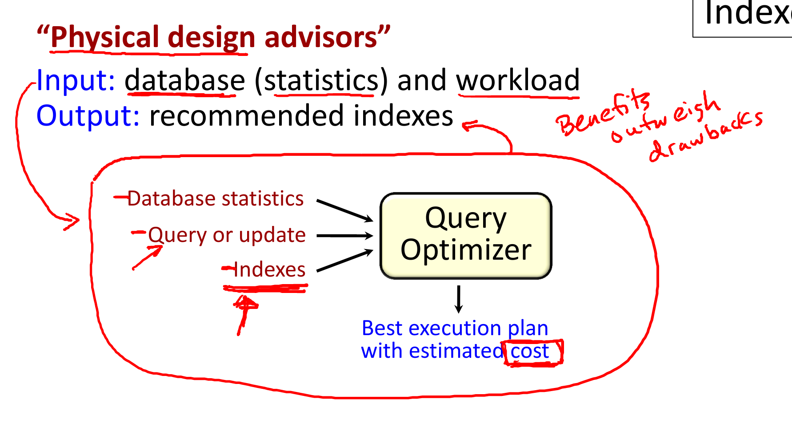{width="3.963542213473316in"
    > height="2.1792891513560804in"}

-   If you\'re **using a system that doesn\'t have a design adviser**,
    > then you\'ll have to kind of go through this process yourself.
    > You\'ll have to take a look at the queries and updates that you
    > expect, how often you expect them to happen, and which indexes
    > will benefit those queries, and hopefully won\'t incur too much
    > overhead when there are updates.

-   Just quickly, here\'s the **SQL standard for creating indexes**:

    -   All indexes are given **names**.

    -   We can **CREATE an index** on a single attribute. We can create
        > an index on several attributes together. \[Create Unique Index
        > IndexName on T(A1,A2,\...,An)\]

    -   We can also say that we want our index to **enforce a uniqueness
        > constraint** so when we add the word **UNIQUE** it sort of
        > adds constraint enforcement.

        -   It says, we\'re going to check that all values for \"A\" are
            > unique using our index and will generate an error if there
            > are two tuples that have the same value for A,

    -   and finally we have a command \[**DROP**\] for **dropping
        > indexes**. \[Drop Index IndexName\]

-   In summary, indexes are really important. They\'re the primary way
    > to get improved performance on a database. By building the right
    > indexes over a database for its workflow we can get orders of
    > magnitude performance improvement. Although we do have to be
    > careful, because there are trade-offs in building indexes,
    > especially for databases that are modified frequently. They are a
    > persistent data structure that are stored together with the
    > database, and there are many interesting implementation issues,
    > but in this video and course we\'re focusing specifically on the
    > user and application perspective, determining which indexes to
    > build and how they will gain performance improvement for us.

12 Transactions
===============

-   The concept of transactions is actually **motivated by two
    > completely independent concerns**:

    -   One has to do with **concurrent access to the database by
        > multiple clients** and

    -   the other has to do with having a system that is **resilient to
        > system failures**.

Concurrency
-----------

-   So we\'re going to talk about each of these in detail in turn.
    > Let\'s take a look at the **software structure of how database
    > systems are used**.

    -   We have the **data** itself usually stored on disc.

    -   And then we have the database management system, or **DBMS**,
        > that controls interactions with the data.

    -   Often there\'s **additional software above the DBMS**, maybe an
        > application server or web server.

    -   And then interacting with that might be a **human user** or
        > **additional software**,

    -   and the types of **operations that these users or the software
        > will be issuing** to the database are the things we\'ve looked
        > at such as

        -   select command in SQL or update commands,

        -   creating tables,

        -   creating and dropping indexes,

        -   maybe a help command,

        -   a delete command.

-   So each of the clients or the software applications will be issuing
    > these types of commands for the database, and most importantly,
    > they will be **issuing them concurrently** and we might have, you
    > know, a database with one user, ten, hundreds or even thousands of
    > users at the same time.

-   Let\'s look at the kind of **difficulties** that we can get into
    > when multiple clients are interacting with a database at the same
    > time. We\'ll be focusing mostly on SQL statements of modifications
    > and some queries that are being issued by clients. And we\'ll look
    > at some **different levels where inconsistency can occur**.

-   We\'re going to focus our first example just on **a single
    > attribute** and how it can have problems when multiple clients are
    > working on the same attribute.

    -   So let\'s say we have two clients, one is issuing a statement
        > that\'s increasing Stanford\'s enrollment by 1000. The second
        > client, around the same time is issuing a statement that\'s
        > increasing Stanford\'s enrollment by 1500. So we have in the
        > database our college table here. And somewhere in this college
        > table we actually have Stanford\'s enrollment.

    -   Now the way database systems work is when we are modifying a
        > value in the database, effectively, the system first **gets**
        > the value, then it **modifies** the value, and then it
        > **puts** the modified value back in the database.

    -   So here\'s the value that we\'re working on. So, client S1 will
        > fetch the value, add one thousand to it, and put it back.
        > Client S2 will do something similar, but adding 1,500 instead.
        > Let\'s suppose Stanford starts out with an enrollment of
        > 15,000 and these two statements are executed concurrently.
        > What are the final values that we might have?

        -   Well, if one of them runs before the other completely, then
            > it will add 2,500 and we will get 17,500.

        -   On the other hand if they really can interleave their get,
            > modifies, and puts, then it is possible that we\'ll
            > instead only add a 1,000, because the 1,500 gets lost,

        -   or we could only add 1,500.

        -   So there are **three possible final values** if there\'s
            > interleaving of the operations that modify the value.

        -   Of course we are going to see that there are mechanisms in
            > the database to avoid this, but I want to motivate the
            > reason that we have to have those mechanisms.

-   Now let\'s look at an example where the inconsistency actually
    > occurs **at the tuple level**. Again, we\'re going to have two
    > clients that are both issuing statements to the database that will
    > have some conflicting behavior.

    -   In this case they\'re both modifying the apply record for the
        > student with ID 123. The first client is trying to change that
        > apply record to have a major that\'s CS. Well the second is
        > modifying a different attribute of the same record, saying
        > that the decision should be yes.

    -   Now let\'s take a look at it again, so we\'ll have our table
        > here. And now, in this case, we\'re looking at an entire
        > tuple. Let\'s say that this is student 123 and so we have say,
        > the major in here and the decision in here.

    -   Now I\'ve mentioned already that the databases tend to use a
        > sort of get, modify, put, and we talked about that at the
        > attribute level previously, but in fact the reality is that it
        > does occur at the tuple level, in fact sometimes it occurs at
        > the entire page or disc lock level. So let\'s suppose that it
        > occurs at least at the tuple level. So, again, we can see the
        > same problem, then, when we have the two clients. Each will be
        > performing a get, modify, put. If they do it interleaved, then
        > it\'s possible that

        -   we will **see both changes**. We\'ll correctly get the major
            > reset and the decision reset

        -   but it\'s also possible we\'d **only see one** of the two
            > changes and it **could be either one**.

    -   So again, we need some mechanism to ensure that we have
        > consistent updates to the database that would give us what we
        > expect.

    -   In this case, we would probably expect both changes to be
        > persistent in the database.

-   Now, let\'s go one step further and look **at table level**
    > inconsistency. Again we have our two clients, and they\'re
    > submitting statements to the database around the same time.

    -   One of them is modifying the applied table and it\'s setting the
        > decision for applications TS for every student who\'s GPA is
        > greater than 3.9. The other statement, occurring at about the
        > same time, is modifying the student table; we\'ve decided to
        > increase the GPA of every student who comes from a large high
        > school.

    -   So here we have the apply table. We have the student table. We
        > have the first client S1 working on the apply table, but the
        > **conditions in which apply tuples are updated depend on
        > probing the student table**. Meanwhile we have client S2
        > that\'s modifying the student table. So what happens in the
        > apply table can depend on whether it occurs **before** or
        > **after** or **during** the modifications of the student
        > table.

        -   So you know, students would certainly prefer if their GPA is
            > increased before the apply records are automatically
            > accepted based on the GPA.

    -   So again, a notion of consistency here would be that we
        > understand that either all the GPA\'s are modified first and
        > then the acceptances are made or vice versa and we\'ll again
        > see mechanisms that will help us enforce that.

-   As a final example we\'ll consider clients that are interacting
    > **with multiple tables** again. But in this case we also have
    > **multiple statements** that are playing into the situation.
    > Specifically we\'ll see an example, where **we will want a one
    > statement to not occur concurrently even between the statements
    > from another client**.

    -   So let me just show you the example. So here again we have two
        > clients. I\'ll label them C1 and C2 now, since the first one
        > has two statements.

    -   So what the **first client** is doing is moving records from the
        > apply table to an archive table. Specifically, it looks in the
        > apply table for records where the decision is no and it
        > inserts those into an archive. And then in a second statement,
        > and this is really the only way to do it, it deletes those
        > tuples from the apply relation.

    -   The **second client** just happens to want to count the number
        > of tuples in the apply table and in the archive table.

    -   So again we have the two tables we\'re concerned with, the apply
        > table and the archive table.

    -   And what the first client is doing is, it\'s moving some tuples
        > from apply to archive, and then in a second statement deleting
        > those tuples from apply. Our second client\-- I\'ll put this
        > one in red\--is counting from the apply and then counting from
        > the archive.

    -   Now if we want the second client to see sort of a consistent
        > state of the database, where we don\'t have records that are
        > duplicated between apply and archive, then **we will really
        > want that second client to go either completely before, or
        > completely after, the first client**.

-   So after that long sequence of examples, I hope you get the feeling
    > of what we\'re looking for in concurrency. We have multiple
    > clients interacting with the database at the same time, and if
    > they have true interleaving of the commands that they\'re
    > executing on the database - often update commands but some select
    > commands as well - then we may get inconsistent or unexpected
    > behavior. So **what we\'d like to have overall** is the ability
    > for clients to execute statements against the database and not
    > have to worry about what other clients are doing at the same time.
    > Specifically, a little more generally, we like the class to be
    > able to execute a sequence of SQL statements, so that the client
    > can at least act like those statements are running in isolation.

-   Now there\'s one obvious solution to do this, right?

    -   Why don\'t we just execute them in isolation? This database
        > system can take its client requests and just do them one at a
        > time **with no concurrency**.

    -   On the other hand we really do **want to enable concurrency
        > whenever we can**.

-   Database systems are geared towards providing the highest possible
    > performance, we talked about that way in the introduction into the
    > course. And they typically do operate in an **environment where
    > concurrency is possible**:

    -   They may be working on a **multiprocessor system**.

    -   They may be using even a **multi-threaded system**.

    -   And database systems, also as they access the database, tend to
        > do a whole bunch of I/O so a **system that provides
        > asynchronous I/O** can also run multiple things concurrently.
        > It can do one thing while it\'s waiting for data to be fetched
        > by another.

    -   So assuming that system supports concurrency, then **we would
        > like the database software to support it** as well.

-   As a very simple example, let\'s suppose we have five clients that
    > are operating on the database and each one of them is operating on
    > a completely different part of the database, and we certainly
    > **wouldn\'t want to force them to execute sequentially when they
    > could execute in parallel** without causing any inconsistency
    > problems.

Resilience
----------

-   Let\'s switch gears entirely now and talk about system failures.
    > Again, we have our database system working with the data on disc,
    > and

-   1\. let\'s suppose we just happen to be **in the process of bulk loading
    > our database**. Maybe bringing in a large amount of data from an
    > external source, say a set of files, and **right in the middle of that
    > bulk load we have a system crash or a system failure**. It could be a
    > software failure, could be a hardware failure, could be as simple as the
    > power going out.

-   So, if the database is, at that point, half loaded, so let\'s say
    > half of this data has made its way to disc and the other half
    > hasn\'t, **what happens when the system comes back up**? That
    > leaves us in a rather unpleasant inconsistent state.

-   2\. Or maybe we\'re just **executing some commands on an existing
    > database**, remember our example earlier, where we were moving tuples
    > from an apply relation to an archive. So we have our relations here.
    > We\'re in the process of moving some data and then once it\'s moved,
    > we\'re going to delete the data that we moved, and then all of a sudden
    > once again we have a **crash or a failure of some type right in the
    > middle of that move**. So what do we do now? When the system comes up,
    > how do we know what was moved and what wasn\'t?

-   3\. As a last example, let\'s just suppose we were **performing a whole
    > bunch of updates on the database**. And as a reminder the way database
    > systems perform updates is they bring some data from the disc into the
    > memory. They modify it in memory and then eventually they write it back
    > to disc. So let\'s suppose **in the middle of that process again we have
    > a system crash**. That would again leave the database in an inconsistent
    > state.

-   So our **overall goal for dealing with system failures** is that
    > when we want to do something on the database that needs to be done
    > in an all or nothing fashion, we\'d like to tell the system that
    > we want to guarantee **all or nothing execution** for that
    > particular set of operations on the database **regardless of
    > failures** that might occur during the execution.

Solution mechanism: Transactions
--------------------------------

-   So we\'ve talked about problems with concurrency, we\'ve talked
    > about problems with system failures, and interestingly the exact
    > **same mechanism can be used to deal with both of those issues**,
    > and that mechanism is not surprisingly **transactions**.

-   So overall, a **transaction** is **a sequence of one or more
    > operations that are treated as a unit**.

    -   Specifically, **each transaction appears to run in isolation**,
        > and furthermore,

    -   if the system fails, **each transaction is either executed in
        > its entirety or not all**.

    -   In terms of the SQL standard, **a transaction begins**
        > automatically, when a SQL statement is issued by a client to
        > the database. When the commit command is issued that\'s a
        > special key word, **the current transaction ends** and a **new
        > one begins**. The current transaction also ends when its
        > session with the database terminates.

    -   And finally there is a mode called **autocommit** and in this
        > mode each statement, each SQL statement, is executed as a
        > transaction on its own.

-   So **for each client**, we can actually **think about a time-line**
    > and the client will be executing along, it might say commit and
    > that will commit anything that happened prior to this point. Then
    > it might do some operations, maybe a select, an update, a delete,
    > and then it says commit again, and when it says **commit** at this
    > point that **turns** this **amount of work** into **a single
    > transaction that\'s treated as a unit**. Maybe it\'ll update,
    > maybe it\'ll create an index, and again maybe commit at this point
    > in time and that, right here, will turn this into a transaction.
    > And so we can see **for each client**, this is Client 1, their
    > **execution on the database is seen as a sequence of
    > transactions**, each of which has the properties that we describe.
    > And then we may have a second client, that\'s also operating on
    > the database, and then it will also have its set of transactions.
    > 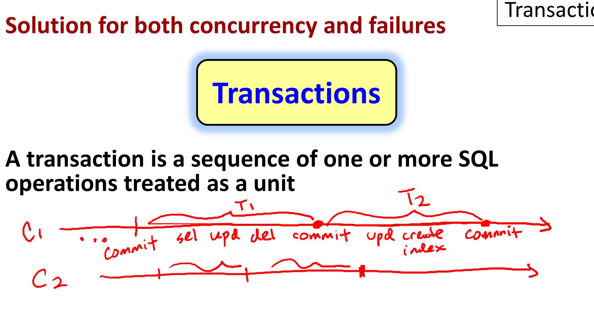{width="4.182292213473316in"
    > height="2.2787237532808398in"}

ACID properties
---------------

-   Every database connoisseur knows that transaction support, what are
    > known as the **ACID properties**. Although not everybody always
    > remembers that A stands for atomicity; C stands for consistency; I
    > stands for isolation; and D stands for durability.

### Isolation property

-   So here\'s the deal with **isolation**. We\'ll have a whole bunch of
    > clients operating on our database, and **we\'d kind of like each
    > client to imagine that they\'re operating on their own**. So as we
    > discussed in the previous video, each client issues to the
    > database system a sequence of transactions. So this first client
    > might be issuing first transaction T1, then T2, T3, and so on.
    > Over here we have T9, T10, T11 and as a reminder, **each
    > transaction itself can be a sequence of statements**. So, this
    > might be statement one, statement two, statement three and so on,
    > and then those statements will be treated as a unit.

-   So the isolation property is **implemented by** a very specific
    > formal notion called **serializability**.

    -   What serializability says is that the **operations within
        > transactions may be interleaved across clients, but the
        > execution of those operations must be equivalent to
        > *[some]{.underline}* sequential serial order of all the
        > transactions**.

        -   So for our example over here, the system itself may execute
            > all of the statements within each transaction and over
            > here concurrently, but it has to guarantee that the
            > behavior against the database is **equivalent to some
            > sequence** in order again. So perhaps the equivalent
            > sequential order will be as if the system first did
            > transaction T1, maybe then T2, T9 and T10, maybe back to
            > T3 and So on. And again the system has to guarantee that
            > the state of the database, at this point in time, even if
            > its interleaved the statements within any of these
            > transactions looks as if these transactions executed in
            > order.

-   Now, you might wonder **how the database system could possibly
    > guarantee this level of consistency while still interleaving
    > operation**. It uses **protocols** that are based on **locking**
    > portions of the database \[vgl. "Rollbacks" später\]. Now we\'re
    > not going to describe the implementation, because implementation
    > aspects are not the focus of this course. What you need to know
    > from a user\'s application perspective is really the properties
    > that are being guaranteed.

-   Now with the formal notion of serializability in mind let\'s go back
    > and look at the examples from the previous video that motivated
    > the problems we could get into with concurrent access.

    -   The first one was the example where two separate clients were
        > updating Stanford\'s enrollment. Let\'s just call one of them
        > T1. It\'s now a transaction. And the other T2. So when we run
        > these against the system and serializability is guaranteed,
        > then we will have a behavior that is at least equivalent to
        > either T1 followed by T2, or T2 followed by T1. So, in this
        > case, when we start with our enrollment of 15,000, **either
        > execution will correctly have a final enrollment of 17,500**
        > solving our concurrency problems.

    -   Here\'s our second example. In this case the first client was
        > modifying the major of student 123 in the apply table and the
        > second was modifying the decision. And we saw that if we
        > allowed these to run in an interleaved fashion, it would be
        > possible that only one of the two changes would be made.
        > Again, with serializability we\'re going to get behavior that
        > guarantees it is equivalent to either T1 and then T2, or T2
        > and then T1. And **in both cases, both changes will be
        > reflected in the database which is what we would like**.

    -   The next example was the one where we were looking at the Apply
        > and the Student table, and we were modifying the Apply table
        > based on the GPA in the Student table, and simultaneously
        > modifying that GPA. So again if these are issued as two
        > transactions, we\'ll have either T1 followed by T2 or T2
        > followed by T1. Or at least we will have behavior that is
        > equivalent to that. Now this case is a bit interesting because
        > either of these does result in a consistent state of the
        > database. In the first case, we\'ll update all the decision
        > records **before the GPAs are modified** for anyone, and in
        > the second case, will update the apply records **after the
        > GPAs have been modified**. The interesting thing here is that
        > **the order does matter in this case**. Now, the database
        > system only guarantees serializability. They guarantee that
        > the behavior will be equivalent to **some sequential order**
        > but they don\'t guarantee the exact sequential order if the
        > transactions are being issued at the same time. So **if it\'s
        > important to get, say, T1 before T2, that would actually have
        > to be coded** as part of the application.

    -   And our last example was the case where we had the Apply table,
        > the Archive table, and we were moving records from one table
        > to another in one of our clients, and the other client was
        > counting the tuples. And again, so T1 and T2, they\'re issued
        > as transactions. The system guarantees that we\'ll either move
        > all the tuples first and then count them, or will count the
        > tuples and then move them. Now, again, here\'s a case where
        > **the order makes a difference**, but if we care specifically
        > about the order, that would have to be coded as part of the
        > application.

-   OK, so we\'ve finished our first of the four ACID properties. The
    > other three will actually be quite a bit quicker to talk about.

### Durability property

-   Let\'s talk now about **durability**. And we only need to look at
    > one client to understand what\'s going on. So let\'s say that we
    > have our client, and the client is issuing a sequence of
    > transactions to the database. And each transaction again is a
    > sequence of statements. And finally at the end of the transaction
    > there is a commit.

-   So what **durability** guarantees for us is that **if there is a
    > system crash after a transaction commits, then all effects of that
    > transaction will remain in the database**. So, specifically, if at
    > a later point in time after this occurs, there\'s a failure for
    > whatever reason, the client can rest assured that the effects of
    > this transaction are in the database, and when the system comes
    > back up, they will still be in there.

-   So you may be wondering **how it\'s possible** to make this
    > guarantee since database systems move data between disc and memory
    > and a **crash could occur at any time**.

    -   There are actually fairly complicated **protocols** that are
        > used and they\'re based on the concept of **logging**. But
        > once again we\'re not gonna talk about the implementation
        > details. What\'s important from the user or application
        > perspective is the properties that are guaranteed.

### Atomicity property

-   Now let\'s talk about **atomicity**. Again we\'ll only look at one
    > client who is issuing a sequence of transactions to the database.
    > And let\'s look at transaction T2 which itself is a sequence of
    > statements followed by a commit.

-   The case that atomicity deals with is the case where there\'s
    > actually a **crash or a failure during the execution of the
    > transaction, before it\'s been committed**. What the atomicity
    > property tells us is that **even in the presence of system
    > crashes, every transaction is always executed either all or
    > nothing on the database**. So in other words, if we have each of
    > our transactions running, it\'s not possible in a system crash to,
    > say, have executed on the database a couple of statements but not
    > the rest of the transaction.

-   Now once again, you might be wondering **how this is implemented**.
    > It also uses a **logging** mechanism and specifically when the
    > system recovers from a crash, **there is a process by which
    > partial effects of transactions that were underway at the time of
    > the crash, are undone**.

    -   Now **applications do need to be somewhat aware of this
        > process**. So when an application submits a transaction to the
        > database, it\'s possible that it will get back an error
        > because there was in fact a crash during the execution of the
        > transaction, and then the system is restarted. In that case
        > the **application does have the guarantee that none of the
        > effects of the transaction were reflected in the database, but
        > it will need to restart the transaction**.

#### Rollbacks (=Aborts)

-   Now let\'s come back to the fact that the system will undo partial
    > effects of a transaction to guarantee the atomicity property, that
    > each transaction is executed in an all or nothing fashion. So,
    > this **concept of undoing partial effects** of the transaction is
    > known as **transaction rollback** or **transaction abort**.

-   And the reason I\'m mentioning it here is that although

    -   1\. **it is the implementation mechanism for atomicity**,

    -   2\. **it\'s also an operation that\'s exposed by the database if an
        > application would like to use it**.

        -   Specifically, a transaction rollback can be **initiated by
            > the system**, in the case of an error, or a crash
            > recovery. But it also can be **client initiated**.

            -   And let me give a little example where a client might
                > write code that takes advantage of the \[rollback\]
                > operation. So here is some toy application code:
                > 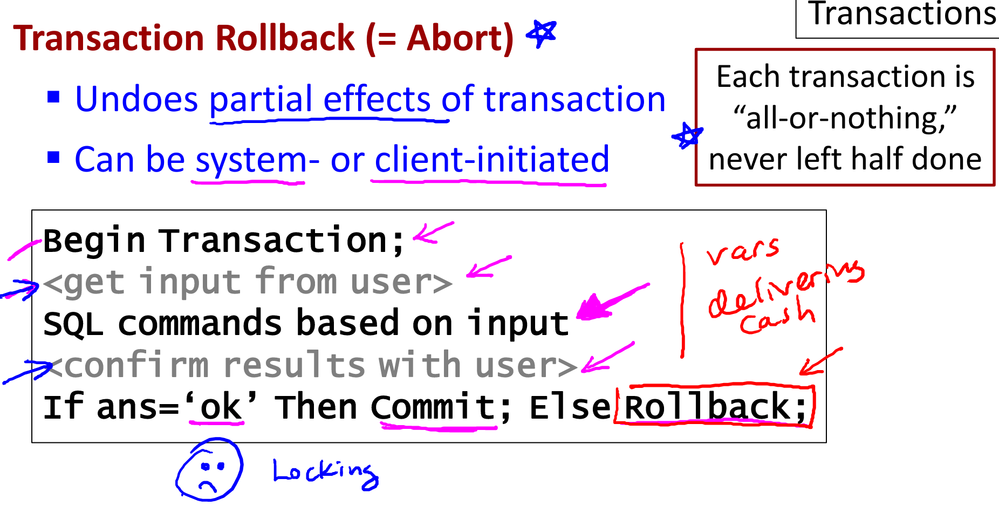{width="3.9843755468066493in"
                > height="2.0980839895013124in"}

            -   In this code, the client begins a transaction, it asks
                > the database user for some input. It performs some SQL
                > commands. Maybe some modifications to the database
                > based on the input from the user. It confirms that the
                > user likes the results of those modifications.

            -   And **if the user says okay**, then the transaction is
                > committed, and we get an atomic execution of this
                > behavior.

            -   But **if the user doesn\'t say okay**, then the
                > transaction is rolled back and, automatically, these
                > SQL commands that were executed are undone, and that
                > frees the application from writing the code that
                > undoes those commands explicitly.

        -   So it can actually be quite a useful feature for clients to
            > use. But clients do need to be very careful, because this
            > rollback command **only undoes effects on the data itself
            > in the database**.

            -   So if perhaps in this code, the system was also
                > **modifying some variables** or even worse, say
                > **delivering cash out of an ATM machine**, the
                > rollback command is not going to undo those! **It\'s
                > not gonna modify variables and it\'s certainly not
                > going to pull that cash back into the ATM**!

        -   So, there actually is another issue with this particular
            > client interaction that I am going to put a \"frownie\"
            > face here. It was a nice, simple example of how rollback
            > can be helpful. But one thing that happens in this example
            > is that we begin a transaction and then we wait for the
            > user to do something. And we actually wait for the user
            > back here. So experienced database application developers
            > will tell you to **never hold open a transaction and then
            > wait for arbitrary amounts of time**. The reason is that
            > transactions do use this **locking mechanism** I alluded
            > to earlier, so when a transaction is running, it may be
            > **blocking other clients from portions of the database**.
            > If the user happened to go out for a cup of coffee or is
            > going to come back in a week, we certainly don\'t want to
            > leave the database locked up for an entire week. So, again
            > and a general rule of thumb is that **transactions should
            > be constructed in a fashion that we know they are going to
            > run to completion fairly quickly**.

### Consistency property

-   Finally, let\'s talk about **consistency**. The consistency property
    > talks about **how transactions interact with the integrity
    > constraints that may hold on a database**.

-   As a reminder an **integrity constraint** is a **specification of
    > which database states are legal**.

-   Transactions are actually very helpful in the **management of
    > constraints**.

    -   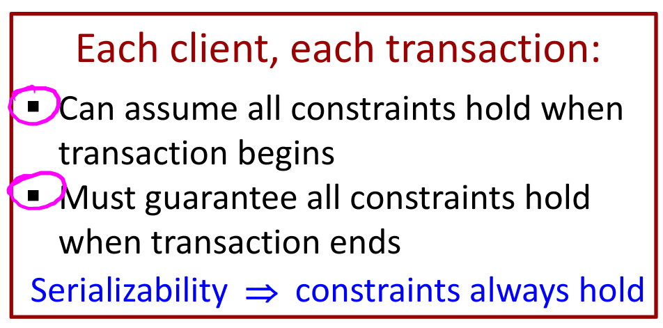{width="4.276042213473316in"
        > height="2.1096084864391953in"}

    -   Specifically, when we have multiple clients interacting with the
        > database in an interleaved fashion, we can have a setup where
        > each client can assume that **when it begins** it operates on
        > a database that satisfies all integrity constraints.

    -   Each client must guarantee that all constraints hold **when the
        > \[client's\] transaction ends** and that\'s typically
        > guaranteed by the constraint enforcement subsystem.

    -   Now with that guarantee, since we have **serialized** ability of
        > transactions **that guarantees that constraints always hold**.

        -   \[Ausführliche Erklärung:\] Specifically the behavior of the
            > database is some sequential order of the transactions. We
            > know and we can assume **at the start** of the transaction
            > the constraints hold. And then we guarantee they hold **at
            > the end**. And since the behavior is equivalent to a
            > sequential order then the next transaction can assume the
            > constraints hold and so on.

-   In conclusion, transactions are a very powerful concept. They give a
    > solution for both concurrency control and system failure
    > management and databases. They provide formally understood
    > properties of atomicity, consistency, isolation and durability. In
    > the next video we are going to focus more on the isolation
    > property. We\'re going to see that in some cases we may want to
    > relax the notion of isolation while still providing properties
    > that are sufficient for applications in certain circumstances.

Isolation Levels
----------------

-   In this final video about transactions, we\'ll focus on the concept
    > of **isolation levels**.

-   \[Problem:\] **Serializability** gives us understandable behavior
    > and consistency but it does have some **overhead** involved in the
    > **locking protocols** that are used and it **does reduce
    > concurrency**.

-   \[Solution:\] As a result of the overhead and reduced concurrency,
    > systems do offer **weaker isolation levels**.

-   In the SQL standard, there are **three levels**:

    -   read uncommitted,

    -   read committed, and

    -   repeatable read.

    -   \[serializable\]

-   And these isolation levels have **lower overhead** and allow
    > **higher concurrency** but of course at a cost which is **lower
    > consistency** guarantees.

-   I\'ve listed the three alternative isolation levels **from the
    > weaker to the stronger** and to complete the picture at the bottom
    > we have a fourth one which is "serializable", which is what we\'ve
    > been talking about already.

-   Before we proceed to learn about the different isolation, let me
    > mention a couple of things:

    -   First of all, **the Isolation level is per a transaction**. So
        > each client could set different isolation levels for each of
        > its transactions, if it wishes.

    -   Second of all, **isolation levels are in the eye of the
        > beholder**, and let me show you what I mean by that:

        -   So each client submits a transaction to the database and
            > might set the isolation level for that transaction. That
            > isolation level only affects that transaction itself. It
            > does not affect the behavior of any other transactions
            > that are running concurrently. So, for example, our client
            > on the left might set its transaction to be a repeatable
            > read, while our client on the right will set it\'s
            > transaction to read uncommitted and those properties will
            > be guaranteed for each of those transactions and won\'t
            > affect the other.

    -   By the way, the isolation levels really are specific to
        > **reads** \[deshalb die Bezeichnungen "**[Read]{.underline}**
        > x" bzw. "Repeatable **[Read]{.underline}**"\]. They specify
        > what values might be seen in the transaction, as we\'ll see
        > when we get into the details.

### Dirty Reads

-   So let\'s start by defining a concept called **dirty reads**. **A
    > data item in the database is dirty if it\'s been written by a
    > transaction that has not yet been committed**.

-   So for example, here are two transactions, I\'ll call them T1 and
    > T2, (and by the way throughout the rest of this video I\'m going
    > to put transactions in boxes, and you can assume implicitly that
    > there is a commit at the end of each box. I\'m not going to write
    > it each time.) So our first transaction is updating Stanford\'s
    > enrollment, adding 1000 to it, and our second transaction is
    > reading the average enrollment in the college table. We\'re using
    > our usual database of students applying to colleges. So after this
    > enrollment, Stanford\'s enrollment has 1,000 added to it, but
    > **before the transaction commits at that point in time the value
    > is what\'s known as dirty**.

    -   \[Why?\] If our second transaction here reads this value then it
        > might be reading a value that never actually exists in the
        > database. And why is that, because before this transaction
        > commits there could be a system failure and **the transaction
        > could be rolled back** as we described before and all of it\'s
        > changes undone. Meanwhile, however, the second transaction may
        > have read that value before it was undone.

-   Here\'s another example. Now we have three transactions T1, T2, T3.
    > Our first transaction is modifying the GPA of student\'s who\'s
    > high school size is sufficiently large. Our second transaction is
    > finding the GPA of student number 123. And our third transaction
    > is modifying the high school size of student 234. So **if this GPA
    > here in transaction T2 is read before the commit of transaction
    > T1, then that would be a dirty value for the GPA**.
    > 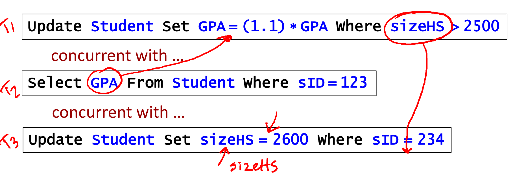{width="4.295659448818897in"
    > height="1.6197922134733158in"}

    -   \[Why?\] Again, because if this first transaction doesn\'t
        > commit, then that value will be rolled back.

-   There\'s a second case where we might have dirty data read in this
    > trio of transactions and that\'s this "sizeHS" here \[in T1\].
    > Because notice that here \[in T3\] we\'re modifying a high school
    > size. So, **if this size of high school is read before the commit
    > point of the third transaction, that would also be a dirty data
    > item**.

-   One clarification about dirty reads, is that **there is no such
    > thing as a dirty read within the same transaction**. In T3 for
    > example, after we\'ve modified the size high school, we might read
    > the size high school later in the same transaction and that\'s not
    > considered a dirty read. So **a read is only dirty when it reads
    > an uncommitted value that was modified by a different
    > transaction**.

### Level: Read Uncommitted

-   So here\'s our first isolation level, and it\'s our weakest one.
    > It\'s called **Read Uncommitted**, and what it says is that **a
    > transaction that has this isolation level may perform dirty
    > reads**. It may read values that have been modified by a different
    > transaction and not yet committed.

-   So let\'s take a look at an example. It\'s our same example. We\'ve
    > dropped the third transaction, so our first transaction is
    > modifying GPAs in the student table and our second transaction is
    > reading the average of those GPAs.

-   So **if these transactions are serializable**, then the behavior is
    > guaranteed to be equivalent to either T1 followed by T2 or T2
    > followed by T1. So either the second transaction will see all the
    > GPAs before they were updated, or it will see all the GPAs after
    > they were updated. As a reminder we don\'t know which order these
    > will occur in. Only that the behavior will be equivalent to one of
    > those orders.

-   Now let\'s suppose we add to our second transaction a specification
    > that it has isolation level read uncommitted. And by the way, this
    > very long sentence \[Set Transaction Isolation Level Read
    > Uncommitted;\] is how we specify the isolation level in the SQL
    > standard.

-   Now **when we don\'t specify an isolation level, as we haven\'t
    > here, the default is serializable**. Although in most of our
    > examples, it won\'t actually matter what the first transaction\'s
    > isolation level is, as we\'ll see. We\'re going to be focusing on
    > the data that\'s read in the second transaction and typically
    > written in the first transaction.

-   Okay, so let\'s see what\'s going on here. Again this is T1 and T2
    > and our first transaction is updating the GPAs. And now we\'ve
    > said in our second that it\'s okay for this average to read dirty
    > values, in other words, to see uncommitted GPA modifications. In
    > that case, as the average is computed, it could be computed right
    > in the middle of the set of modifications being performed by T1.
    > In that case, we certainly **don\'t have serializable behavior**.

    -   We **don\'t have T1 followed by T2**, since T2 is reading some
        > values that are in the middle of T1, and similarly **we don\'t
        > have T2 followed by T1**.

-   It might be that for our particular application, we just don\'t care
    > that much about having exact consistency. **It may be that we
    > don\'t mind** if our average is computed with some old values and
    > some new values, we might not even mind if we compute in our
    > average an increased GPA that ends up being undone when a
    > transaction rolls back. So if we\'re just looking for a rough
    > approximate GPA we can use this isolation level, and we\'ll have

    -   **increased concurrency**,

    -   **decreased overhead** and

    -   **better performance** overall with the understanding that

    -   it will have **reduced consistency** guarantees.

### Level: Read Committed

-   Let\'s go one step up to the next isolation level which is called
    > \"**read committed**\". As you can probably guess this one
    > **specifies that transactions may [not]{.underline} perform dirty
    > reads**. They may only read data values whose updates by other
    > transactions have been committed to the database.

-   Now this isolation level is stronger but it **still doesn\'t
    > guarantee global serializability**.

-   Let\'s take a look through an example. Our first transaction, T1, is
    > the same one, modifying the GPA for students from large high
    > schools. Our second transaction is the one where we are going to
    > reset the isolation level. In this case to read committed. And it
    > is going to perform two statements. One of them is going to read
    > the average GPA from the student table, and the other is going to
    > read the maximum GPA from the student table.

-   So let\'s look at **one behavior that\'s consistent with the
    > isolation level, but we will see is not serializable**.

    -   Let\'s suppose that this average GPA is read **before**
        > transaction T1, but the max GPA is computed **after**
        > transaction T1. So the average will not take into account the
        > increases but the max will take into account the increases.

    -   So, let\'s **see if this is equivalent to any serial order**:

        -   Is it equivalent to **T1 followed by T2**? Well it\'s
            > certainly not because T2\'s first statement is reading the
            > state of the table before T1 and not the state of the
            > table afterwards, although T2\'s second statement is
            > reading the state of the table afterwards.

        -   Similarly it\'s not equivalent to **T2 followed by T1**
            > because T2 is reading in its second statement the state of
            > the database after T1.

        -   **So there\'s no equivalent serial order**.

-   But again, **perhaps that\'s not needed** for the particular
    > application. And by using Read Committed we do get somewhat more
    > performance than we would have if we were serializable.

### Level: Repeatable Read

-   Our next isolation level is called **Repeatable Read**. And it\'s
    > our strongest one before we get to Serializable. In Repeatable
    > Read, **a transaction may not perform dirty reads just like in
    > read committed. And furthermore, there is an additional constraint
    > that if an item is read multiple times, it can\'t change value.**

-   You might remember in our previous example, we read the GPA multiple
    > times, and it did change value. So if we were using Repeatable
    > Read for the consistency level there, then the behavior that I
    > described couldn\'t occur.

-   So, even with this stronger condition, we **still don\'t have a
    > guarantee of global serializability**, and we\'ll again see that
    > through an example:

-   So we have our two transactions T1, T2,

    -   our **first transaction** is still modifying the GPA (I took
        > away the condition about the high school size, just to keep
        > things simple) and our second statement in our first
        > transaction is modifying the high school size of the student
        > with ID 123. So we first modified GPA\'s and then a high
        > school size.

    -   In our **second transaction**, and that\'s the one we\'re
        > setting as Repeatable read, we are going to read the average
        > GPA, as we usually do, and this time we are going to read the
        > average of the high school sizes.

    -   Incidentally, our first transaction is serializable, as they
        > always are by default.

-   Let\'s look at a **behavior where the first statement reading the
    > average GPA is executed before transaction T1, or sees the values
    > before T1**, while our second statement, the high school size,
    > sees the values after transaction T1.

    -   So let\'s check our conditions \[for Repeatable Read\].

        -   We are not performing dirty reads, because the first read
            > here is of the committed value before T1 and the second
            > read is the committed value after T1

        -   and furthermore, any items that are read multiple times have
            > not had their value changed because we are actually not
            > reading any values multiple times.

        -   So the execution of the first statement here, before T1 and
            > the second one after is legal in the repeatable read
            > isolation level.

    -   Yet we\'re still not serializable.

        -   We\'re not equivalent to T1 before T2 because again the
            > first statement of T2 is going before T1 or seeing the
            > state before T1 and

        -   we\'re not equivalent to T2 followed by T1 because the
            > second statement of T2 is seeing the state after T1.

#### Phantom Tuples

-   Now there is another situation with repeatable read that\'s quite
    > important to understand. We said that a transaction can\'t perform
    > dirty reads, and it can\'t. We also said that when an item that\'s
    > read multiple times can\'t change value. But the fact is that
    > **Repeatable Read does allow a relation to change values if it\'s
    > read multiple times** through what\'s known as **phantom tuples**.

-   Let me explain through an example. Let\'s suppose our first
    > transaction inserts a hundred new students into the database. And
    > that\'s run concurrently with our second transaction, which is
    > right at the repeatable read isolation level and now we\'re just
    > going to read the average GPA and we\'re going to follow that with
    > the max GPA similar to one of our earlier examples.

-   Now, repeatable read actually does allow behavior where this average
    > is computed **before** T1 and this max is computed **after** T1.
    > So the justification behind that is pretty much that when we do
    > the second read of the GPA, **the tuples that we\'re reading for a
    > second time** do still have the same value. So we are reading
    > those some new tuples that were inserted and in fact if this max
    > were an average instead of max we might get 2 different answers
    > for the average, even with Repeatable Read as the isolation level.
    > But that\'s what it allows and these hundred tuples here are what
    > are known as the **phantom tuples**. They sort of emerged during
    > execution out of nowhere.

-   Now, I would have to say that my opinion is that **this behavior**
    > within the repeatable read isolation level, although it\'s part of
    > the standard, **is really an effect of the way repeatable read is
    > implemented using Locks**. When a value is read once, it\'s locked
    > and can\'t be modified, but when we insert new tuples, they
    > aren\'t inserted with locks so they can be read in a second read
    > of the same relation. Don\'t worry about the implementation
    > details, but **do worry about phantom tuples** because if you\'re
    > using the repeatable read isolation level, **you do need to know
    > that insertions can be made by another transaction, even between
    > two entire readings of a table**.

-   Now on the other hand, **if what we do in our first transaction is
    > [delete]{.underline} the hundred tuples instead of inserting
    > them**, in that case we actually can **[not]{.underline}** get the
    > behavior where the first statement is before and the second
    > statement is after. Because once the average value has been read
    > of the GPA, this deletion will not be allowed **because (again
    > kind of an implementation) those values are locked**. And so in
    > this case, the second read of that same relation wouldn\'t be
    > allowed.

-   So in summary **we may have phantom tuples** up here between two
    > reads of the same relation in a repeatable read transaction, **but
    > we won\'t have tuples disappear** from the relation in between two
    > reads of it.

### Read Only

-   So, that completes our three isolation levels, in addition to
    > serializable we had at the weakest read-uncommitted, then
    > read-committed, and then repeatable read.

-   I did want to mention that we can also set transactions to be
    > **read-only**. That\'s sort of orthogonal to setting the isolation
    > level, what it does is it **helps the system optimize
    > performance**.

-   So, for example, in our transaction, where we were just reading the
    > average GPA and the max GPA, we can

    -   set an isolation level,

    -   and then we can also tell the system that it\'s going to be a
        > read only transaction. **That means that we are not going to
        > perform any modifications to the database within the
        > transaction**.

-   The system can use that as a hint to figure out its protocols to
    > guarantee the right isolation level, but it might **not have as
    > much overhead as if** the transaction had the possibility of
    > performing **modifications [as well as]{.underline} performing
    > reads**.

-   OK, so the behavior of transactions can be rather confusing and
    > it\'s very important to get it right or surprising things might
    > happen.

-   But I think we can **summarize** it pretty well with this table
    > here. We\'re going here from the weakest to the strongest and we
    > can classify the behavior of transactions based on, again, what
    > happens with reading. Can they read uncommitted values? Can they
    > have non-repeatable reads, where we read a value and then read a
    > different one later in the same transaction, and can there be
    > phantom tuples inserted during the transaction?
    > 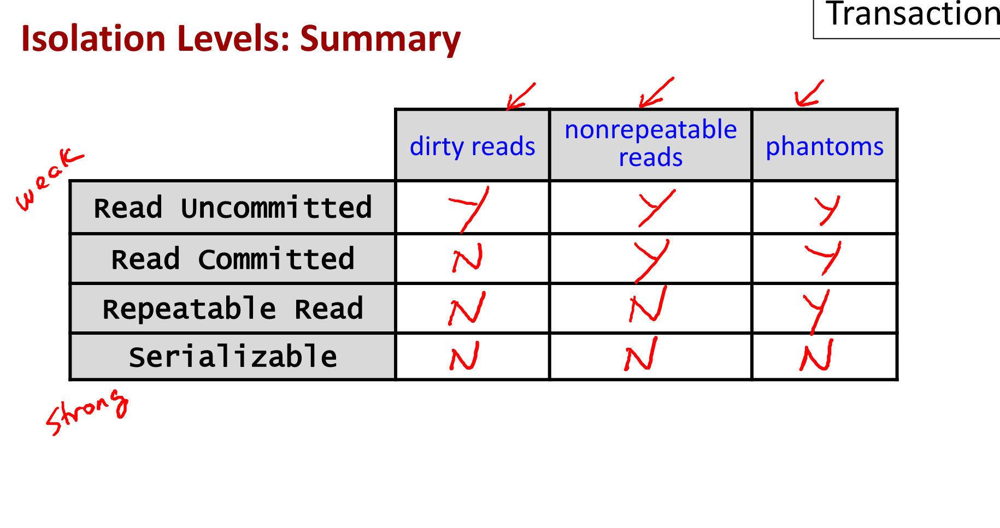{width="3.338542213473316in"
    > height="1.7529549431321085in"}

-   If we set our isolation level to **serializable**, then we cannot
    > have dirty reads, we cannot have non-repeatable reads and we
    > cannot have phantoms.

-   If we go one step weaker for a little more performance, and use
    > **repeatable read**, then we still won\'t have dirty reads, we
    > still won\'t have non-repeatable reads, but we might have phantom
    > tuples.

-   Moving up with **Read Committed**, we still won\'t have dirty reads
    > but we might have non-repeatable reads. So we might read a value
    > that\'s committed both times we read it. However, a transaction
    > wrote the value in between those two reads. So, it\'s different
    > each time and we may have phantoms as well.

-   Finally **read uncommitted** is the absolute weakest, not many
    > guarantees at all. We might have dirty reads, we might have not
    > repeatable reads, and we might have phantoms.

Summary + additional Remarks
----------------------------

-   So to wrap up transactions completely the standard default is
    > serializable behavior, and we specified exactly what that means.
    > Weaker isolation levels allow us to **increase concurrency**,
    > **decrease overhead** so overall we will get an **increased
    > performance**, but we have **weaker consistency** guarantees.

-   I should mention that **some prominent database systems have
    > actually chosen to have repeatable read as their default**.
    > **Oracle** and **MySQL** are examples of that. So, in those
    > systems it\'s assumed that most applications will be willing to
    > sacrifice a little bit inconsistency in order to get higher
    > performance.

-   And, finally, the **isolation level is set for each transaction**
    > and **is in the eye of the beholder**, meaning that that
    > transaction\'s reads must conform to its own isolation level but
    > won\'t affect any concurrent transaction\'s isolation level.

-   I hope I\'ve gotten the point across that transactions are one of
    > the most important concepts in database systems.

    -   They are what allow multiple clients, maybe thousands, tens of
        > thousands of clients, to operate on a database, **all at the
        > same time without concern** that the actions they perform on
        > the data will affect each other in unpredictable ways.

    -   And furthermore, transactions are what allow database systems
        > **to recover when there\'s an unexpected crash** into a
        > consistent space.

[^1]: [[später]{.underline}](#my7qdc2v408e) sagt sie auch hierzu: "It\'
    s really quite similar to the analogy in programming languages.",
    d.h. [[meine Interpretation]{.underline}](#9gu8288dnxzl) ist
    plausibel

[^2]: In programming we call a language **loosely typed** (JavaScript,
    Python and Ruby) \[**= statically typed** (at [[compile
    time]{.underline}](https://en.wikipedia.org/wiki/Compile_time))\]
    when you don't have to explicitly specify types of variables and
    objects. A **strongly typed** (C, Go, Java and Swift) \[**=
    dynamically typed** (at [[run
    time]{.underline}](https://en.wikipedia.org/wiki/Run_time_(program_lifecycle_phase)))\]
    language on the contrary wants types specified.
    ([[https://flaviocopes.com/loosely-strongly-typed/]{.underline}](https://flaviocopes.com/loosely-strongly-typed/))
    (see also
    [[https://en.wikipedia.org/wiki/Type\_system]{.underline}](https://en.wikipedia.org/wiki/Type_system))

[^3]: zB cross-product, natural join, theta join ... usw

[^4]: zB cross-product, natural join, theta join ... usw
